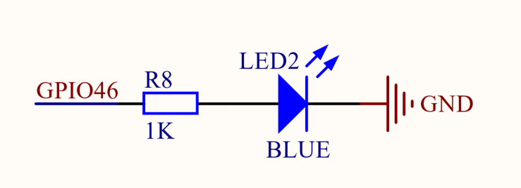
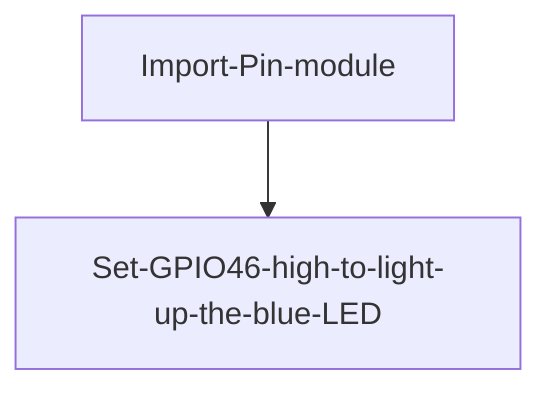
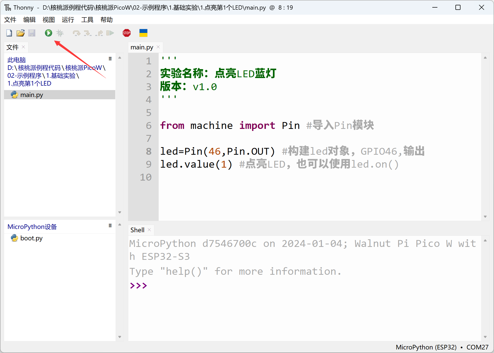

# Lighting Up the First LED

## Introduction
Most people start learning embedded MCU programming by lighting up an LED. Learning MicroPython on the WalnutPi PicoW is no exception. Lighting up your first LED helps you understand the development environment and program architecture, building a strong foundation for future learning and larger projects while boosting your confidence.

## Objective
Learn to light up an LED (blue LED).

## Experiment Explanation

The WalnutPi PicoW has an LED connected to a GPIO that can be controlled.


From the schematic, we can see that the blue LED corresponds to chip IO pin 46. From the circuit, when IO46 is high, the blue LED lights up.


Controlling the LED uses the Pin object from the machine module. Usage instructions are as follows:

## Pin Object

Pin is a pin object.

### Constructor
```python
from machine import Pin

LED = Pin(id, mode, pull)
```

Pin is located under the machine module and can be used by directly importing it:

- `id` : Chip pin number, e.g., 1, 2, 46.
- `mode` : Input/output mode.
    - `Pin.IN` : Input mode;
    - `Pin.OUT` : Output mode;
- `pull`: Pull-up/pull-down resistor configuration.
    - `None` : No pull-up/pull-down resistor;
    - `Pin.PULL_UP` : Pull-up resistor enabled;
    - `Pin.PULL_DOWN` : Pull-down resistor enabled.


### Usage
```python
LED.value([X])
```
Configure pin level:
- `Output mode` : Output level value.
    - `0` : Output low level;
    - `1` : Output high level.
- `Input mode` : No parameters needed, gets the current pin input level.

<br></br>

```python
LED.on()
```
Outputs high level "1", 3.3V.

<br></br>

```python
LED.off()
```

Outputs low level "0", 0V.

<br></br>

For more usage, refer to the official documentation:<br></br>
https://docs.micropython.org/en/latest/library/machine.Pin.html#machine-pin


The table above provides a detailed explanation of the Pin object in MicroPython's machine module. machine is the main module, and Pin is one of its submodules. There are two ways to reference related modules in Python programming:

- Method 1: `import machine`, then operate via `machine.Pin`;

- Method 2: `from machine import Pin`, which directly imports the Pin module from machine, then operates by constructing a led object. Method 2 is clearly more intuitive and convenient, and this experiment uses Method 2 for programming.

The code writing flow is as follows:




## Reference Code

```python
'''
Experiment Name: Light up the blue LED
Version: v1.0
'''

from machine import Pin #Import Pin module

LED=Pin(46,Pin.OUT) #Build LED object, GPIO46, output
LED.value(1) #Light up LED, or use led.on()

```

## Experimental Results

Run the above code in Thonny IDE:



You can see the blue LED lights up.


From this first experiment, we can see that the key to MicroPython development is learning the constructor and its usage methods to operate related objects. With powerful module functions, the experiment achieved lighting up an LED with just two simple lines of code.
