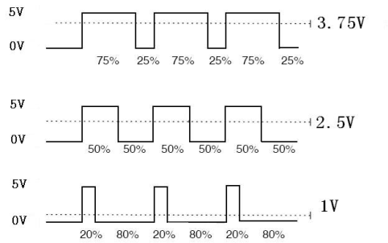
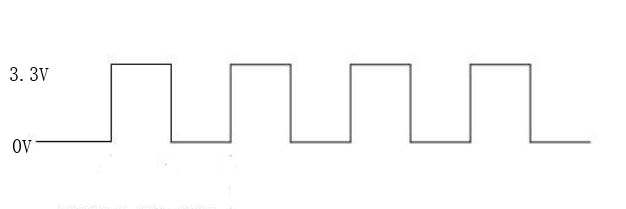
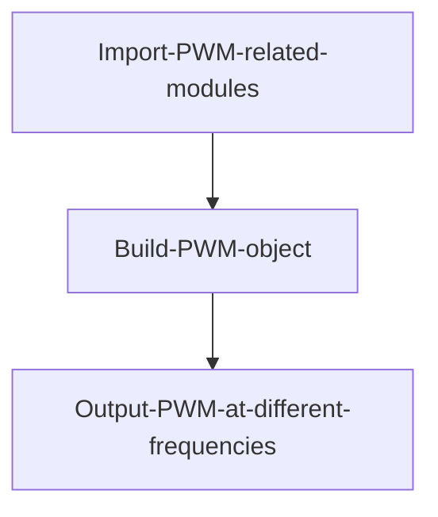
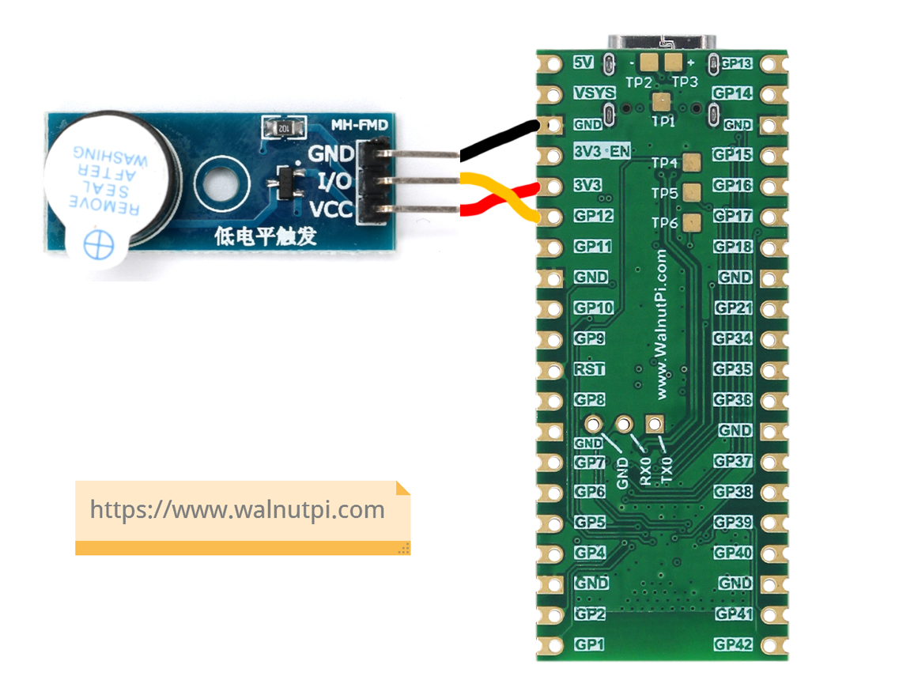
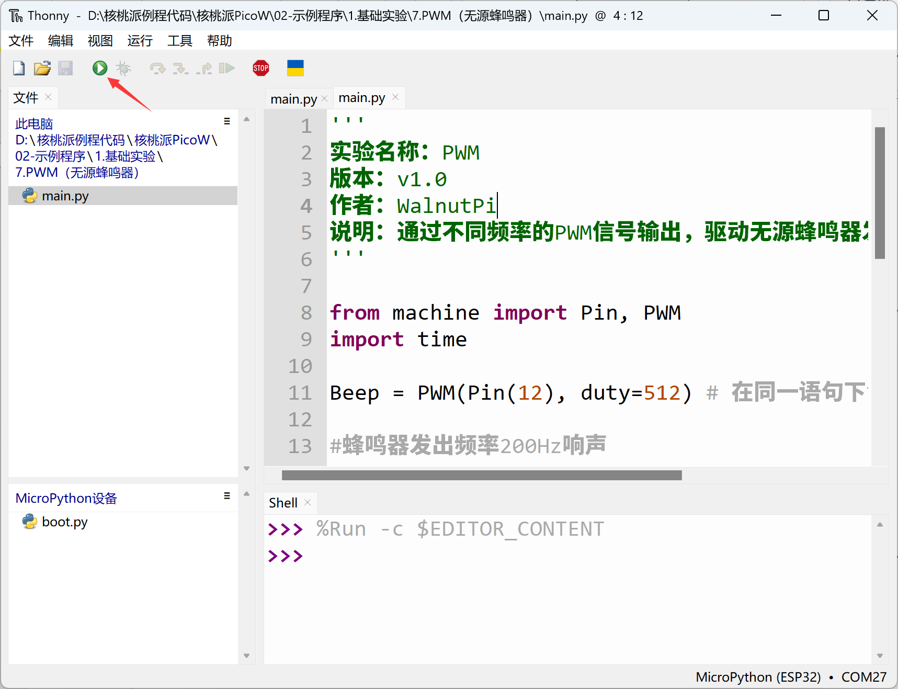
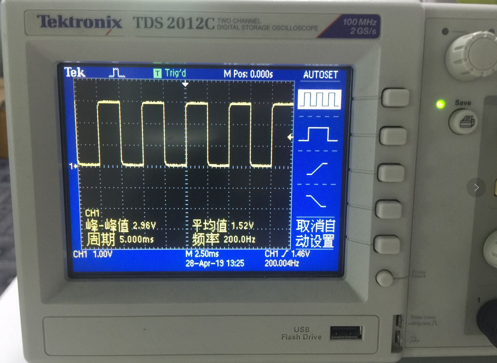

# PWM (Passive Buzzer)

## Introduction
PWM (Pulse Width Modulation) is a specific signal output mainly used to generate square waves with different frequencies and duty cycles (the proportion of high-level time within a cycle to the total period). This enables fixed frequency or average voltage output.




## Objective
Output PWM signals at different frequencies to drive a passive buzzer to produce sounds at different frequencies.

## Experiment Explanation

Buzzers are divided into active and passive types. An active buzzer is very simple to use — just connect it to power and it sounds, disconnect and it stops. The passive buzzer used in this experiment requires a specified frequency to produce sound. The advantage is that the buzzer's sound can be changed by varying the frequency, which helps verify that the WalnutPi PicoW's PWM output frequency is changing.

All WalnutPi PicoW pins can be configured as PWM output, with a frequency range from 1Hz to 40MHz and duty cycle from 0-1023.

## PWM Object

### Constructor
```python
pwm = machine.PWM(machine.Pin(id), freq, duty)
```
Build a PWM object. The PWM object is located under the machine module.

- `machine.Pin(id)` : Pin number, e.g., Pin(12);
- `freq` : PWM frequency, unit: Hz, range: 1-40MHz;
- `duty` : PWM duty cycle, range: 0-1023;

### Usage
```python
pwm.freq([value])
```
Set frequency. Returns current frequency if no parameter is passed.

<br></br>

```python
pwm.duty([value])
```
Set duty cycle. Returns current duty cycle if no parameter is passed.

<br></br>

```python
pwn.deinit()
```
Deregister PWM.

<br></br>


For more usage, refer to the official documentation:<br></br>
https://docs.micropython.org/en/latest/library/machine.PWM.html#machine-pwm

<br></br>

A passive buzzer can be driven by a square wave at a specific frequency. The principle of a square wave is simple: alternating high and low levels at a certain frequency, which can be understood as PWM output with a 50% duty cycle.



Combining the above explanation, the code flow chart is summarized as follows:



## Reference Code

```python
'''
Experiment Name: PWM
Version: v1.0
Author: WalnutPi
Description: Output PWM signals at different frequencies to drive a passive buzzer to produce sounds at different frequencies.
'''

from machine import Pin, PWM
import time

Beep = PWM(Pin(12), duty=512) # Create and configure PWM in one statement, 50% duty cycle

#Buzzer produces 200Hz sound
Beep.freq(200)
time.sleep(1)

#Buzzer produces 400Hz sound
Beep.freq(400)
time.sleep(1)

#Buzzer produces 600Hz sound
Beep.freq(600)
time.sleep(1)

#Buzzer produces 800Hz sound
Beep.freq(800)
time.sleep(1)

#Buzzer produces 1000Hz sound
Beep.freq(1000)
time.sleep(1)

#Stop
Beep.deinit()
```

## Experimental Results

This experiment uses a passive buzzer powered by 3.3V and controlled by pin 12. The wiring diagram is as follows:


Run the code and you can hear the buzzer producing sounds at different frequencies sequentially.



If you have access to an oscilloscope, you can measure pin 12 of the WalnutPi PicoW to observe the PWM waveform changes.



By this section, we've found that the methods for using object functions in the experiments are very simple — which is a good thing. It allows us to focus more on applications and create more interesting projects without getting bogged down in complex low-level code development. However, as the complexity of required functionality increases, the amount of code will grow, and the logic will become somewhat more complex.
