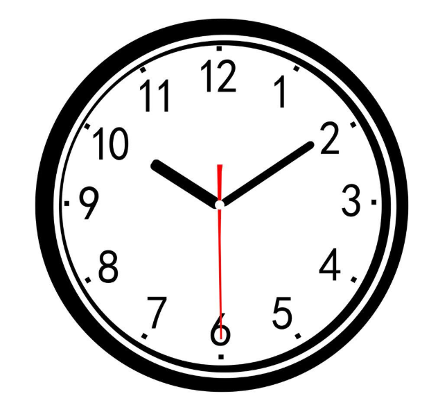
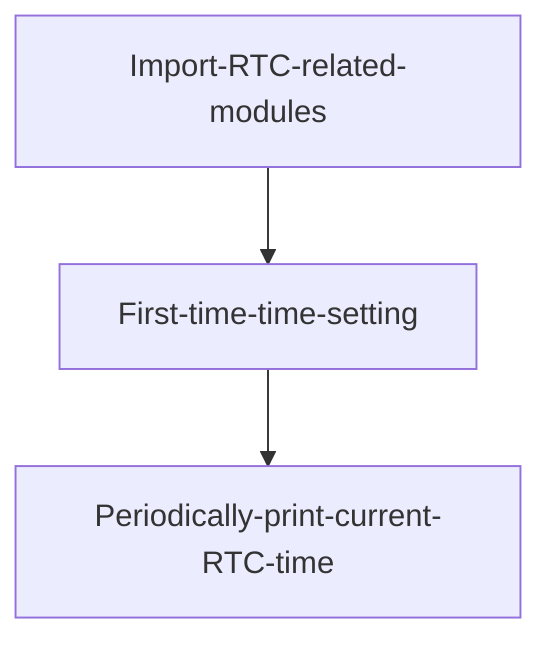
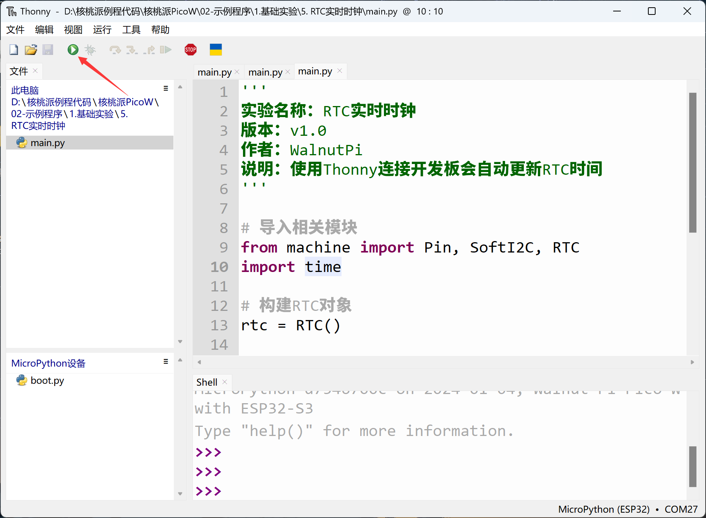
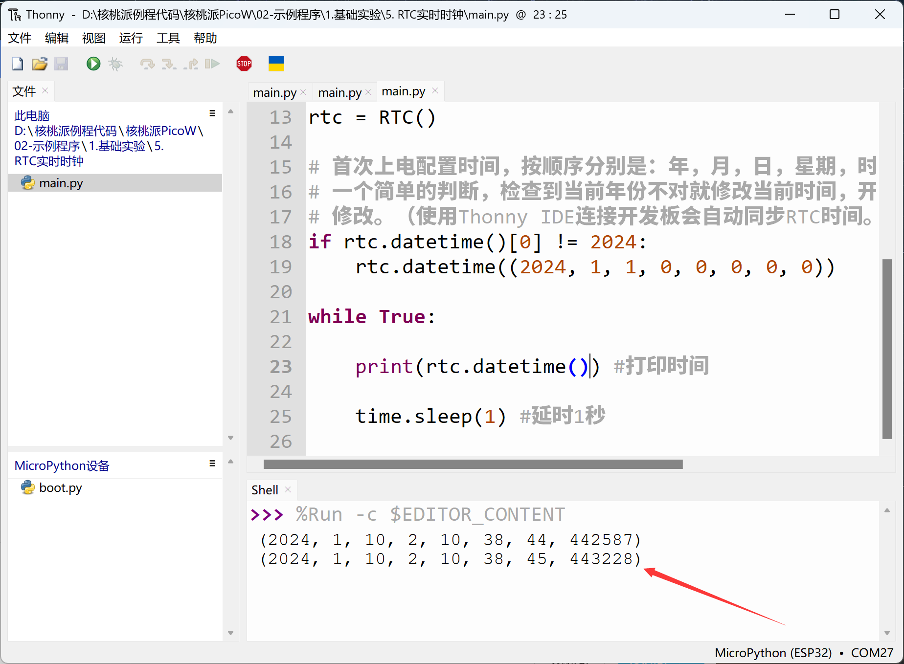

# RTC Real-Time Clock

## Introduction
Clocks are perhaps the most commonly used thing in our daily lives — watches, computers, phones, all display the current time constantly. Every electronics enthusiast likely dreams of making their own electronic clock. Next, we'll use a MicroPython development board to create our own electronic clock.




## Objective
Learn RTC programming.

## Experiment Explanation

The principle of this experiment is to read RTC data. Unsurprisingly, the powerful MicroPython already integrates built-in clock functions in the machine module's RTC class. The details are as follows:

## RTC Object

### Constructor
```python
rtc = machine.RTC()
```
Build an RTC object. The RTC object is located under the machine module.

### Usage
```python
rtc.datetime((2024, 1, 1, 0, 0, 0, 0, 0))
```
Set RTC date and time. (2024, 1, 1, 0, 0, 0, 0, 0) represents (year, month, day, weekday, hour, minute, second, microsecond) respectively, where weekday uses 0-6 to represent Monday through Sunday.

<br></br>

```python
rtc.datetime()
```
Get the current RTC time. Returns a tuple: (year, month, day, weekday, hour, minute, second, microsecond), where weekday uses 0-6 to represent Monday through Sunday.

For more usage, refer to the official documentation:<br></br>
https://docs.micropython.org/en/latest/library/machine.RTC.html#machine-rtc

<br></br>

After familiarizing with RTC usage, we'll implement code that sets the time on first power-up if no time is set, then periodically prints the obtained time information. The code flow chart is as follows:




## Reference Code

```python
'''
Experiment Name: RTC Real-Time Clock
Version: v1.0
Author: WalnutPi
Description: Connecting to the development board with Thonny automatically updates the RTC time
'''

# Import related modules
from machine import Pin, SoftI2C, RTC
import time

# Build RTC object
rtc = RTC()

# Configure time on first power-up. The order is: year, month, day, weekday, hour, minute, second, sub-second.
# A simple check is done here — if the current year is incorrect, update the current time.
# Developers can modify this based on their actual situation.
# (Using Thonny IDE to connect to the development board will automatically sync the RTC time.)
if rtc.datetime()[0] != 2024:
    rtc.datetime((2024, 1, 1, 0, 0, 0, 0, 0))

while True:

    print(rtc.datetime()) #Print time

    time.sleep(1) #Delay 1 second
```

## Experimental Results

Run the code in Thonny IDE:



You can see the terminal prints the current RTC time information.



Observant users may have noticed that the RTC time updates automatically when running the program. This is because Thonny automatically updates the development board's RTC time each time it connects to a MicroPython development board. RTC time is lost when power is removed; to keep the RTC time running continuously, the development board must remain powered. Users can use the RTC function to build their own electronic clock.
