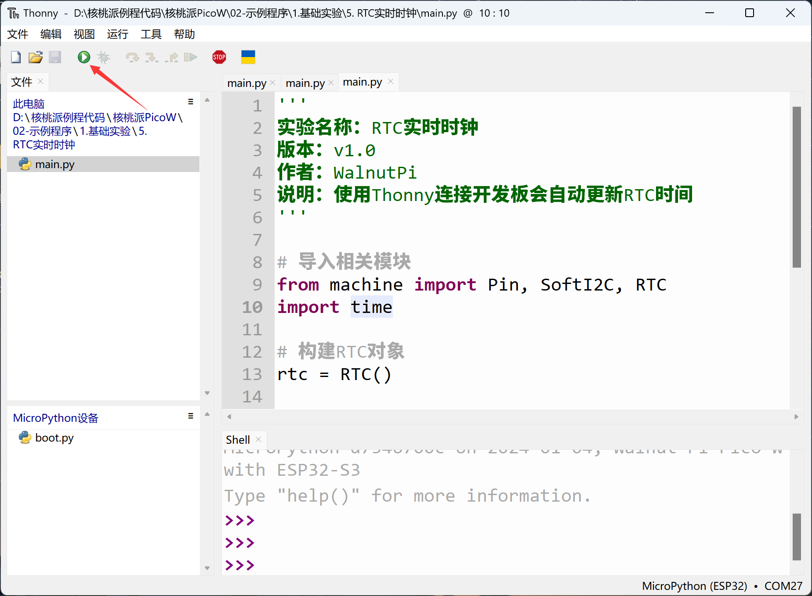
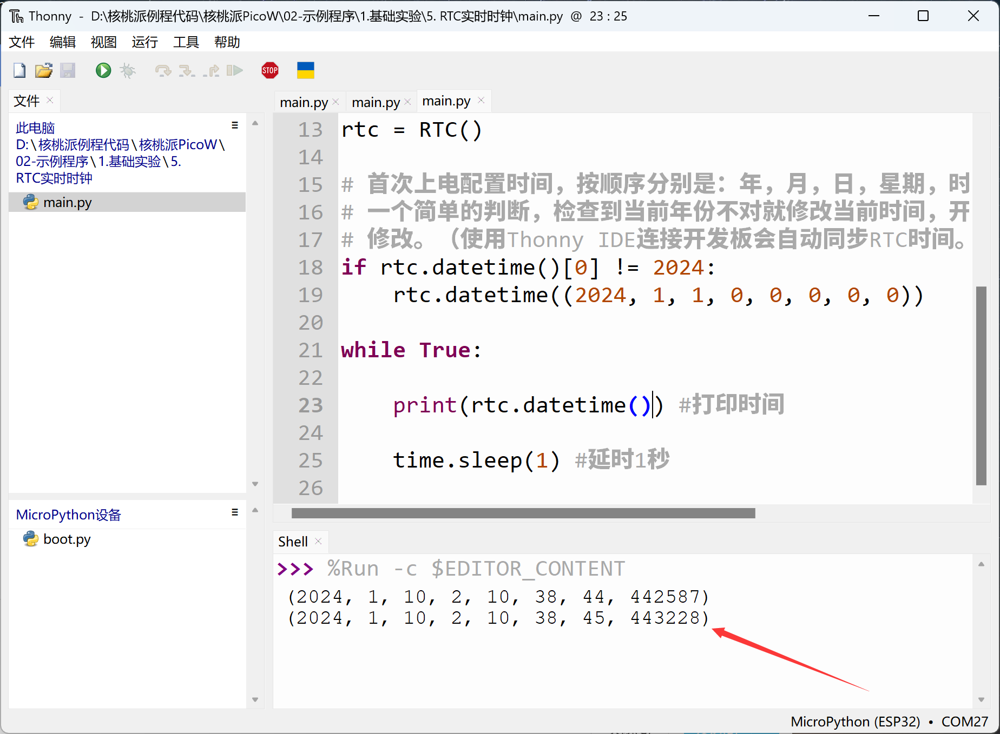

# RTC实时时钟

## 前言
时钟可以说我们日常最常用的东西了，手表、电脑、手机等等无时无刻不显示当前的时间。可以说每一个电子爱好者心中都希望拥有属于自己制作的一个电子时钟，接下来我们就用MicroPython开发板来制作一个属于自己的电子时钟。


## 实验目的
学习RTC编程。

## 实验讲解

实验的原理是读取RTC数据。毫无疑问，强大的MicroPython已经集成了内置时钟函数模块。位于machine的RTC模块中，具体介绍如下：

## RTC对象

### 构造函数
```python
rtc = machine.RTC()
```
构建RTC对象，RTC对象位于machine模块下。

### 使用方法
```python
rtc.datetime((2024, 1, 1, 0, 0, 0, 0, 0))
```
设置RTC日期和时间。(2024, 1, 1, 0, 0, 0, 0, 0)按顺序分别表示（年，月，日，星期，时，分，秒，微妙），其中星期使用0-6表示星期一到星期日。

<br></br>

```python
rtc.datetime()
```
获取当前RTC时间。返回元组：（年，月，日，星期，时，分，秒，微妙），其中星期使用0-6表示星期一到星期日。

更多用法请阅读官方文档：<br></br>
https://docs.micropython.org/en/latest/library/machine.RTC.html#machine-rtc

<br></br>

熟悉RTC使用方法后，我们通过代码实现首次上电如果检测到未设置时间可以先设置时间，然后周期打印获取的时间信息，代码编程流程图如下：


```mermaid
graph TD
    导入RTC相关模块 --> 首次时间设置 --> 周期性打印当前RTC时间;
```

## 参考代码

```python
'''
实验名称：RTC实时时钟
版本：v1.0
作者：WalnutPi
说明：使用Thonny连接开发板会自动更新RTC时间
'''

# 导入相关模块
from machine import Pin, SoftI2C, RTC
import time

# 构建RTC对象
rtc = RTC()

# 首次上电配置时间，按顺序分别是：年，月，日，星期，时，分，秒，次秒级；这里做了
# 一个简单的判断，检查到当前年份不对就修改当前时间，开发者可以根据自己实际情况来
# 修改。（使用Thonny IDE连接开发板会自动同步RTC时间。）
if rtc.datetime()[0] != 2024:
    rtc.datetime((2024, 1, 1, 0, 0, 0, 0, 0))

while True:
    
    print(rtc.datetime()) #打印时间
    
    time.sleep(1) #延时1秒
```

## 实验结果

在Thonny IDE运行代码：



可以看到终端打印当前RTC时间信息。



细心的用户或许已经发现运行程序后RTC时间自动更新，那是因为thonny每次连接MicroPython开发板会自动更新开发板的RTC时间。RTC时间是断电丢失的，要想RTC时间连续运行需要保持对开发板供电，用户可以使用RTC功能打造自己的电子时钟。
