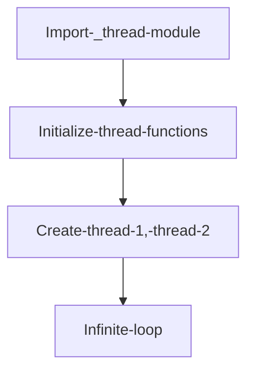
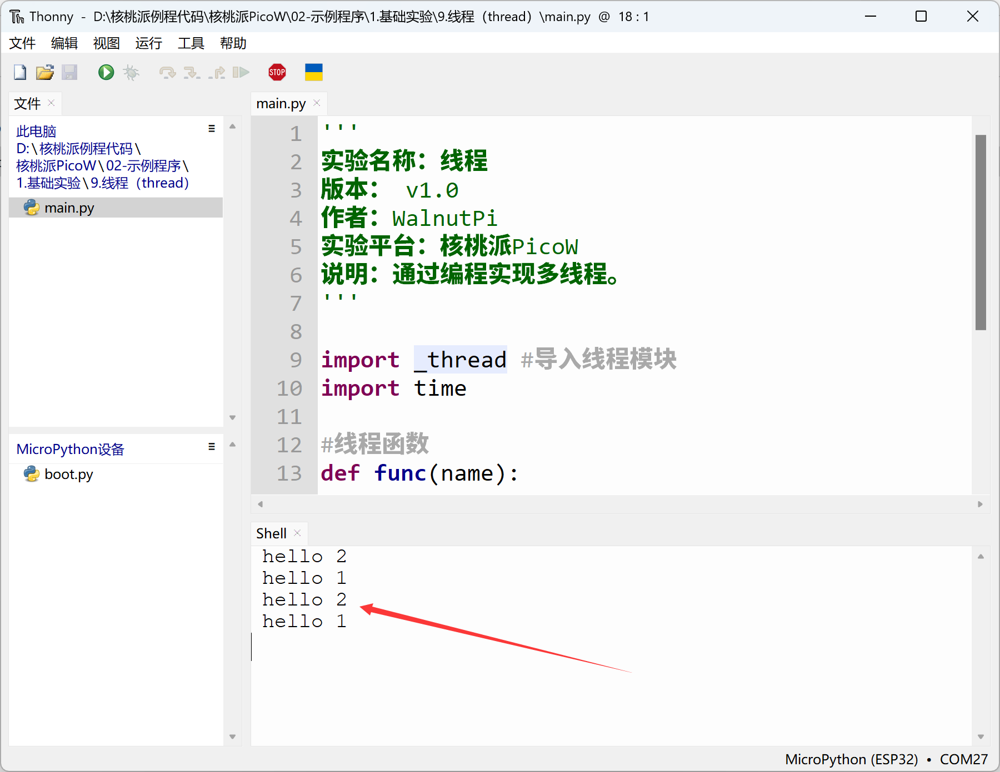

# Thread

## Introduction
We've seen that all previous programming was done in a single loop. But when we need to perform different tasks in a time-shared manner, thread programming comes in handy. This is somewhat similar to RTOS (Real-Time Operating System). Today we'll learn how to implement multi-threading through MicroPython programming.

## Objective
Program multi-threaded concurrent task execution.

## Experiment Explanation

The WalnutPi PicoW's MicroPython firmware already integrates the _thread module. We can use it directly. This module derives from Python 3 and is a low-level thread. For details, see the official documentation: https://docs.python.org/3.5/library/_thread.html#module-thread

The programming flow is as follows:



## Reference Code

```python
'''
Experiment Name: Thread
Version: v1.0
Author: WalnutPi
Platform: WalnutPi PicoW
Description: Implement multi-threading through programming.
'''

import _thread #Import thread module
import time

#Thread function
def func(name):
    while True:
        print("hello {}".format(name))
        time.sleep(1)

_thread.start_new_thread(func,("1",)) #Start thread 1, argument must be a tuple
_thread.start_new_thread(func,("2",)) #Start thread 2, argument must be a tuple

while True:
    pass
```

## Experimental Results

Run the code and you can see the serial terminal repeatedly executing 2 threads.



In this chapter we learned about thread programming based on MicroPython, which is essentially Python 3's low-level thread programming. The introduction of threads makes multi-tasking much simpler and greatly increases programming flexibility.
