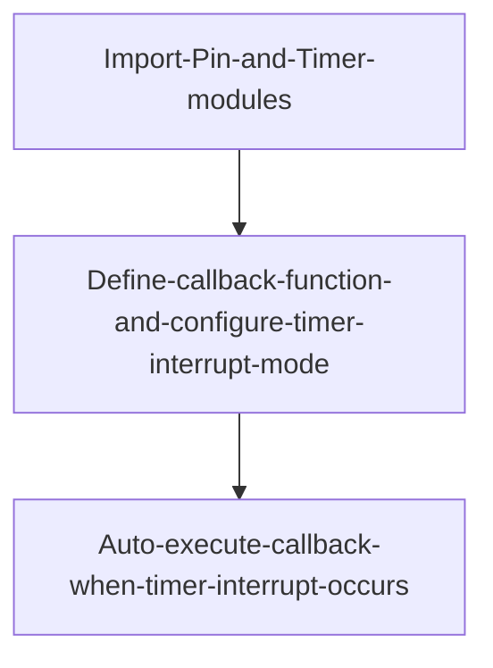
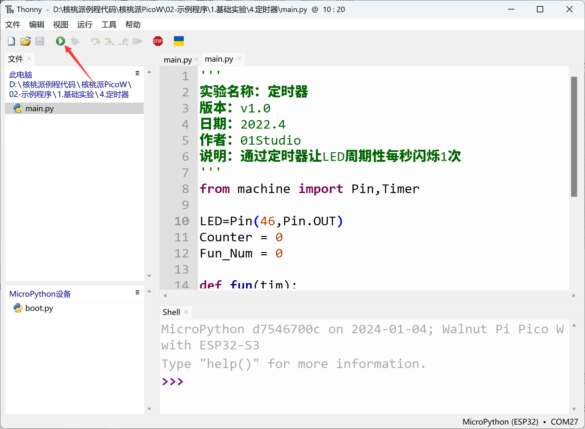

# Timer

## Introduction
A timer, as the name suggests, is used for timing. We often set timers or alarms, and when the time is up, we're told what to do. The same goes for MCUs — timers can complete various preset tasks.

## Objective
Use a timer to make the blue LED blink once per second periodically.

## Experiment Explanation

The timer is in the machine module's Timer class. It can be easily programmed using MicroPython. We just need to understand its constructor and usage methods!

## Timer Object

### Constructor
```python
tim = machine.Timer(id)
```
The Timer object is located under the machine module.

- `id` : Timer number. 0~3, for a total of 4 timers.

### Usage
```python
tim.init(mode, freq, period, callback)
```
Timer initialization.
- `mode` : Timer mode.
    - `Timer.ONE_SHOT` : Execute only once.
    - `Timer.PERIODIC` : Execute periodically.

- `freq` : Timer frequency, in Hz. The upper limit depends on the IO pin. When both freq and period are provided, freq has higher priority and period is ignored.

- `period` : Timer period, in ms.

- `callback` : Callback function after timer interrupt.

<br></br>

```python
Timer.deinit()
```
Deregister the timer.

For more usage, refer to the official documentation:<br></br>
https://docs.micropython.org/en/latest/library/machine.Timer.html#machine-timer

<br></br>

When the timer reaches the preset time, it also generates an interrupt, so the programming approach is similar to external interrupts. The code flow chart is as follows:




## Reference Code

```python
'''
Experiment Name: Timer
Version: v1.0
Date: 2022.4
Author: 01Studio
Description: Use a timer to make the LED blink once per second periodically
'''
from machine import Pin,Timer

LED=Pin(46,Pin.OUT)
Counter = 0
Fun_Num = 0

def fun(tim):

    global Counter
    Counter = Counter + 1
    print(Counter)
    LED.value(Counter%2)

#Use Timer 1
tim = Timer(1)
tim.init(period=1000, mode=Timer.PERIODIC,callback=fun) #Period is 1000ms
```

## Experimental Results

Run the code in Thonny IDE:



You can see the blue LED blinking once per second.


This experiment introduced the usage of timers. Some users might think using a delay function could achieve the same result, but compared to delay functions, the advantage of timers is that they don't consume excessive CPU resources. Interested users can also define more timer objects like `tim2`, `tim3`, configured with different parameters to implement multi-tasking operations.
