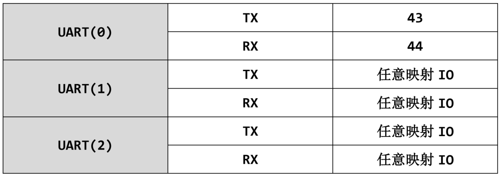
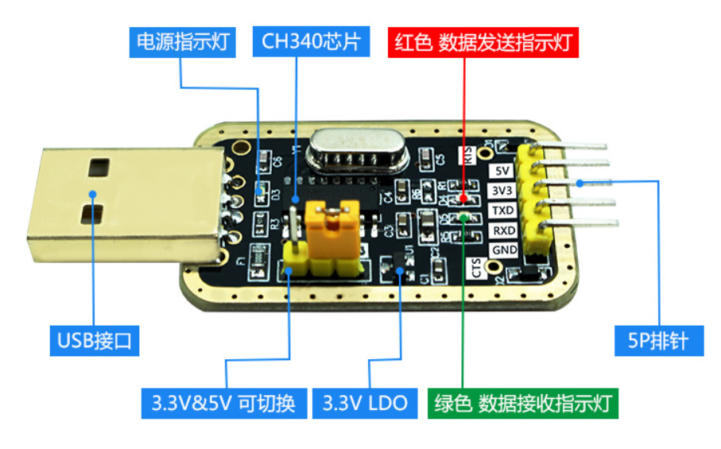
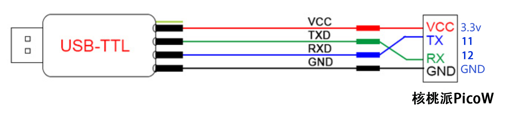
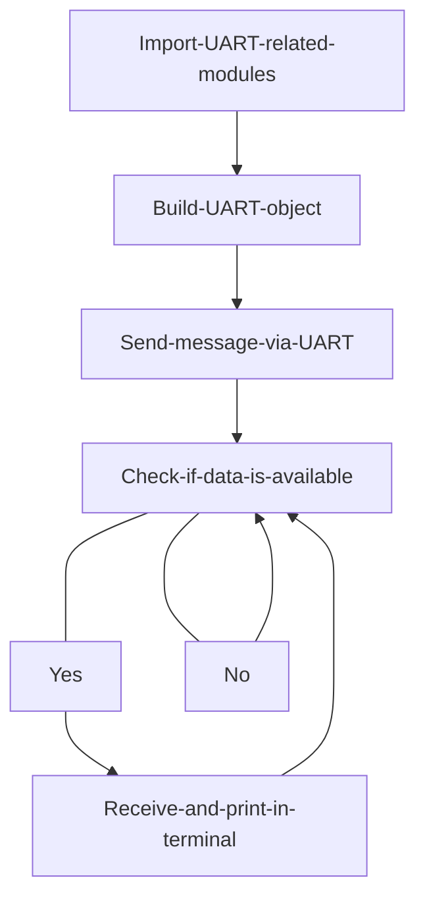
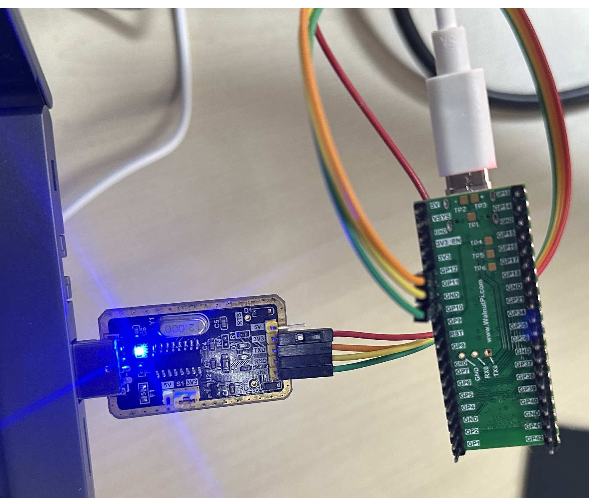
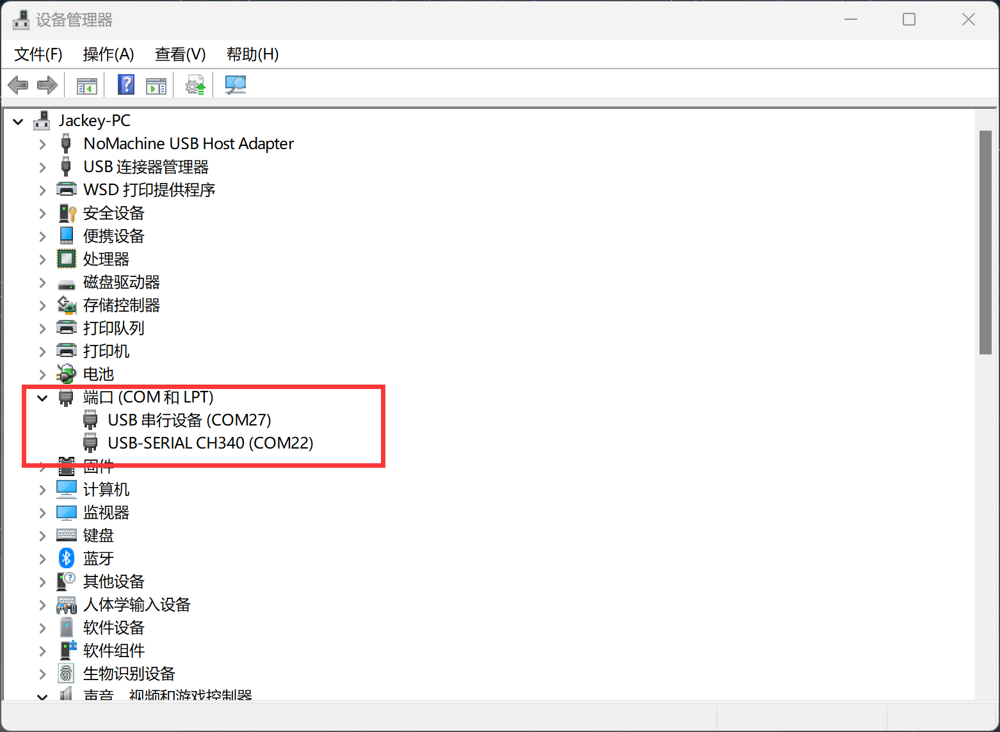
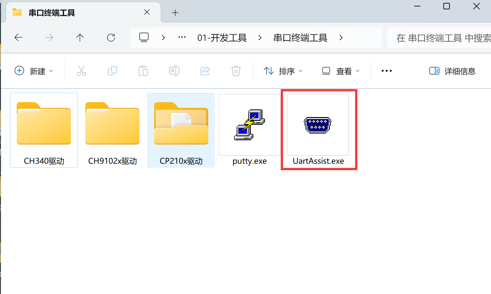
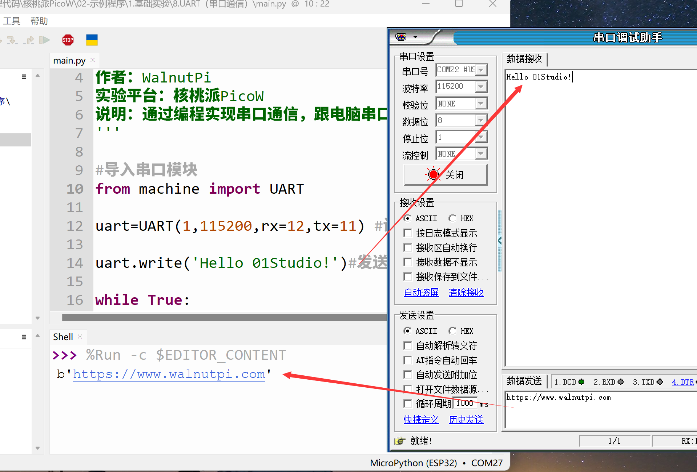

# UART (Serial Communication)

## Introduction
UART is a very commonly used communication interface. Many industrial control products and wireless transparent transmission modules use UART to send and receive commands and transfer data, and to communicate with other development boards such as Raspberry Pi, WalnutPi, STM32, Arduino, etc. This allows users to flexibly utilize various serial function modules without worrying about the underlying implementation principles.

## Objective
Program serial data transmission and reception.

## Experiment Explanation

The WalnutPi PicoW has a total of 3 UART ports, numbered 0-2, as shown in the table below. uart0 is the debug serial port and cannot be used; experiments can use uart1 or uart2.



Let's learn about the UART object's constructor and usage methods:

## UART Object

### Constructor
```python
uart = machine.UART(id,baudrate,tx=None,rx=None bits=8, parity=None, stop=1,…)
```
Create a UART object.

- `id` : UART port number, 2 available: 1 or 2.

- `baudrate`: Baud rate, commonly 115200, 9600;

- `tx` : WalnutPi PicoW transmit pin, customizable IO, e.g.: tx = 12.

- `rx` : WalnutPi PicoW receive pin, customizable IO, e.g.: rx = 11.

- `bits` : Data bits, default 8;

- `parity` : Parity check, default None;
    - `0`: Even parity;
    - `1`: Odd parity;

- `stop`: Stop bits, supports 1, 1.5, 2, default 1.

### Usage

```python
uart.any()
```
Returns the number of bytes waiting to be read. 0 means none, used to check if data has been received.

<br></br>

```python
uart.read([nbytes])
```
Read characters.
- `nbytes`: Number of bytes to read.

<br></br>

```python
uart.readline()
```
Read a line.

<br></br>

```python
UART.write(buf)
```
Send data.
- `buf`: Data to send.

<br></br>

```python
UART.deinit()
```
Deregister the UART port.

For more usage, refer to the official documentation:<br></br>
https://docs.01studio.cc/library/machine.UART.html#machine-uart

<br></br>

We can use a USB-to-TTL tool along with a PC serial assistant to communicate with the WalnutPi PicoW development board.



Note that you must use a 3.3V level USB-to-UART TTL tool. In this experiment, we configure the WalnutPi PicoW with rx=12, tx=11. The wiring diagram is as follows (cross-wired):




In this experiment, we first initialize the UART port, then send a message to it. The PC's serial assistant will display the message in the receive area. Then we enter a loop where, when data is detected as available to receive, it is received and printed through the REPL. The code flow chart is as follows:




## Reference Code

```python
'''
Experiment Name: Serial Communication
Version: v1.0
Author: WalnutPi
Platform: WalnutPi PicoW
Description: Implement serial communication through programming, exchanging data with the PC serial assistant.
'''

#Import serial module
from machine import UART

uart=UART(1,115200,rx=12,tx=11) #Set UART port 1 and baud rate

uart.write('Hello 01Studio!')#Send a piece of data

while True:

    #Check if data has been received
    if uart.any():

        text=uart.read(128) #Receive 128 characters
        print(text) #Print data received on UART via REPL
```

## Experimental Results

Connect the USB-to-TTL TX to WalnutPi PicoW pin 12, RX to WalnutPi PicoW pin 11, GND together as described above. 3.3V can be connected or left disconnected.



Open the PC's Device Manager, and you should see 2 COM ports. The one labeled CH340 is the serial tool, and the other is the WalnutPi PicoW's serial port. **If the CH340 driver is not installed, you need to manually install it. The driver is located in: <u>配套资料包\开发工具\串口终端\CH340 folder</u>.**



This experiment requires a serial assistant. Open the [UartAssist.exe] software located in 配套资料包\开发工具\串口终端工具.



Configure the serial tool as COM22 according to the image above (adjust based on your computer's COM port number). Baud rate 115200. Then open it.

Run the program. You should see the serial assistant receives the message "Hello WalnutPi!" sent by the WalnutPi PicoW at startup. Enter "https://www.walnutpi.com" in the serial assistant's send field, click send, and you can see the WalnutPi PicoW prints the received message in the REPL. As shown below:



## Communicating with Other Development Boards or Serial Modules

Simply replace the serial TTL tool wiring in this experiment with the development board's wiring. The wiring method is cross-connected: connect the WalnutPi PicoW TX and RX to the other board's RX and TX respectively, and connect GND together. Ensure the other development board's IO level is also 3.3V.
