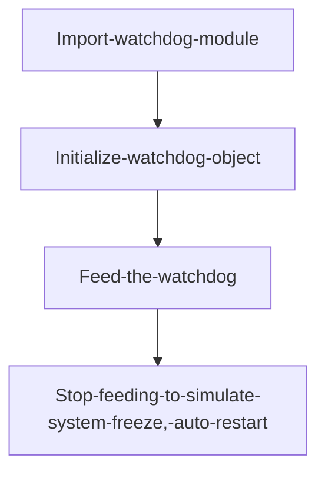
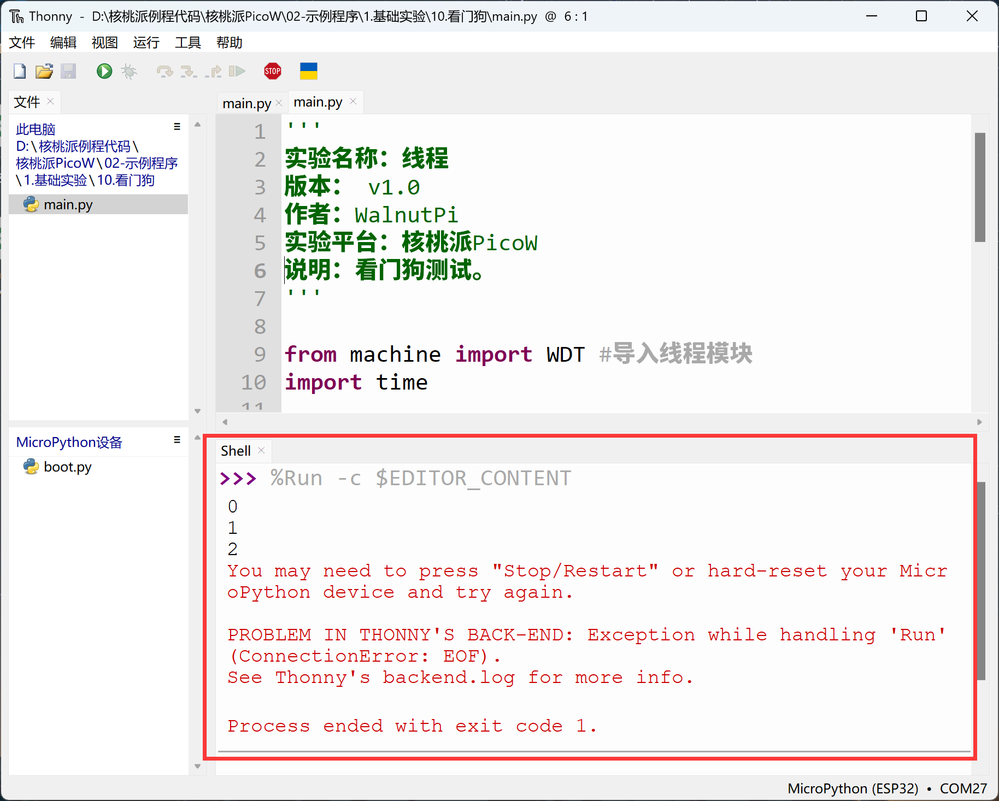

# Watchdog

## Introduction
Any code can crash during execution. This is where watchdog code comes in. A watchdog is used to automatically restart the system when an application crashes and enters an unrecoverable state. Once started, it cannot be stopped or reconfigured in any way. After enabling, the application must periodically "feed" the watchdog to prevent it from expiring and resetting the system.

## Objective
Test the watchdog auto-reset function.

## Experiment Explanation

The WalnutPi PicoW's MicroPython firmware already integrates the WDT (Watchdog Timer) module. We can use it directly.

## WDT Object

### Constructor
```python
wdt = WDT(timeout=5000)
```
Create a watchdog object.

- `timeout` : Watchdog feeding period, in ms. Default 5000ms.

### Usage

```python
wdt.feed()
```
Feed the watchdog. This instruction must be executed within the time specified when building the watchdog object.

<br></br>

For more usage, refer to the official documentation:<br></br>
https://docs.micropython.org/en/latest/library/machine.WDT.html

The programming flow is as follows:



## Reference Code

```python
'''
Experiment Name: Watchdog
Version: v1.0
Author: WalnutPi
Platform: WalnutPi PicoW
Description: Watchdog test.
'''

from machine import WDT #Import watchdog module
import time

#Build watchdog object, feeding period within 2 seconds.
wdt = WDT(timeout=2000)


#Feed the watchdog every 1 second, execute 3 times.
for i in range(3):

    time.sleep(1)
    print(i)

    wdt.feed() #Feed the watchdog

#Stop feeding, system will restart.
while True:
    pass
```

## Experimental Results

Run the code and you can see the serial terminal prints 3 messages, then automatically restarts.



With a watchdog, the development board can automatically restart when it freezes.
