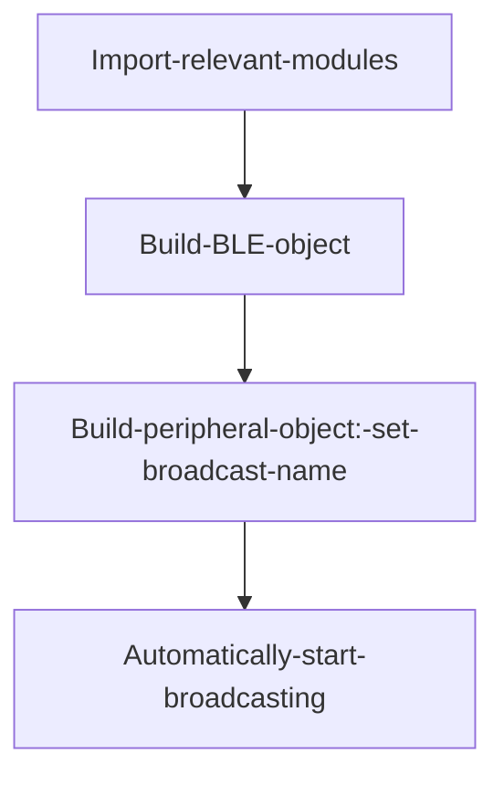
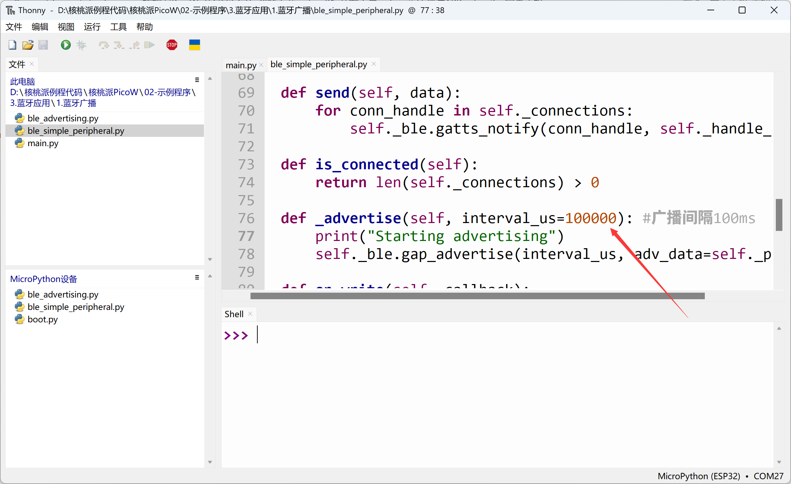
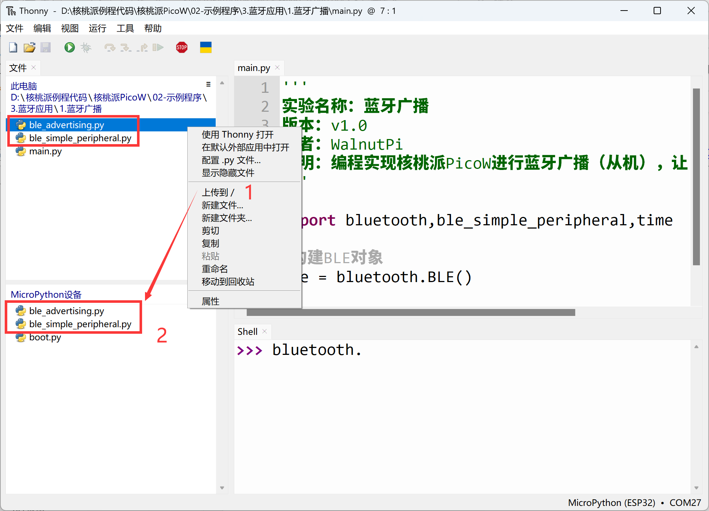
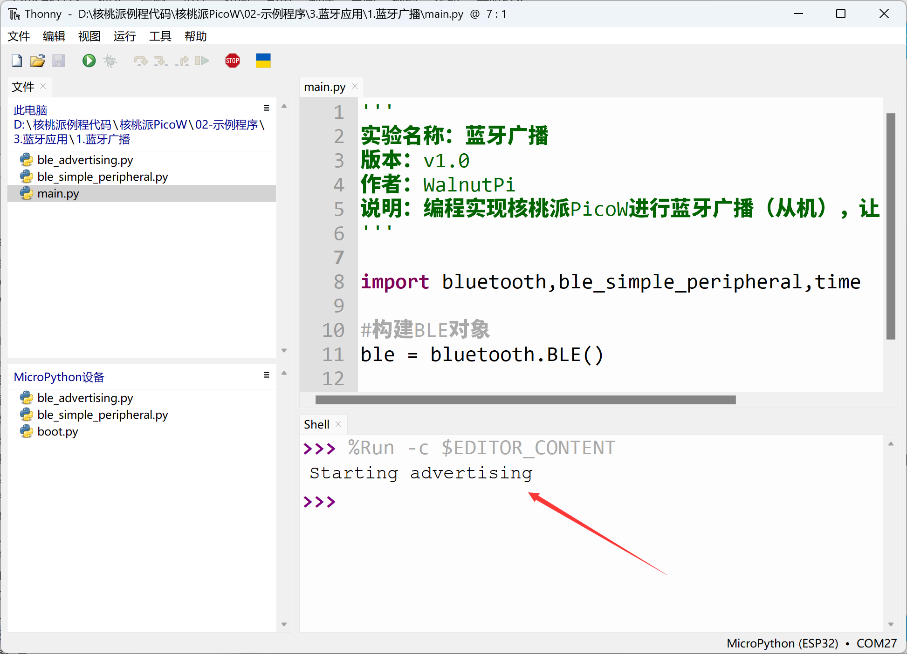
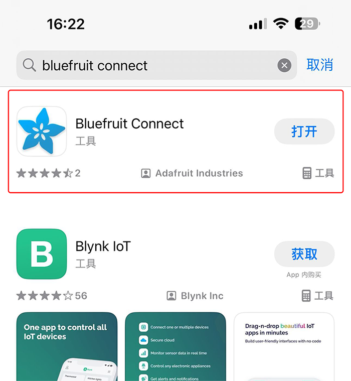
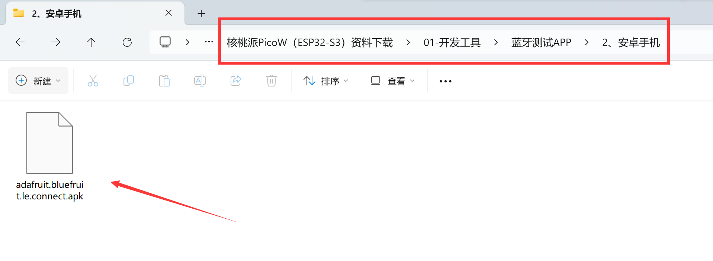
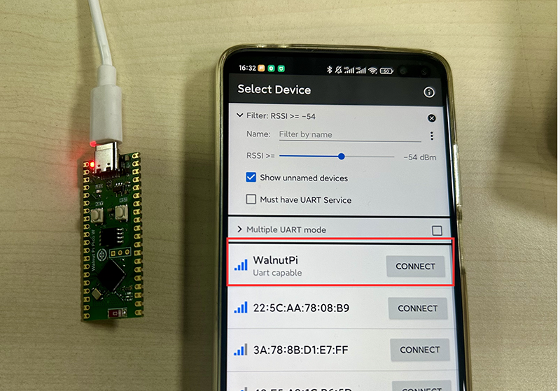

# Bluetooth Broadcasting

## Introduction
BLE (Bluetooth Low Energy) plays a very important role in IoT. Compared to WiFi connections, BLE can achieve ultra-low power consumption and fast connections. By connecting to smartphones and then to the internet, BLE has become a popular choice for many smart products — smart wristbands being one example.

Like traditional Bluetooth speakers, to connect, the phone must first discover the BLE device's broadcast signal. In this section we'll learn how BLE broadcasting works.


## Objective
Programming the WalnutPi PicoW to perform Bluetooth broadcasting (as a peripheral), allowing a phone (central) to discover the device.

## Experiment Explanation

Typically, a Bluetooth device (BLE peripheral) must emit a broadcast signal for a phone (BLE central) to discover it and initiate a connection.

The WalnutPi PicoW's MicroPython firmware includes the built-in bluetooth library and provides additional BLE Python library files. Developers can use simple module functions to conveniently implement various Bluetooth wireless applications on the WalnutPi PicoW.


Let's look at the BLE constructor and usage methods.

## BLE Object

### Constructor
```python
import bluetooth

ble = bluetooth.BLE()
```
Build a BLE object.

## Bluetooth Peripheral Object

### Constructor

```python
import ble_simple_peripheral

p = ble_simple_peripheral.BLESimplePeripheral(ble,name='WalnutPi')
```
Build a Bluetooth peripheral object.
- `ble`: The BLE object built previously;
- `name`: Broadcast name, supports up to 8 characters.


### Usage

After building the peripheral object, Bluetooth broadcasting starts automatically.

<br></br>

For more usage, refer to the official documentation:<br></br>
https://docs.micropython.org/en/latest/library/bluetooth.html

From the above, we can see that MicroPython makes BLE broadcasting very simple through module encapsulation. The code flow is as follows:



## Reference Code

```python
'''
Experiment Name: Bluetooth Broadcasting
Version: v1.0
Author: WalnutPi
Description: Program the WalnutPi PicoW to perform Bluetooth broadcasting (peripheral), allowing a phone to discover the device.
'''

import bluetooth,ble_simple_peripheral,time

#Build BLE object
ble = bluetooth.BLE()

#Build peripheral object, broadcast name is WalnutPi, name supports up to 8 characters.
p = ble_simple_peripheral.BLESimplePeripheral(ble,name='WalnutPi')
```

In the `ble_simple_peripheral.py` code, the default broadcast interval is 500000us, i.e., 500ms. This can be changed to 100ms to make it easier for phones to discover the device. **Shorter broadcast intervals make the device easier to discover, but consume more power.**



## Experimental Results

Since this example depends on Bluetooth-related libraries, you need to use Thonny to upload the supporting Python library files from the example source code to the WalnutPi PicoW development board:



Run the main program `main.py`, and the WalnutPi PicoW will start Bluetooth broadcasting:



<br></br>

**Phone APP Testing:**

Since BLE is not classic Bluetooth protocol, it cannot be directly searched on phones. You need to install an app for testing. We recommend Adafruit's **bluefruit connect** app.

- iOS Installation:

Search "bluefruit connect" in the App Store and install directly.



<br></br>

- Android Installation:

Install using the APK provided in the WalnutPi resources package, located in **开发工具-->蓝牙测试APP -->安卓手机** directory:



After installing, open the app (this tutorial is based on Android testing). You can see the Bluetooth broadcast signal emitted by the WalnutPi PicoW.



This example successfully implements Bluetooth broadcasting on the WalnutPi PicoW. In later chapters, we'll cover how to connect and exchange data over Bluetooth.
