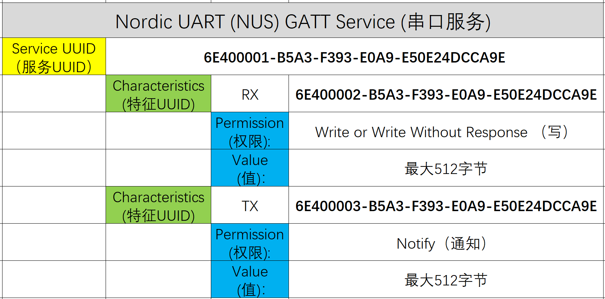
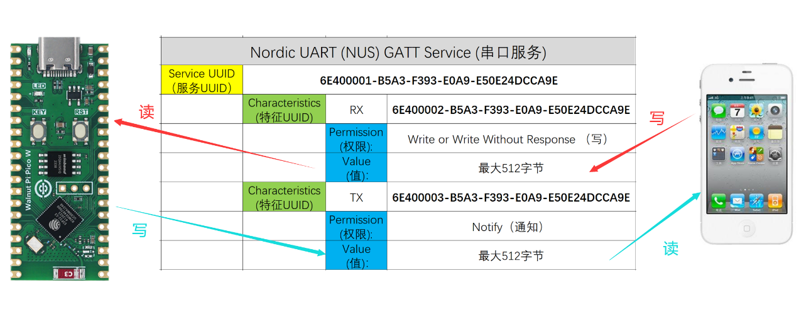
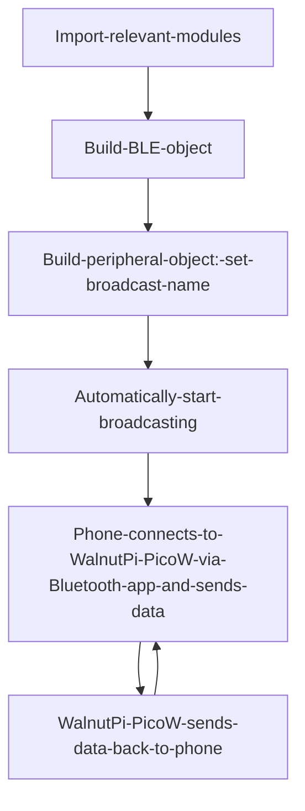
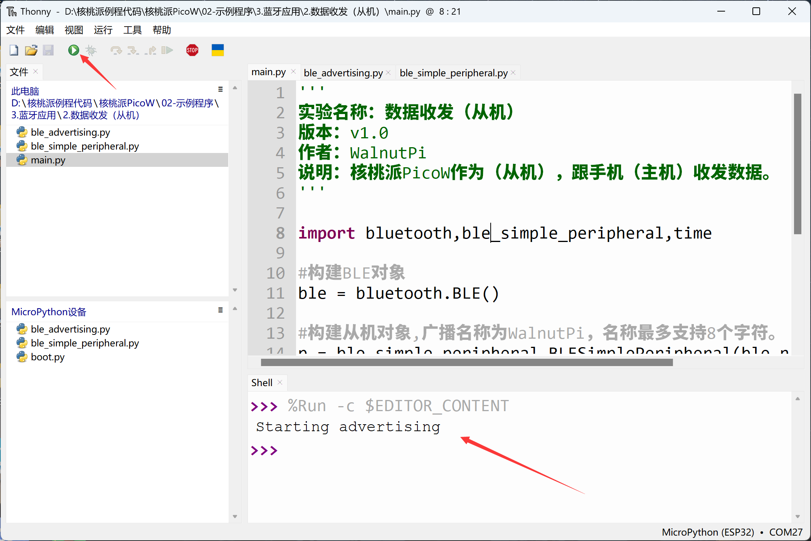
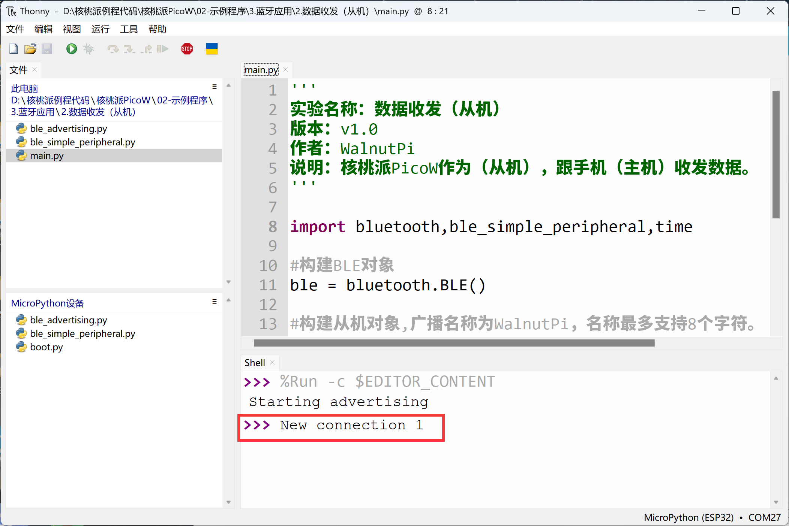
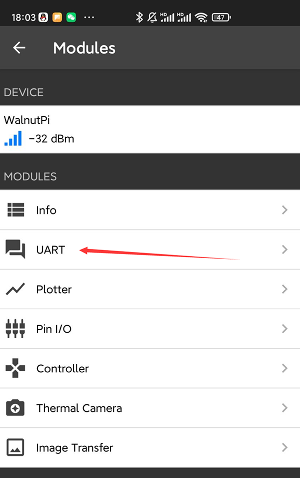
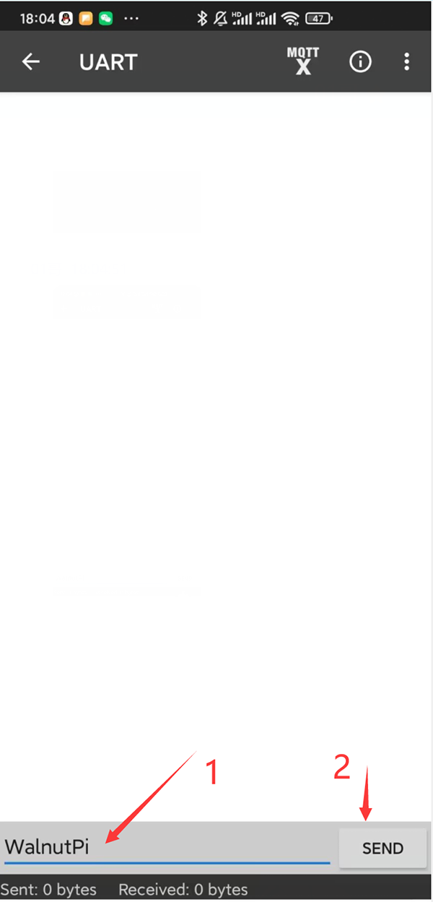
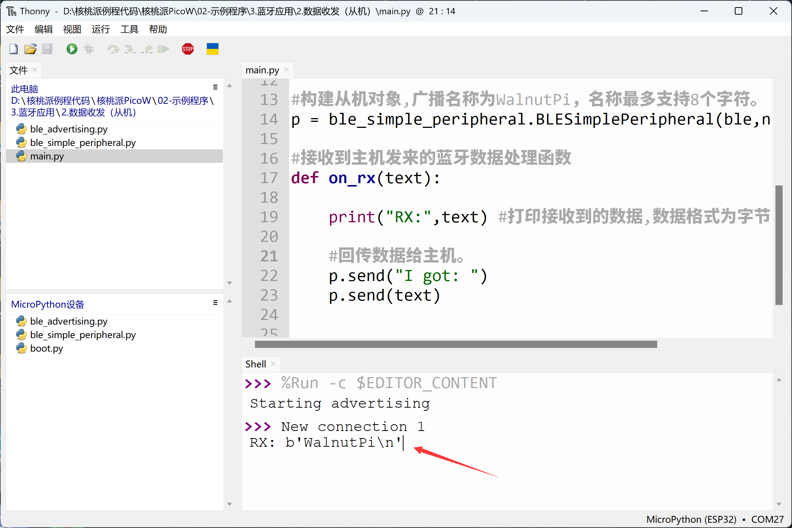
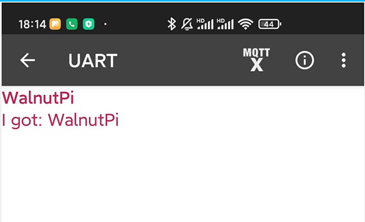

# Bluetooth Peripheral (Data Transceiver)

## Introduction
BLE (Bluetooth Low Energy) data transmission and reception (UART service) is perhaps the most versatile function and service. Virtually all BLE data transmission devices use the UART service. Note that "UART" here doesn't refer to hardware serial port but rather a BLE service. With it, phone apps and Bluetooth devices can establish data communication. Let's get started right away.


## Objective
Program the WalnutPi PicoW as a peripheral to send and receive data with a phone (central).

## Experiment Explanation

In this experiment, the WalnutPi PicoW acts as the peripheral and the phone acts as the central. Communication between Bluetooth devices and phones primarily relies on "services." Simply put, a service is a numbered black box.

**<font color='#00c0ff' size='4'>The Black Box Story:</font>**

The Bluetooth device and the phone agree on a black box named "AAA." After establishing a connection, this black box only allows the phone to write data, and the Bluetooth device reads data from it. When the phone writes data "123" to the black box, the Bluetooth device reads it from the black box — this completes the process of sending data from the phone to the Bluetooth device!

Conversely, another black box named "BBB" is agreed upon, with rules opposite to "AAA" — it allows the Bluetooth device to write data and the phone to read data. This completes the process of sending data from the Bluetooth device to the phone.

Thus, various types of black boxes make up the entire Bluetooth service system. Later, to ensure compatibility between Bluetooth devices from different manufacturers, a series of fixed-number black boxes was established, along with many detailed specifications — this became the Bluetooth standard protocol.

The UART service used in this section follows the UART protocol. Let's take this as an example to explain the actual communication process between a phone and a BLE device. First, look at the table below. The WalnutPi PicoW first defines the Service UUID for the serial service in code, with a length of 128 bits (there are 16-bit and 128-bit standards): 6E400001-B5A3-F393-E0A9-E50E24DCCA9E. Under this service UUID, there are 2 characteristic values: RX and TX. These characteristics are also identified by 128-bit UUIDs. Each characteristic has permissions and a value — permissions determine read and write (notification), and value is the data to be written and read.



In the serial service, the phone and BLE device communicate through the protocol above, as shown below:



At this point, we're discussing at the application layer. Most Bluetooth chip manufacturers provide Bluetooth C SDK development protocol stacks that handle the underlying layers including RF transmission, making development simpler. The emergence of MicroPython has been a game-changer — once you understand the principles, you can use object-oriented programming with just a few lines of code to implement Bluetooth data communication.

## BLE Object

### Constructor
```python
import bluetooth

ble = bluetooth.BLE()
```
Build a BLE object.

## Bluetooth Peripheral Object

### Constructor

```python
import ble_simple_peripheral

p = ble_simple_peripheral.BLESimplePeripheral(ble,name='WalnutPi')
```
Build a Bluetooth peripheral object. Broadcasting starts automatically after building.
- `ble`: The BLE object built previously;
- `name`: Broadcast name, supports up to 8 characters.

### Usage

```python
p.on_write(callback)
```
Peripheral receive callback function. When data is received from the phone, it enters the callback function.

- `callback`: Callback function;

<br></br>

```python
p.send(data)
```
Send data to the phone (central).

- `data`: Content to send.


For more usage, refer to the official documentation:<br></br>
https://docs.micropython.org/en/latest/library/bluetooth.html

The code flow is as follows:



## Reference Code

```python
'''
Experiment Name: Data Transceiver (Peripheral)
Version: v1.0
Author: WalnutPi
Description: WalnutPi PicoW as peripheral, sends and receives data with phone (central).
'''

import bluetooth,ble_simple_peripheral,time

#Build BLE object
ble = bluetooth.BLE()

#Build peripheral object, broadcast name is WalnutPi, name supports up to 8 characters.
p = ble_simple_peripheral.BLESimplePeripheral(ble,name='WalnutPi')

#Bluetooth data processing function for receiving data from central
def on_rx(text):

    print("RX:",text) #Print received data, format is byte array.

    #Send data back to central.
    p.send("I got: ")
    p.send(text)


#Peripheral receive callback function, enters on_rx function when data is received.
p.on_write(on_rx)
```

## Experimental Results

Since this example depends on Bluetooth-related libraries, you need to use Thonny to upload the supporting Python library files from the example source code to the WalnutPi PicoW development board:


Run the main program `main.py`, and the WalnutPi PicoW starts Bluetooth broadcasting, waiting for phone connection:



<br></br>

**Phone APP Testing:**

Since BLE is not classic Bluetooth protocol, it cannot be directly searched on phones. You need to install an app for testing. We recommend Adafruit's **bluefruit connect** app.

- iOS Installation:

Search "bluefruit connect" in the App Store and install directly.


<br></br>

- Android Installation:

Install using the APK provided in the WalnutPi resources package, located in **开发工具-->蓝牙测试APP -->安卓手机** directory:


After installing, open the app (this tutorial is based on Android testing). You can see the Bluetooth broadcast signal emitted by the WalnutPi PicoW.


Click the **CONNECT** button in the app to connect to the WalnutPi PicoW. After a successful connection, the WalnutPi PicoW terminal will show the new connection:




Several service options appear in the phone app. Select the UART service here:



Now the connection is established and data can be sent and received. Enter the content to send at the bottom of the app and click **SEND**:



You can see the received information printed in the WalnutPi PicoW terminal:



At the same time, the app receives the data sent back by the WalnutPi PicoW:


