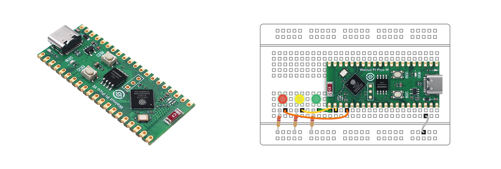

# Directory

### **WalnutPi PicoW Introduction**

- [WalnutPi PicoW](./intro/wpi_picow.md)
- [Downloads](./intro/download.md)

### [**Python3 Basics**](./python_learn.md)

### **Development Environment Setup**

- [Thonny IDE Installation](./getting_start/thonny_ide.md)
- [Serial Driver Installation](./getting_start/driver.md)
- [REPL Serial Interaction](./getting_start/repl.md)
- [File System](./getting_start/file_system.md)
- [Example Testing](./getting_start/demo.md)
- [Offline Code Execution](./getting_start/run_offline.md)
- [Firmware Update](./getting_start/firmware_update.md)

### **Basic Experiments**

- [Lighting Up the First LED](./basic_examples/led.md)
- [Button](./basic_examples/key.md)
- [External Interrupt](./basic_examples/exti.md)
- [Timer](./basic_examples/timer.md)
- [ADC (Voltage Measurement)](./basic_examples/adc.md)
- [PWM (Buzzer)](./basic_examples/pwm_beep.md)
- [UART (Serial Communication)](./basic_examples/uart.md)
- [Thread](./basic_examples/thread.md)
- [Watchdog](./basic_examples/watchdog.md)
- [File Read/Write](./basic_examples/file.md)

### **WiFi Applications**

- [Connecting to Wireless Router](./wifi/connect_wifi.md)
- [Socket Communication](./wifi/socket.md)
- [MQTT Communication](./wifi/mqtt.md)

### **Bluetooth Applications**

- [Bluetooth Broadcasting](./bluetooth/broadcast.md)
- [Bluetooth Peripheral (Data Transceiver)](./bluetooth/peripheral.md)

### **Sensors**

- [Temperature Sensor (DS18B20)](./sensor/ds18b20.md)
- [Temperature & Humidity Sensor (DHT11)](./sensor/dht11.md)
- [Human Body Induction Sensor](./sensor/human_induction.md)
- [Photosensitive Sensor](./sensor/photosensitive.md)
- [Ultrasonic Distance Measurement (HC-SR04)](./sensor/hcsr04.md)
- [Atmospheric Pressure Sensor (BMP280)](./sensor/bmp280.md)
- [6-Axis Accelerometer (MPU6050)](./sensor/mpu6050.md)
- [Infrared Temperature Measurement (MLX90614)](./sensor/mlx90614.md)

### **Expansion Modules**

- [Relay](./module/relay.md)
- [Servo](./module/servo.md)
- [Neopixel LED](./module/neopixel.md)

### [**Update Notes**](./update.md)
