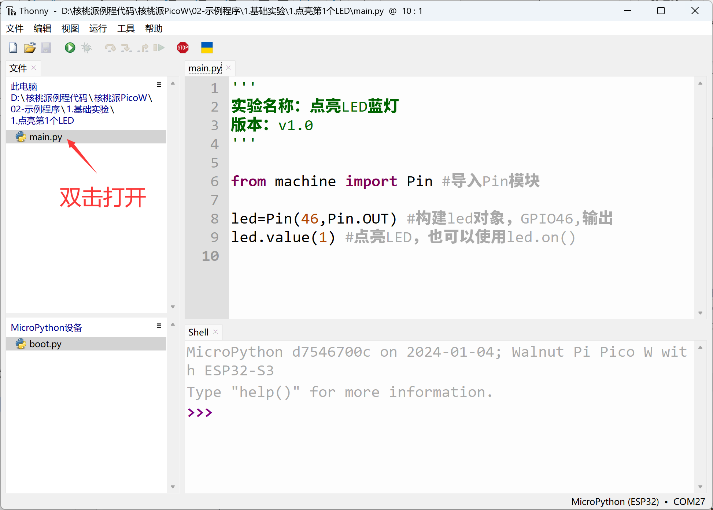
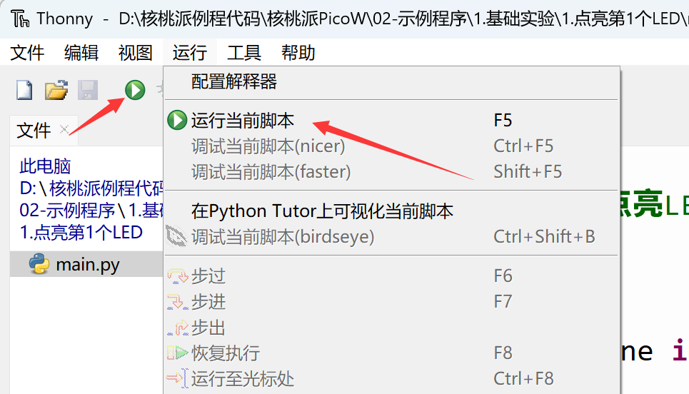
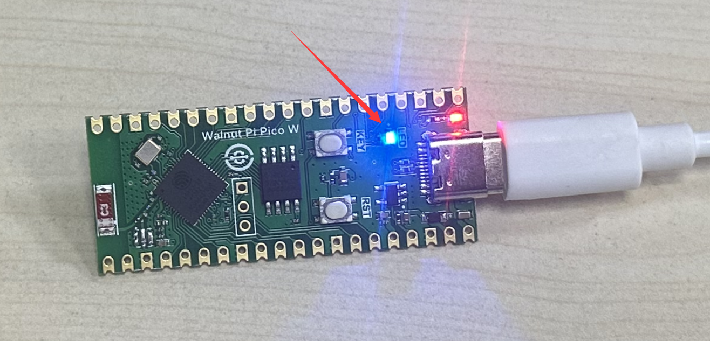

# Example Testing

We have already installed Thonny IDE. Now let's use the simplest approach to do an experiment lighting up the blue LED. Don't worry about understanding the code yet — later chapters will explain it. The main goal here is to familiarize you with how to use the MicroPython programming software Thonny and understand its principles. Here's the procedure:

Connect the development board. In the local file area at the top left of Thonny, locate the `main.py` file under **WalnutPi PicoW (ESP32-S3) Resources Download\02-Example Programs\1.Basic Experiments\1.Light Up the First LED**. Double-click to open it and you'll see the relevant code appear in the programming area on the right.




```python
'''
Experiment Name: Light Up the Blue LED
Version: v1.0
'''

from machine import Pin #Import Pin module

led=Pin(46,Pin.OUT) #Build led object, GPIO46, output
led.value(1) #Light up LED, or use led.on()

```

Click **Run — Run Current Script** or directly click the green button:



You can see the blue LED on the WalnutPi PicoW development board light up:


