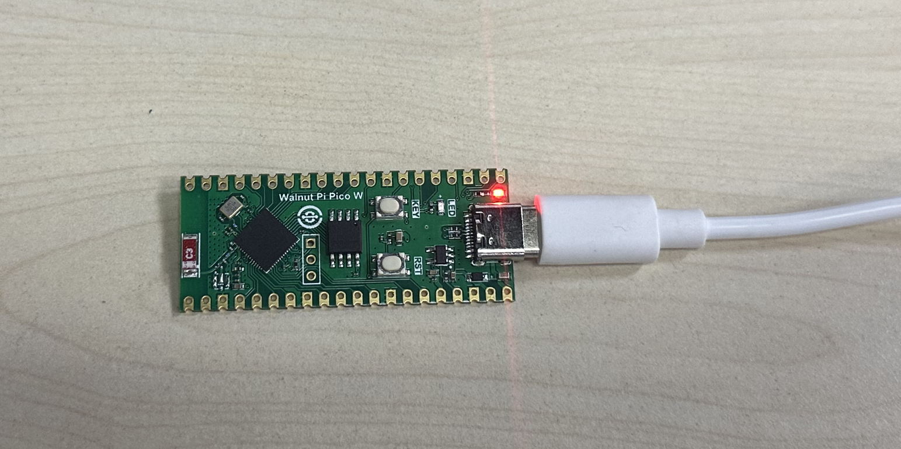

# Serial Driver Installation

The WalnutPi PicoW (ESP32-S3) uses USB virtual serial port for programming and debugging, so the main step is installing the USB-to-Serial driver. Connect the WalnutPi PicoW development board to your computer via a Type-C data cable:

We recommend using Windows 10 or above. In most cases, the driver will be installed automatically. Right-click **"My Computer — Properties — Device Manager"**: If a COM port number appears, the installation was successful, as shown below.

