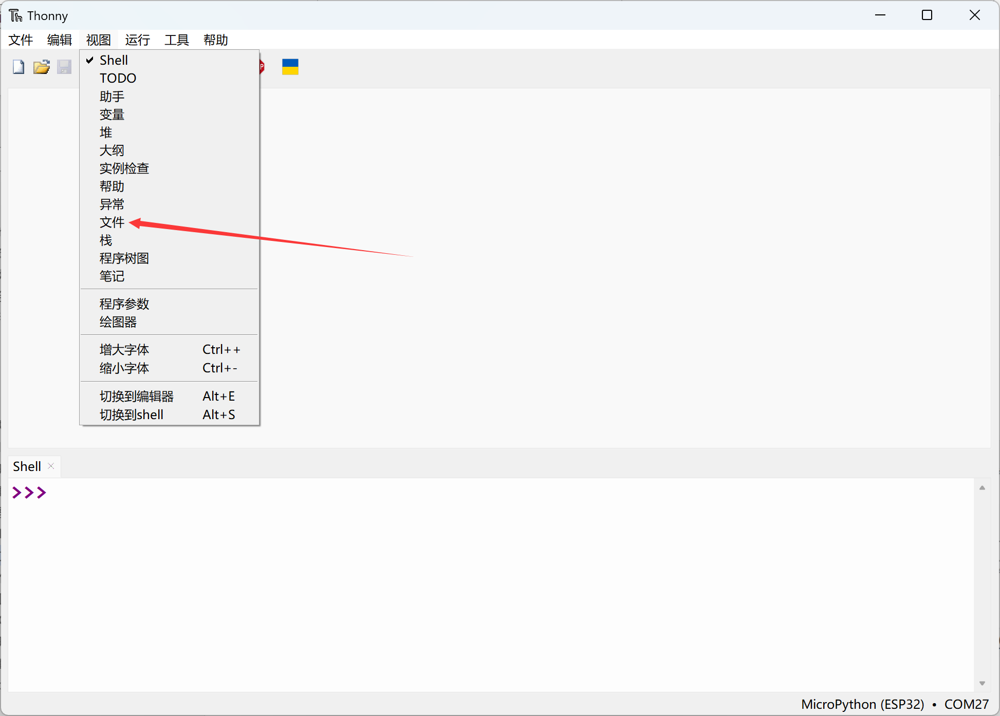
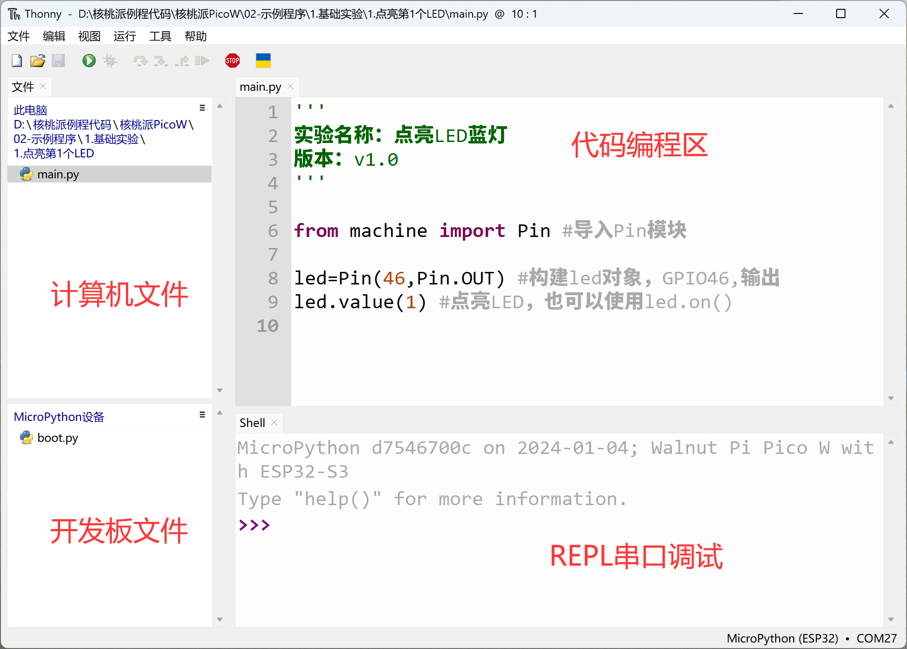
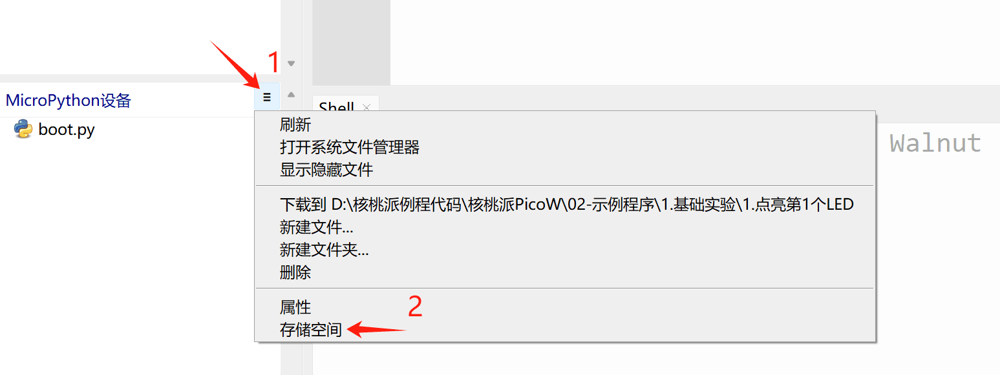
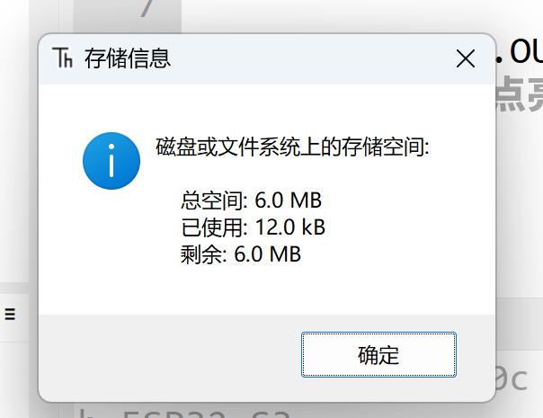
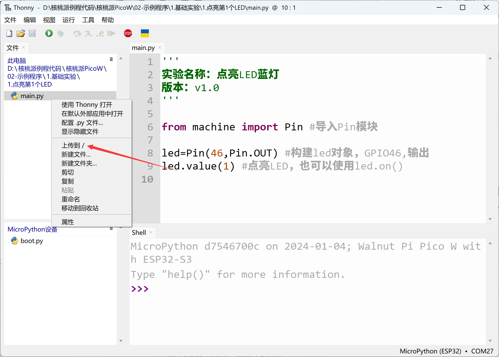

# File System

The WalnutPi PicoW has a built-in file system, which can be simply understood as Python script files that run after power-on. This can be easily browsed, read, and written using Thonny IDE's file functionality.

Select View — Files:

You can see real-time file browsing windows for both local and development board files on the left:

Click the expand bar on the right side of the MicroPython device, select storage space, and you can see the total and remaining space on the development board. This space is used to store code, images, and other files. **(The WalnutPi PicoW has 8MB of Flash; the first 2MB is used for firmware, leaving approximately 6MB of space)**

Right-click a local file — Upload to / to send the file to the development board. You can also download files from the development board to your local machine, which is very convenient.

::::tip Note
By default, MicroPython runs `boot.py` first, then `main.py` at power-on. Generally, placing the main program code in `main.py` better conforms to MicroPython usage conventions!
::::
