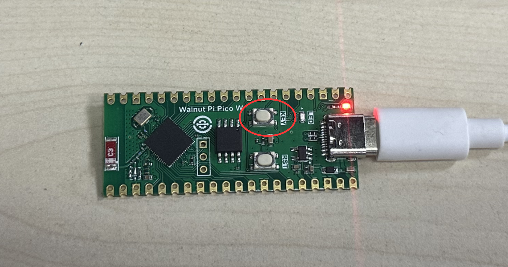
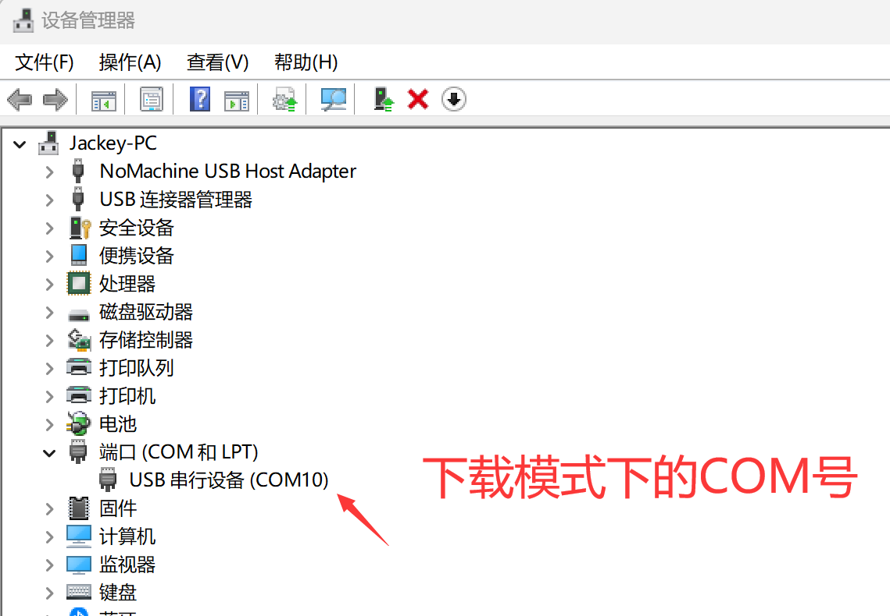
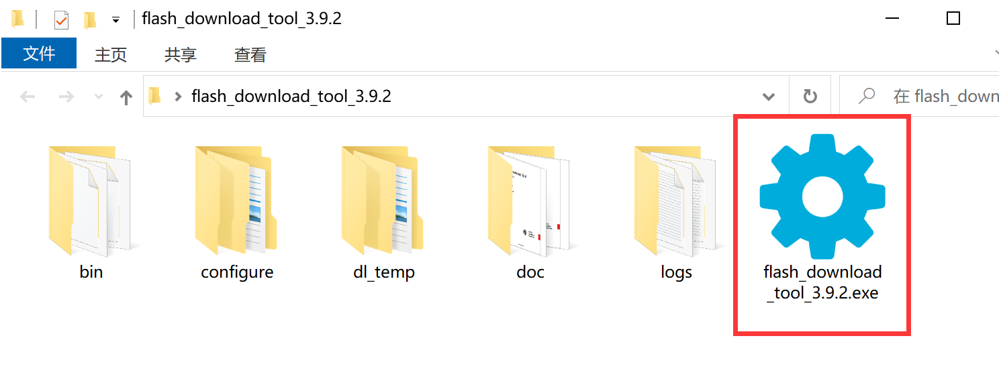
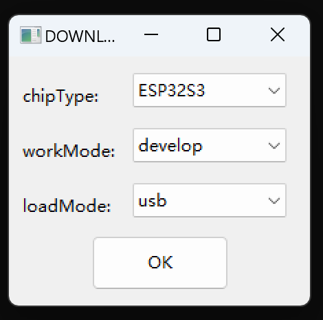
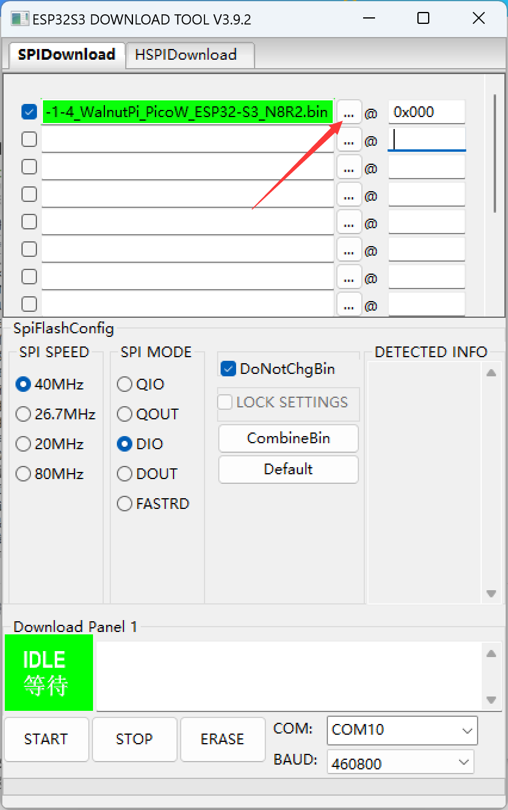
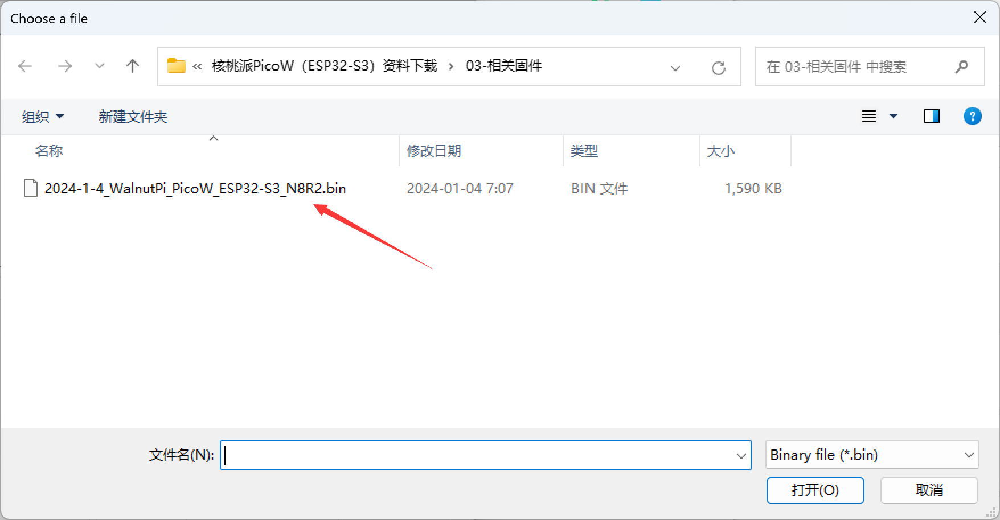
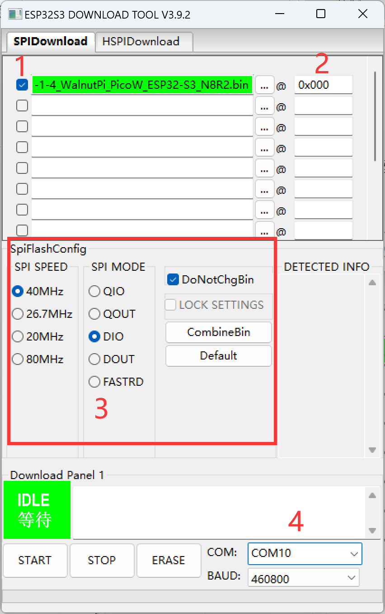
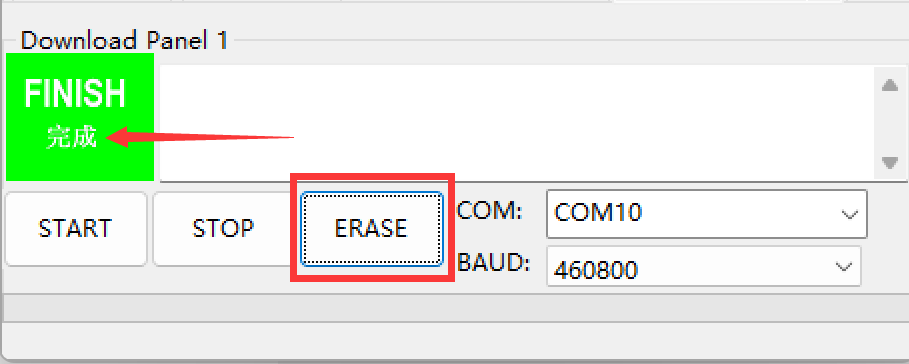
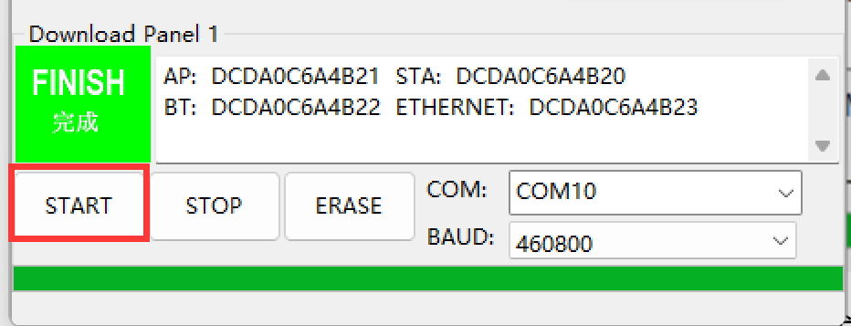

# Firmware Update

The WalnutPi PicoW development board comes with firmware pre-programmed at the factory. Firmware update refers to reprogramming the factory file onto the development board or upgrading the firmware.

Entering download mode on the WalnutPi PicoW:
Press and hold the KEY button on the development board while plugging in the Type-C cable to enter download mode:

At this point, Device Manager will show a new COM port number, which is usually different from the COM port number used during development:

Use the official software provided by Espressif for programming. Navigate to: **WalnutPi PicoW (ESP32-S3) Resources Download\01-Development Tools\Firmware Update Tool\flash_download_tools_v3.9.2\flash_download_tools_v3.9.2.exe** and double-click to open.

Select the chip as **ESP32-S3, develop developer mode, USB mode** then click OK:

Select the firmware at the position indicated by the arrow. The firmware is located in **Resources Package--Relevant Firmware** folder:

Refer to the image below for download configuration. Note the following items:

1. Must be checked — downloading without checking will not work properly;

2. Address: 0x000;

3. Configure as shown in the image;

4. Select your computer's COM port number in download mode.

After configuration, first click the "ERASE" button to erase the module's content. Click the "ERASE" button at the bottom of the software. After successful erasure, the green box on the left will show "完成" (Complete).

After successful erasure, click the "START" button to begin programming. When programming is complete, the green box on the left will show "完成" (Complete). Remember to click the "stop" button or close the software to release the serial port afterward.

After programming, reset the development board for the changes to take effect.
