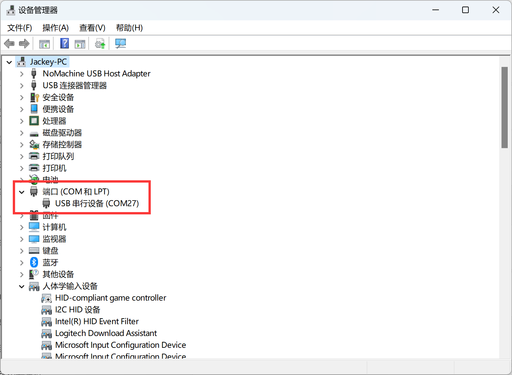
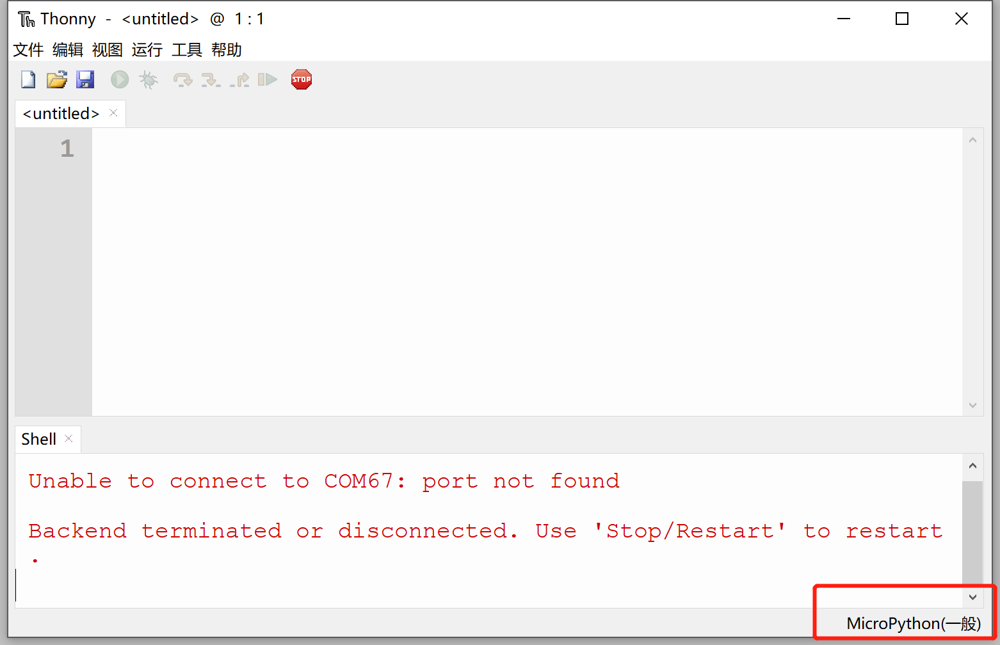
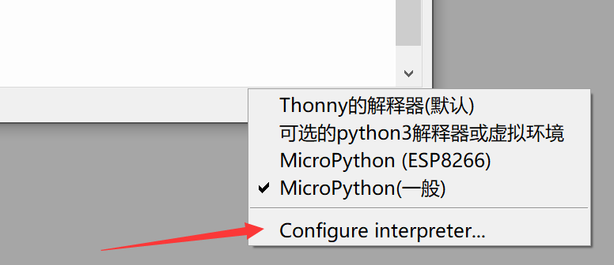
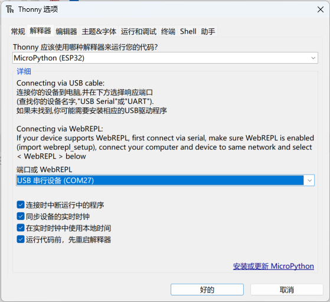
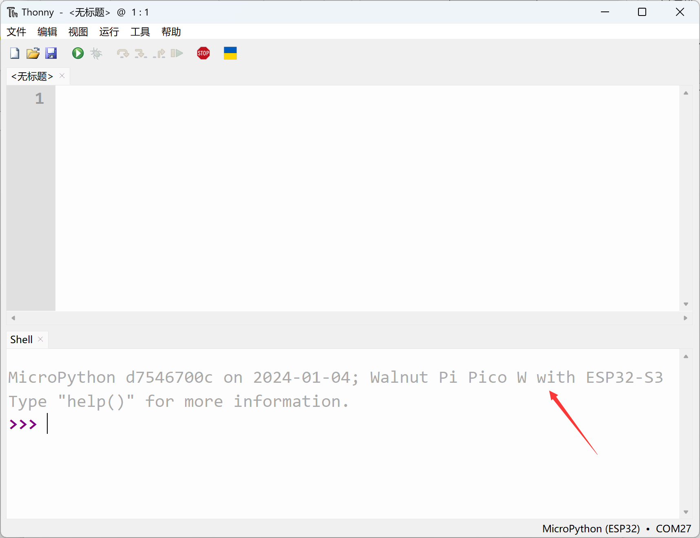
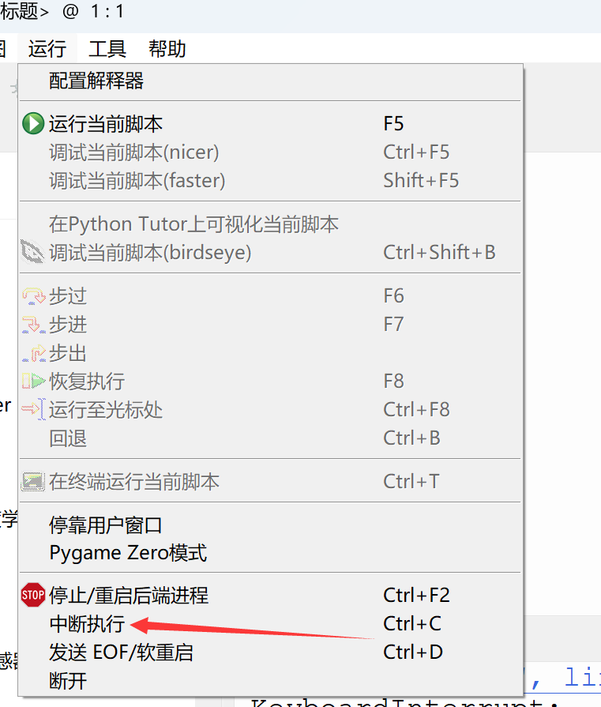
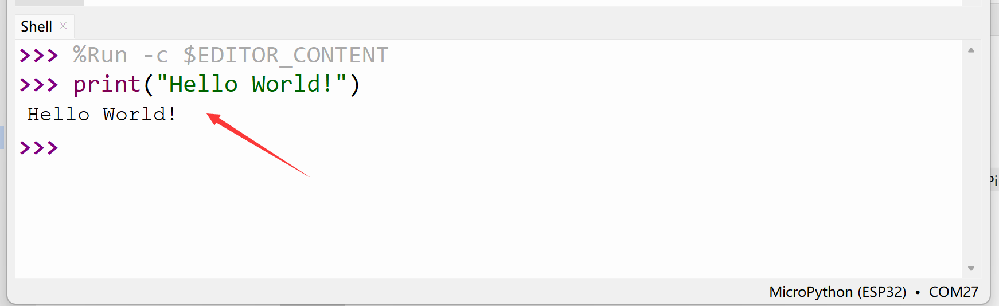
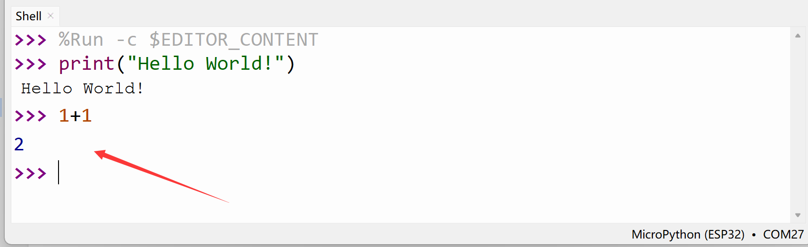

# REPL Serial Interactive Debugging

The MicroPython firmware on the WalnutPi PicoW (ESP32-S3) integrates an interactive interpreter called REPL [Read-Eval-Print-Loop]. Developers can directly debug the development board through the serial terminal.

Connect the development board to the computer. From **My Computer — Properties — Device Manager**, find the current COM port number of the development board, which is COM27 here.

Open Thonny and connect the development board to the computer. Click the bottom right corner:

In the popup list, select: Configure interpreter

Select "MicroPython (ESP32)" and the COM port number corresponding to the current development board, then click confirm.

After a successful connection, you can see firmware-related information in the shell (serial terminal):

If the firmware information doesn't appear after connecting the serial port, it might be because there is code running on the development board that is blocking the REPL. In this case, click **Run — Interrupt Execution** in the menu bar to interrupt the running program.

Now let's test REPL in the terminal:

Enter `print("Hello World!")` in the terminal and press Enter. You can see the characters "Hello World!" are printed:

Enter `1+1` and press Enter:

Another powerful feature of REPL is printing error codes for debugging. When code runs and an error occurs, the error information will be printed through the REPL.
