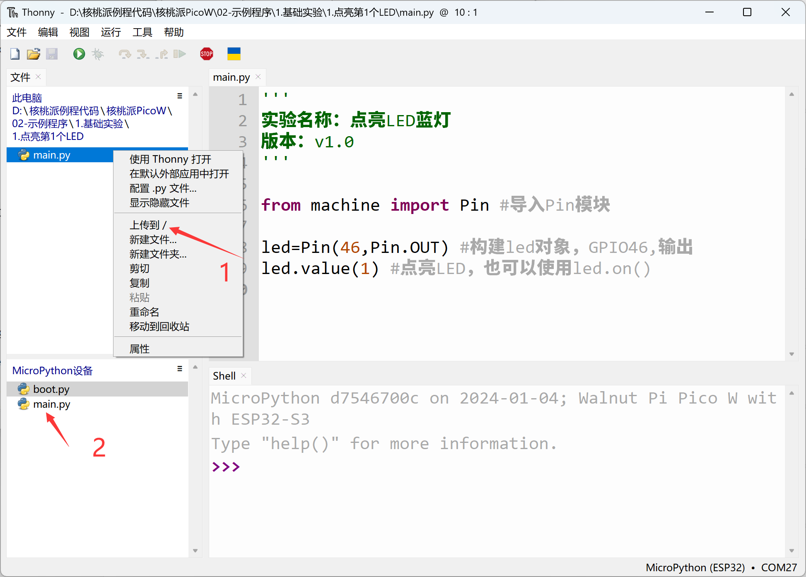

# Offline Code Execution

In the previous section, running functional code directly in the IDE saves it to the development board's RAM (memory), which is convenient for debugging but is lost when power is removed. So how do we make the development board run our code on power-up? Here's the method:

The MicroPython mechanism is: on power-up, it first runs a file named `boot.py` by default, then runs `main.py`. If there is no `boot.py`, it directly runs `main.py`.

**boot.py: Generally used for configuring initialization parameters (optional);**

**main.py: Main program.**

That means we just need to send the code as a `main.py` file to the development board, and the board will run the program automatically on power-up.

Send the LED example's `main.py` to the development board:

Then close the IDE and press the WalnutPi PicoW's reset button. You can see the blue LED on the WalnutPi PicoW lights up after each reset. The code is now running offline:

Simply rename your code to `main.py` and send it to the development board to achieve automatic offline execution on power-up.
