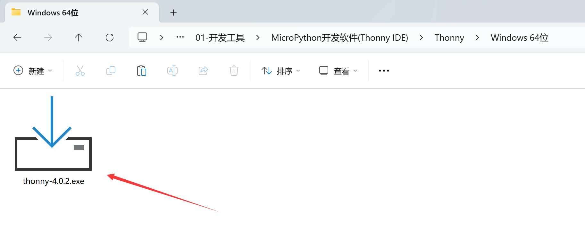
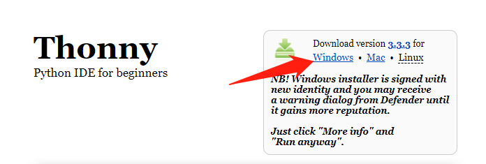
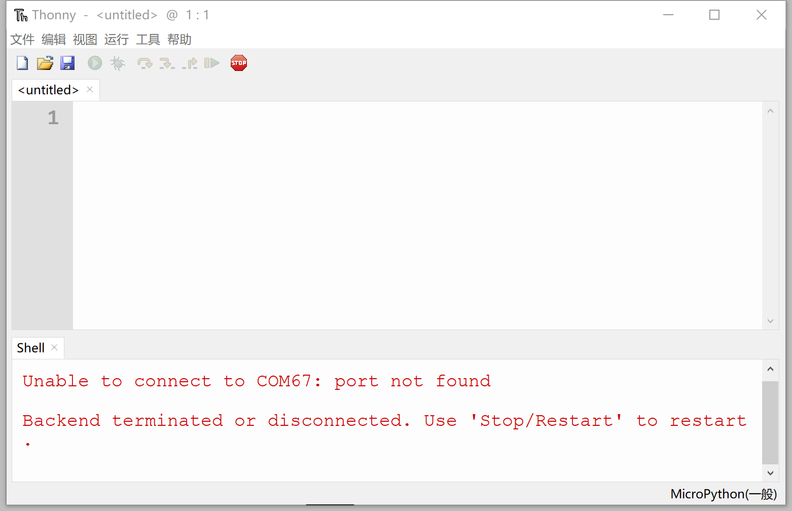

# Thonny IDE Installation

Development software refers to the tools we use to write code. Python has many editors available. If you're already proficient in Python or have been developing with Python, you can directly use your preferred IDE. If you're a beginner or prefer simplicity and quick application, we recommend using the officially recommended Thonny Python IDE.

Thonny IDE is open-source software designed with a minimalist approach and excellent MicroPython compatibility. It supports Windows, Mac OS, Linux, and Raspberry Pi. Being open-source, the software iterates quickly and its features continue to mature. Installation instructions are as follows:

The software can be found in the **WalnutPi PicoW (ESP32-S3) Resources Download\01-Development Tools\MicroPython IDE (Thonny)\Thonny** directory. A Windows installer is provided by default.

You can also download the latest version from https://thonny.org/ — select your development platform for download and installation (choose Windows here!):

After opening, follow the prompts to install. If you can't find the software on the desktop after installation, search for "thonny" in the installation path or system search bar. Open the software as shown below — installation is now complete.

