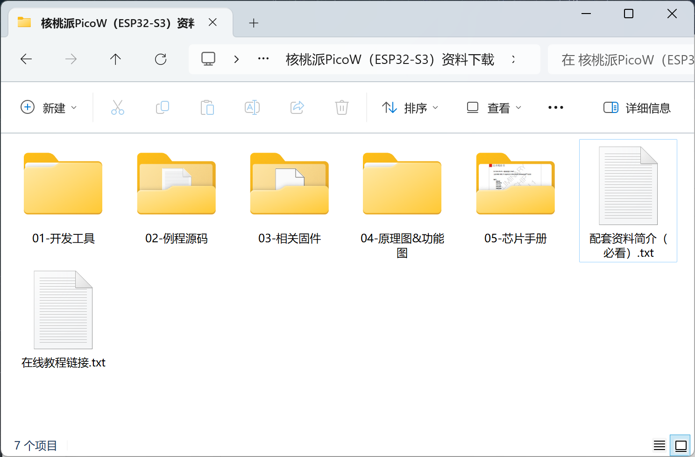
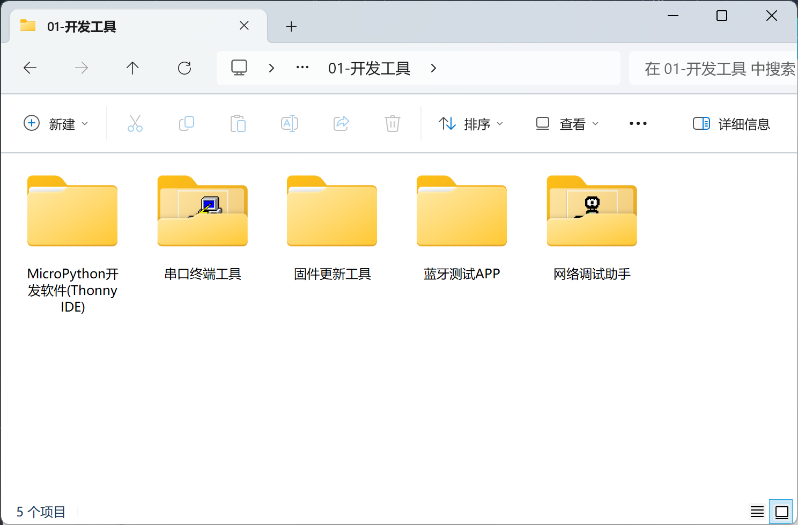
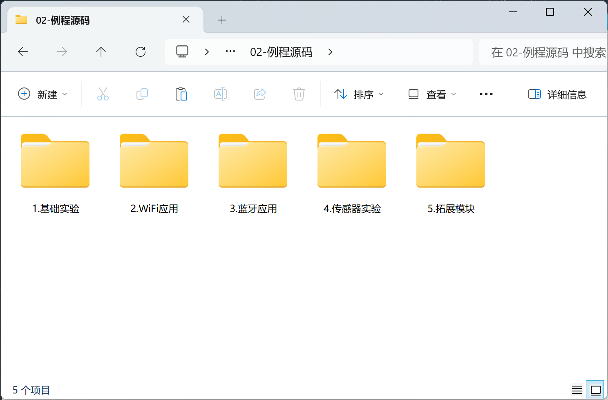
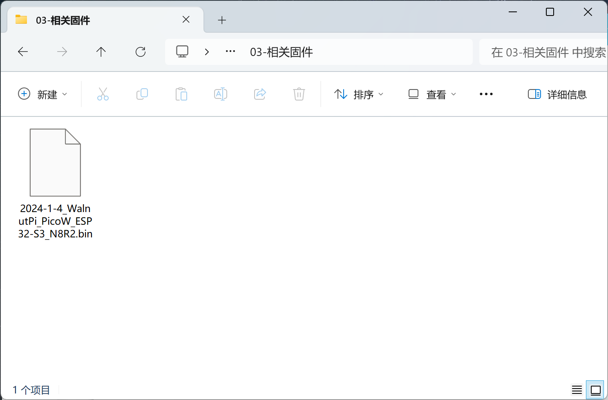
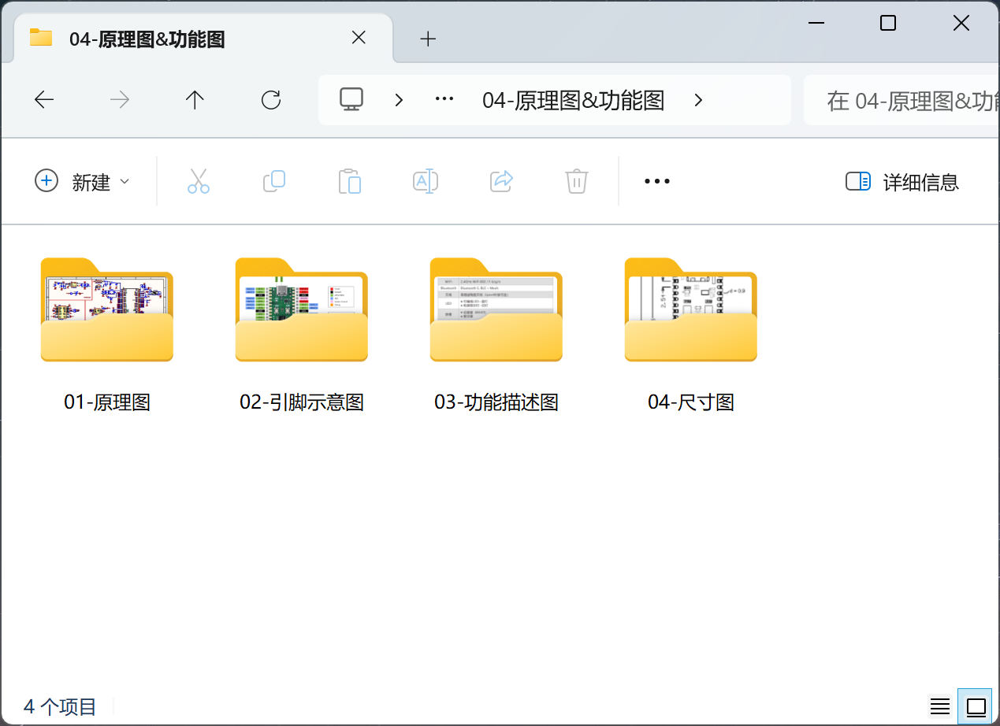
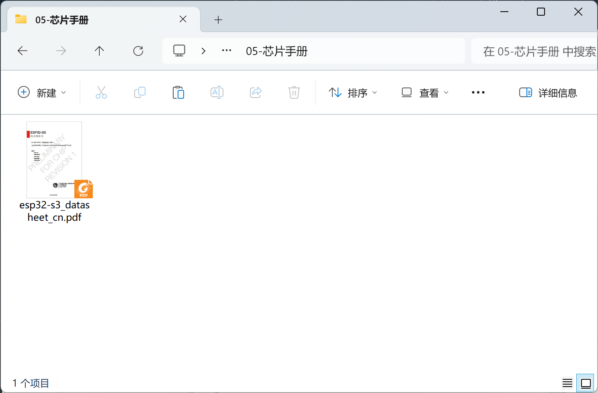

# Downloads

Supporting software, source code, schematics, chip manuals, etc. for the WalnutPi PicoW tutorial series.

## Download Methods

### Baidu Netdisk Download

- Baidu Netdisk link: https://pan.baidu.com/s/1zShpnKu_Nnm6CSix_XlGXA?pwd=WPKJ
- Extraction code: **WPKJ**

### QQ Group File Download

WalnutPi Open Source Support Group: **677173708**

::::tip Note
Forward group files to your own device or another QQ account in the group for high-speed download.
::::

## Resource Introduction

### Development Tools

Development software and related drivers.

### Example Source Code

All source code for this online tutorial.

### Firmware

Development board firmware for upgrading and reflashing.

### Schematics and Diagrams

Development board schematics and interface documentation images.

### Chip Manuals

Main IC manuals.

