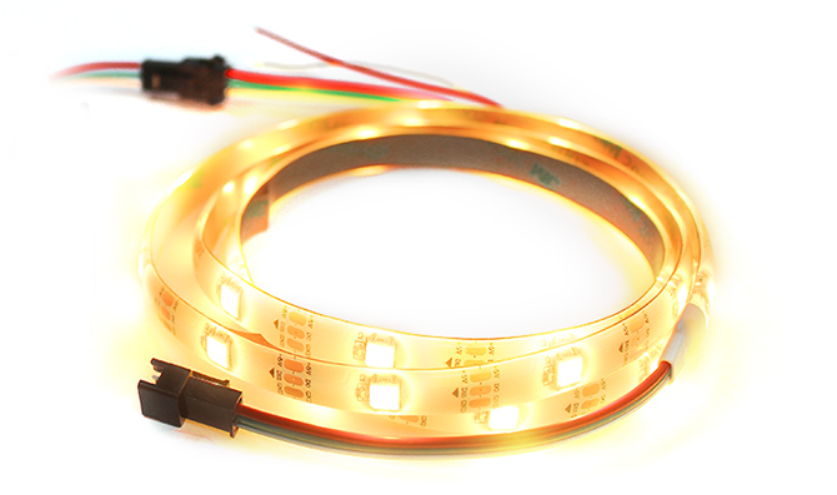
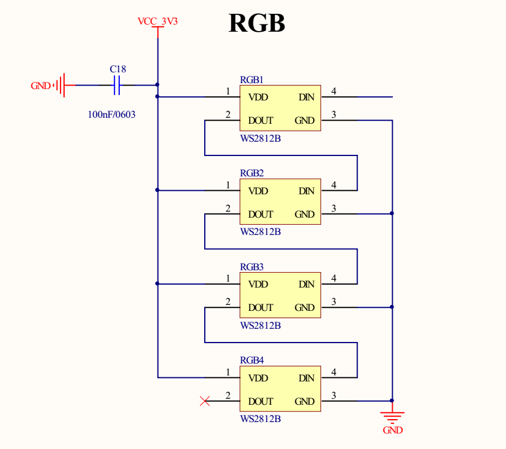
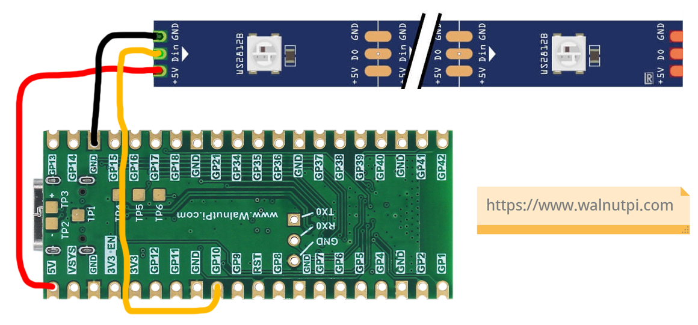
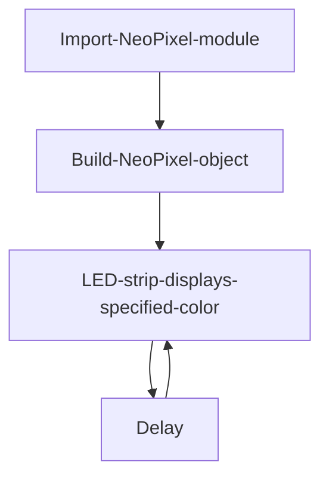
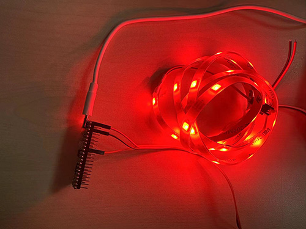
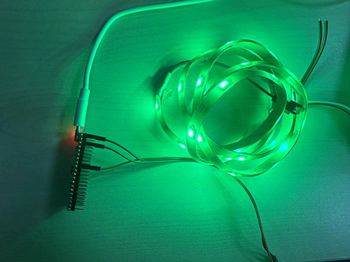
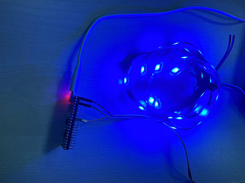
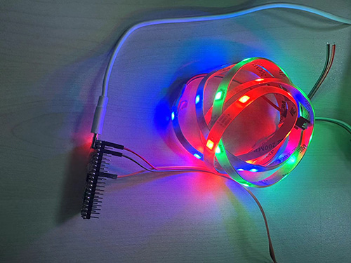

# Neopixel LED Strip

## Introduction
RGB LED strips are a type of colorful lighting. The long LED strips and LED color displays we see are all composed of individual LED beads. In this chapter, we'll program the control of an RGB LED strip, which can be used for home decoration and festive atmosphere scenarios.

## Objective
Program the LED strip to cyclically display red (RED), green (GREEN), blue (BLUE), and a mix (red, green, blue).

## Experiment Explanation

First, let's introduce the RGB LED strip used in this experiment.



This LED strip has a 3-wire interface, is 1 meter long, and has 30 LED beads. Each bead has a built-in driver IC, model WS2812B, driven by a single bus. Each bead is connected end to end. The strip has a reserved connector at the end for daisy-chaining more strips. This means that, with sufficient power, you can control dozens or even hundreds of beads using just one GPIO pin.



In this experiment, WalnutPi PicoW pin 10 controls the LED strip. Power uses 3.3V or 5V — 5V is recommended for slightly brighter output. **(Most LED beads on the market can be powered by 5V while using 3.3V level IO for control)**



After understanding the wiring, we know that colors are created by mixing different brightness levels of the three basic colors. These three basic colors, in order, are Red, Green, and Blue (RGB). Each color's brightness level ranges from 0-255, where 0 means off and 255 means brightest. For example, (255,0,0) represents red at full brightness. The GPIO port sends this data to the LED strip bead by bead.

The WalnutPi PicoW's MicroPython firmware integrates the NeoPixel LED driver module, suitable for WS2812B-driven LED beads. So we can use it directly. The object description is as follows:


## NeoPixel Object

### Constructor
```python
np = neopixel.NeoPixel(pin, n, bpp=3, timing=1)
```
Build a NeoPixel object.

- `pin`: Control pin; requires the machine.Pin interface.
- `num`: Number of LED beads.
- `bpp`: LED bead type.
    - `3`: RGB LEDs.
    - `4`: RGBW LEDs. Has an additional white LED bead inside.
- `timing`: LED bead type.
    - `0`: 400KHz.
    - `1`: 800KHz (most LED beads use this frequency)


### Usage
```python
np.fill(pixel)
```
Set all LED beads to a specified color.
- `pixel`: Color value, e.g., (255,0,0) for red.

<br></br>

```python
np[i] = pixel
```
Set the color of a specific LED bead.
- `pixel`: Color value, e.g., np[0] = (255,0,0) sets the first bead to red.

<br></br>

```python
np.write()
```
Write data to the LED beads. After configuring colors, you must execute this statement for the beads to display the corresponding colors.

<br></br>

For more usage, refer to the official documentation:<br></br>
https://docs.micropython.org/en/latest/library/neopixel.html#module-neopixel

The code flow chart is as follows:




## Reference Code

```python
'''
Experiment Name: RGB LED Strip Control
Version: v1.0
Author: WalnutPi
Description: Program different color changes on the LED strip.
'''
import time
from machine import Pin,Timer
from neopixel import NeoPixel

#Define red, green, blue colors
RED=(255,0,0)
GREEN=(0,255,0)
BLUE=(0,0,255)

#Pin 22 connects to LED strip, 30 beads
pin = Pin(10, Pin.OUT)
np = NeoPixel(pin, 30)

#Set LED bead RGB colors, this experiment has 30 beads
def rgb():

    global RED,GREEN,BLUE

    for i in range(30):
        if i < 10:
            np[i]=RED
        elif i <20:
            np[i]=GREEN
        else:
            np[i]=BLUE

while True:

    np.fill(RED) #Red
    np.write()     # Write data
    time.sleep(1)

    np.fill(GREEN) #Green
    np.write()     # Write data
    time.sleep(1)

    np.fill(BLUE) #Blue
    np.write()     # Write data
    time.sleep(1)

    #RGB color mode
    rgb()
    np.write()
    time.sleep(1)
```

## Experimental Results

Run the code and you can see the LED strip colors cycling through red, green, blue, and mixed modes.









The single-bus nature of RGB LED strips makes it easy to add or reduce the number of beads without much code modification. However, note that if the number of beads is large, an external power supply is needed; otherwise, insufficient current will affect performance.
