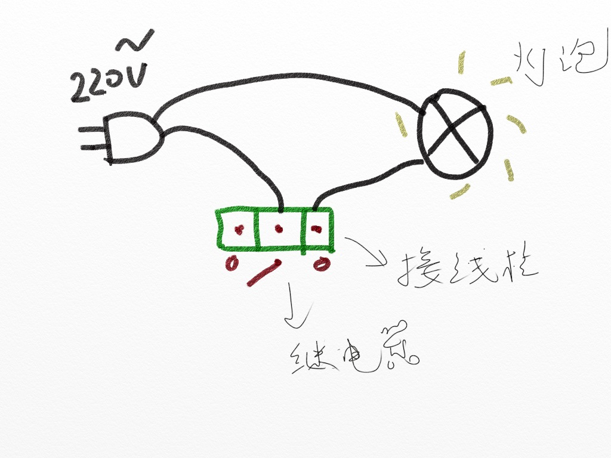
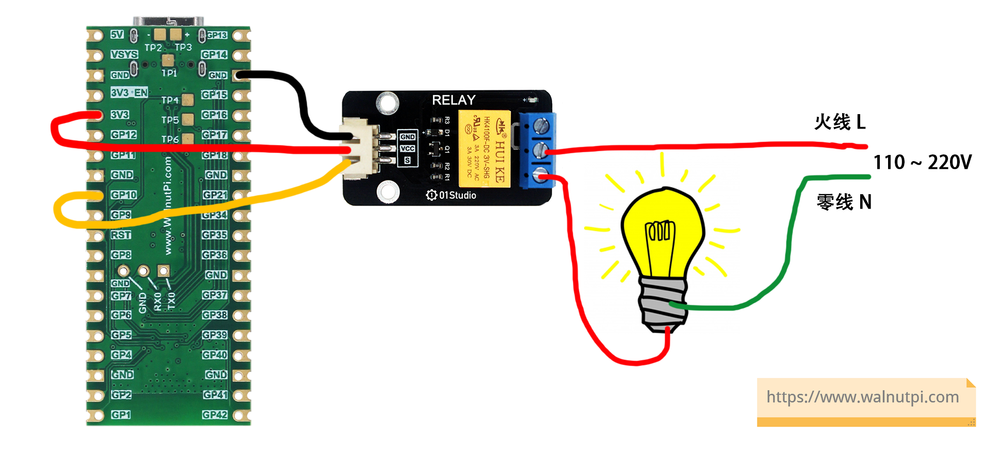
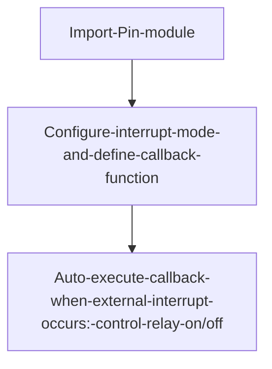
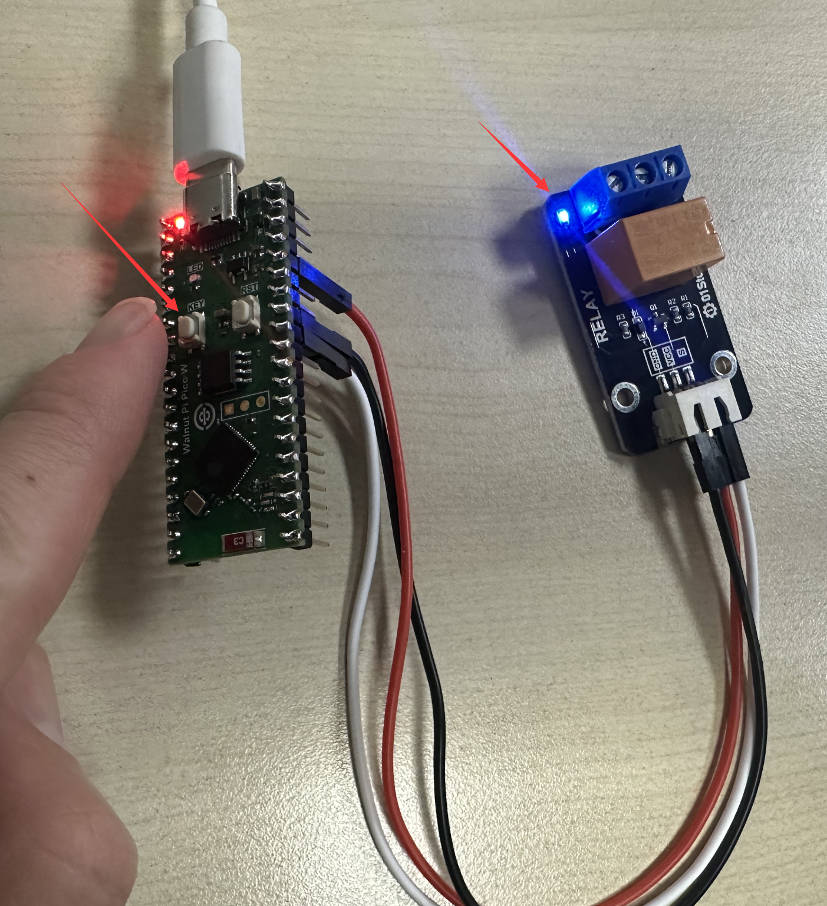

# Relay

## Introduction
We know that the GPIO output level of our development board is 3.3V, which cannot directly control high-voltage devices such as lights (220V). This is where the relay — a commonly used low-voltage-controlled high-voltage component — comes in.

## Objective
Use a button to control the relay's on/off state.

## Experiment Explanation

The image below shows the 01Studio relay module, which can be powered by 3.3V. The WalnutPi PicoW's IO pins can be directly connected to the module's control terminal. The low-voltage control interface on the left mainly has power pins and a signal control pin (supply voltage is typically 3.3V, depending on the manufacturer's specifications). The blue high-voltage section on the right can connect to 220V appliances.

::::tip Note

Always use a 3.3V level controlled relay, because the WalnutPi PicoW's GPIO voltage tolerance is 3.3V. Using a 5V-controlled relay may back-feed and damage the development board.

::::


A relay can be understood as a switch, similar to a light switch panel in our homes, except now it's controlled by an MCU's GPIO. A typical wiring diagram for a relay controlling a high-voltage appliance from low voltage is shown below:



In this experiment, WalnutPi PicoW pin 10 is connected to the relay module's control pin. The wiring diagram is as follows:



The 01Studio relay module's control principle is very simple, similar to LED control: low level '0' means relay ON, high level '1' means relay OFF.

We can refer to the Basic Experiments — Button External Interrupt example for using the relay. Please see the [**External Interrupt**](../basic_examples/exti.md) chapter; it won't be repeated here!

The code flow is as follows:




## Reference Code

```python
'''
Experiment Name: Relay
Version: v1.0
Author: WalnutPi
Platform: WalnutPi PicoW
Description: Use a button to change the relay's on/off state (external interrupt method)
'''

#Import related modules
from machine import Pin
import time

relay=Pin(10,Pin.OUT,value=1) #Build relay object, default off
KEY=Pin(0,Pin.IN,Pin.PULL_UP) #Build KEY object

state=0  #Relay pin state flag

#LED state toggle function
def fun(KEY):
    global state
    time.sleep_ms(10) #Debounce
    if KEY.value()==0: #Confirm button is pressed
        state = not state
        relay.value(state)

KEY.irq(fun,Pin.IRQ_FALLING) #Define interrupt, falling edge trigger
```

## Experimental Results

Run the code and you can control the relay on/off via the button:



Relay control is very simple and widely applicable. It only requires a simple GPIO high/low level to achieve control.
