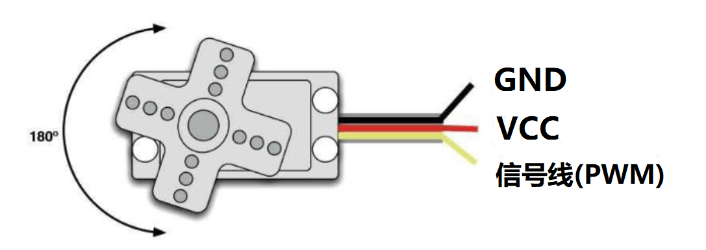
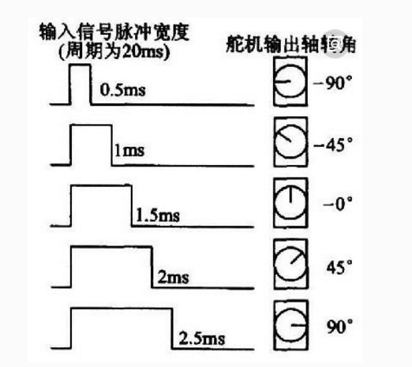
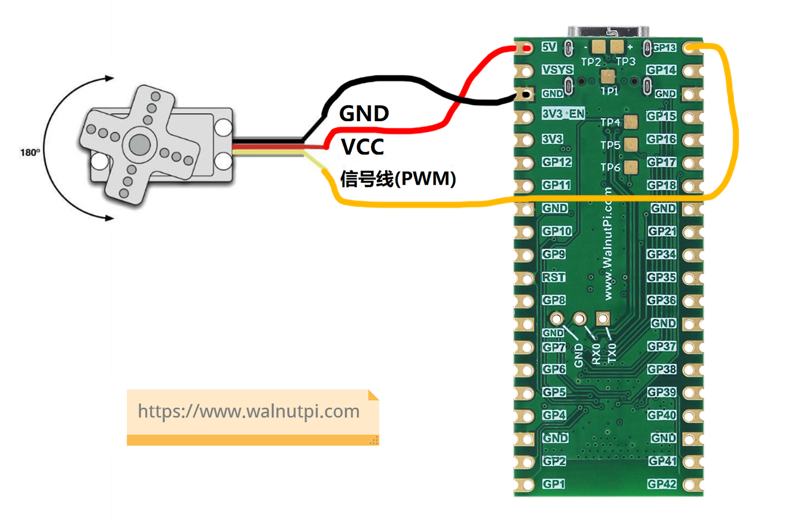
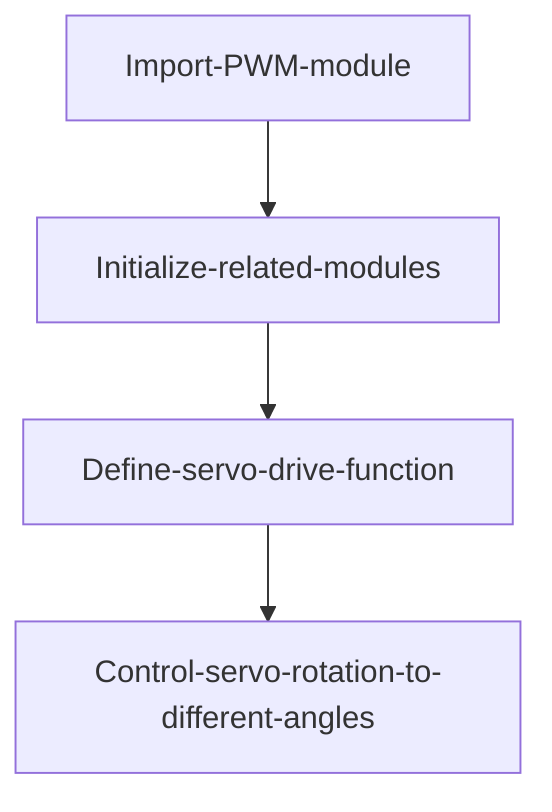
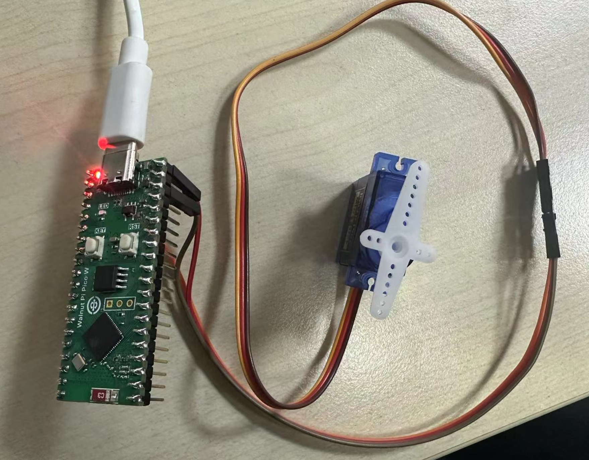
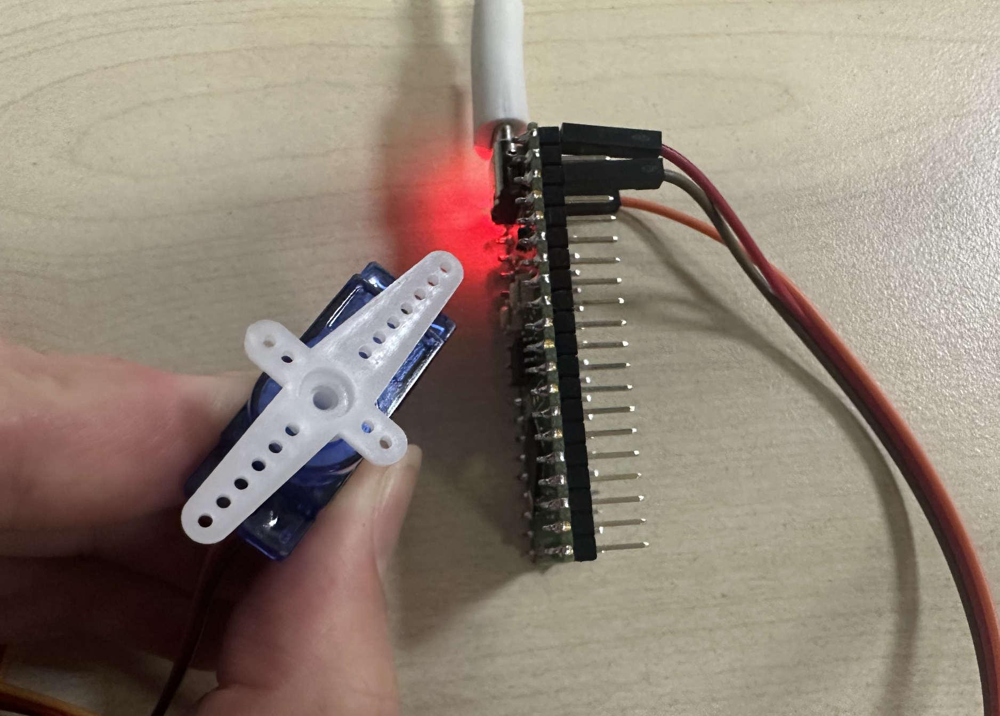

# Servo

## Introduction
A servo motor, also called a servo, is a motor that can rotate to specific angles, typically 90°, 180°, and 360° (360° can rotate continuously). You can see many servos on robots — arm-raising or head-shaking movements are often done by servos. Therefore, the more servos a robot has, the more flexible its movements.

## Objective
Program control of the SG90 servo.

## Experiment Explanation

Servo motors are controlled via 3 wires (typically in the order: signal, power, ground). This experiment uses the cost-effective SG90 servo. Typically: black is GND, red is VCC, orange is the signal wire.



Controlling a 180° servo typically requires a ~20ms time-base pulse. The high-level portion of this pulse, generally 0.5ms-2.5ms, is the angle control pulse, with a total interval of 2ms. For a 180° servo, the corresponding control relationship in MicroPython is from -90° to 90°. The illustration is as follows:



For a 360° continuous rotation servo, the pulse table above corresponds to the process from maximum forward speed to maximum reverse speed.

In this experiment, GPIO13 generates PWM to control the servo. Note that the SG90 servo's **power supply is 5V**. Make sure not to reverse the wire order.



The WalnutPi PicoW's MicroPython firmware doesn't integrate a Servo module, but from the above we can see it's controlled via PWM, so we can directly write PWM functions to drive it. For PWM tutorial, refer to: [PWM](../basic_examples/pwm_beep.md) chapter.

The code flow chart is as follows:




## Reference Code

```python
'''
Experiment Name: Servo Control
Version: v1.0
Author: WalnutPi
Platform: WalnutPi PicoW
Description: Program control of servo rotation to different angles
'''

from machine import Pin, PWM
import time

S1 = PWM(Pin(13), freq=50, duty=0) # Servo1 pin is 13

'''
Description: Servo control function
Function: 180° servo: angle:-90 to 90 represents corresponding angle
    360° continuous rotation servo: angle:-90 to 90 represents rotation direction and speed.
'''
def Servo(servo,angle):
    servo.duty(int(((angle+90)*2/180+0.5)/20*1023))

#-90 degrees
Servo(S1,-90)
time.sleep(1)

#-45 degrees
Servo(S1,-45)
time.sleep(1)

#0 degrees
Servo(S1,0)
time.sleep(1)

#45 degrees
Servo(S1,45)
time.sleep(1)

#90 degrees
Servo(S1,90)
time.sleep(1)
```

## Experimental Results

Run the program. You can see the servo rotates to different angles sequentially.



## 360° Continuous Rotation Servo

We just implemented angle control for a 180° servo. Now let's experiment with a 360° continuous rotation servo. A 360° continuous rotation servo can function as a DC geared motor, used in small cars or model aircraft.

The code remains the same; the parameter [-90 to 90] represents rotation direction and speed magnitude. Plug in the 360° continuous rotation servo and you can see the servo's speed and direction gradually change.



Through this section, we learned how to use different types of servos. By combining multiple motors, you can create experiments with models, model aircraft, small cars, and robots.
