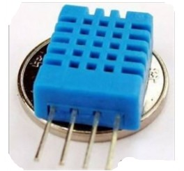
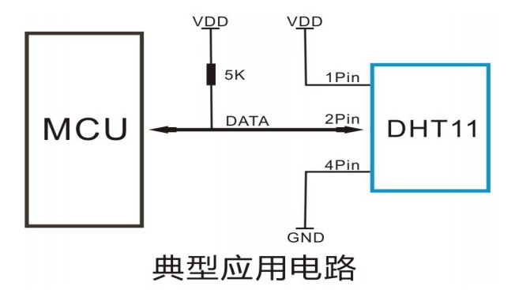
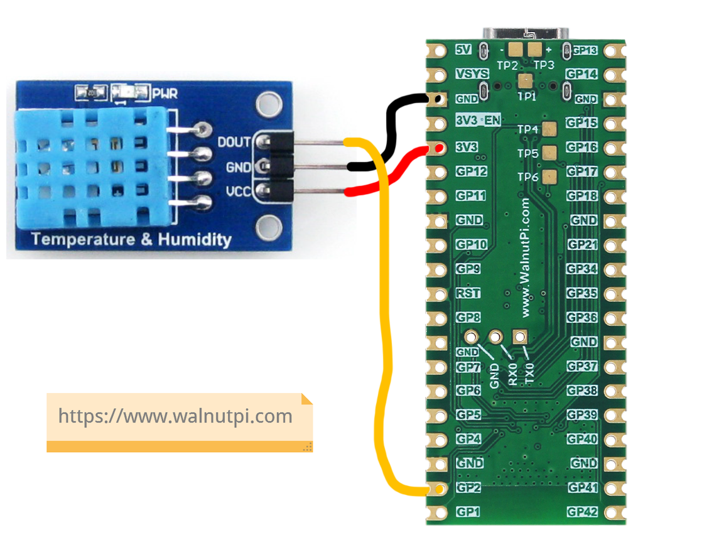
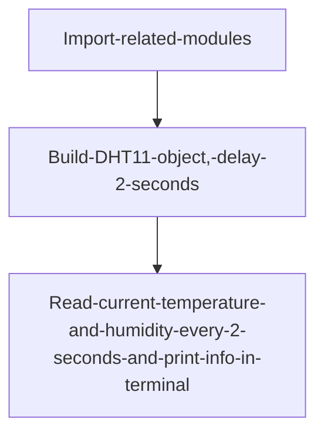
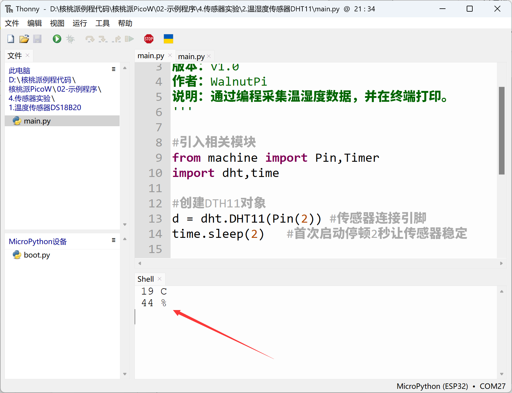

# Temperature & Humidity Sensor (DHT11)

## Introduction
Temperature and humidity are very common environmental indicators we encounter daily. We'll use the DHT11 digital temperature and humidity sensor. This is a calibrated digital signal output temperature and humidity composite sensor. It uses dedicated digital module acquisition technology and temperature/humidity sensing technology to ensure extremely high reliability and excellent long-term stability.

The DHT11 features small size, extremely low power consumption, and signal transmission distance of over 20 meters, making it an ideal choice for various applications, even the most demanding ones. The product comes in a 4-pin single-row package for easy connection.



**DHT11 Temperature & Humidity Sensor**


## Objective
Collect DHT11 sensor temperature and humidity data using MicroPython programming.

## Experiment Explanation

Although the DHT11 has 4 pins, the third pin is unused (floating). This means the DHT11 is also a single-bus sensor, occupying only 1 IO pin:



Below is a commonly used DHT11 module. This example uses GPIO2 for connection; the wiring diagram is as follows:



This means we need to write a program targeting WalnutPi PicoW pin 2 to drive the DHT11. The WalnutPi PicoW's MicroPython firmware already integrates the dht object, specifically for the DHT11 sensor. We can directly use it in Python programming. The module description is as follows:

## dht Object

### Constructor
```python
d = dht.DHT11(machine.Pin(id))
```
Build a DHT11 sensor object.

- `id`: Chip pin number, e.g., 1, 2.


### Usage
```python
d.measure()
```
Measure temperature and humidity.

<br></br>

```python
d.temperature()
```
Get temperature value.

<br></br>

```python
d.humidity()
```
Get humidity value.

<br></br>


We recommend delaying 1-2 seconds after power-on to let the DHT11 stabilize before starting to read. The code flow is as follows:




## Reference Code

```python
'''
Experiment Name: Temperature & Humidity Sensor DHT11
Version: v1.0
Author: WalnutPi
Description: Collect temperature and humidity data and print to terminal.
'''

#Import related modules
from machine import Pin,Timer
import dht,time

#Create DHT11 object
d = dht.DHT11(Pin(2)) #Sensor connection pin
time.sleep(2)   #Pause 2 seconds on first startup to let sensor stabilize

def dht_get(tim):

    d.measure()  #Temperature and humidity collection

    #Terminal print temperature and humidity info
    print(str(d.temperature())+' C')
    print(str(d.humidity())+' %')

#Start RTOS timer, number 1
tim = Timer(1)
tim.init(period=2000, mode=Timer.PERIODIC,callback=dht_get) #Period 2000ms
```

## Experimental Results

Connect the DHT11 module to WalnutPi PicoW pin 2 as shown below.


Run the code and you can see the terminal printing temperature and humidity data collected by the sensor:



Through this section, we learned how to use MicroPython to drive the DHT11 temperature and humidity sensor. The DHT11 has a great price-performance ratio and is very suitable for learning, but its precision and response speed are somewhat limited. Users who need higher performance can use the DHT22 or other more advanced sensors.
