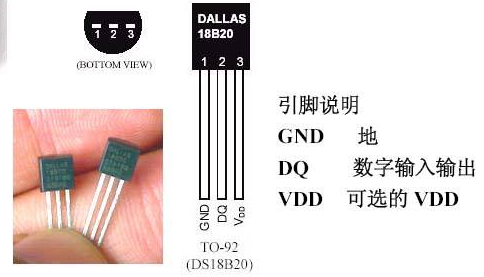
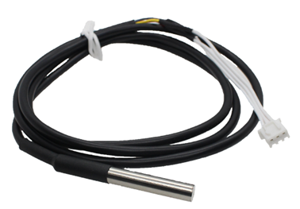
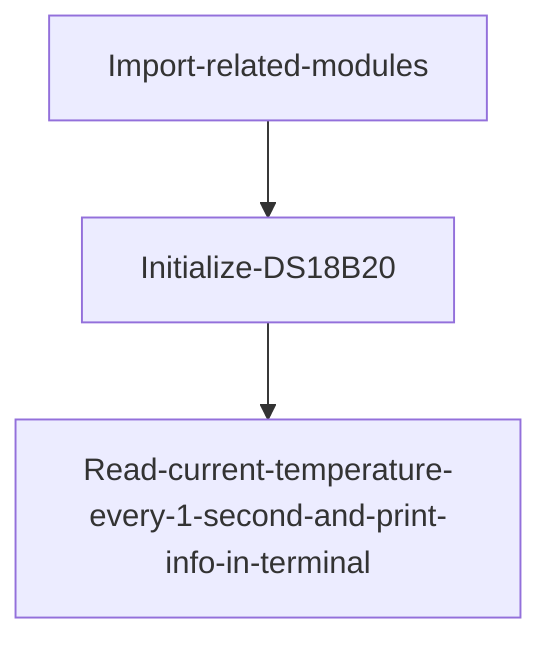
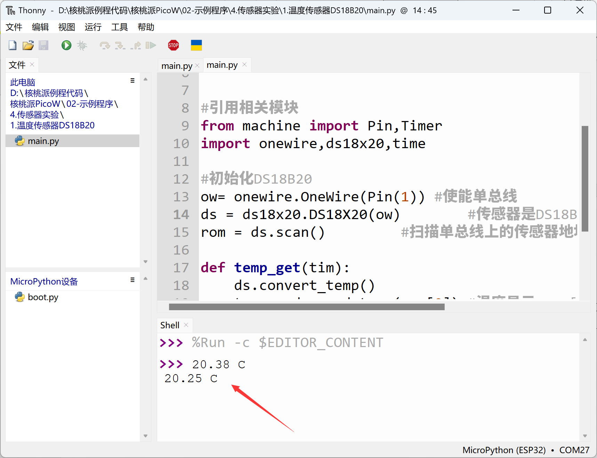

# Temperature Sensor (DS18B20)

## Introduction
It's likely that every electronics enthusiast knows about the DS18B20. The DS18B20 is a commonly used digital temperature sensor that outputs a digital signal. It features small size, low hardware overhead, strong anti-interference capability, and high precision. The DS18B20 digital temperature sensor is easy to wire, and after packaging, it can be used in various scenarios such as pipeline-type, threaded, magnetic-attached, and stainless steel encapsulated types — coming in many different forms.

Its appearance varies mainly based on the application scenario. Packaged DS18B20 sensors can be used for cable trench temperature measurement, blast furnace water circulation temperature measurement, boiler temperature measurement, server room temperature measurement, agricultural greenhouse temperature measurement, clean room temperature measurement, ammunition depot temperature measurement, and various other non-extreme temperature environments. It is wear-resistant, impact-resistant, small, easy to use, available in diverse package types, and suitable for digital temperature measurement and control in various confined spaces.




**DS18B20 Temperature Sensor**



**DS18B20 Metal Probe Package**


## Objective
Collect DS18B20 sensor temperature data using MicroPython programming.

## Experiment Explanation

The DS18B20 is a one-wire driven sensor, meaning it occupies only 1 IO pin. Below is a commonly used DS18B20 module. This example uses GPIO1 for connection; the wiring diagram is as follows:


This means we need to write a program targeting WalnutPi PicoW pin 1 to drive the DS18B20. Do we need to write our own driver? The answer is no — life is short. The WalnutPi PicoW's MicroPython firmware already integrates the onewire module and the ds18b20 object. We can directly use them in Python programming:

The onewire and ds18x20 module descriptions are as follows:

## onewire Object

### Constructor
```python
ow = onewire.OneWire(machine.Pin(id))
```
Build a one-wire bus object.

- `id`: Chip pin number, e.g., 1, 2.


### Usage
```python
ow.scan()
```
Scan for devices on the bus. Returns device addresses, supports multiple devices connected simultaneously.

<br></br>

```python
ow.reset()
```
Bus device reset.

<br></br>

```python
ow.readbyte()
```
Read 1 byte.

<br></br>

```python
ow.readbyte()
```
Read 1 byte.

<br></br>

```python
ow.writebyte(0x12)
```
Write 1 byte.

<br></br>

```python
ow.write('123')
```
Write multiple bytes.

<br></br>

```python
ow.select_rom(b'12345678')
```
Select a specific device on the bus by its ROM number.

<br></br>

## ds18x20 Object

### Constructor
```python
ds = ds18x20.DS18X20(ow)
```
Build a DS18B20 sensor object.

- `ow`: Defined one-wire bus object.


### Usage
```python
ds.scan()
```
Scan for DS18B20 devices on the bus. Returns device addresses, supports multiple devices connected simultaneously.

<br></br>

```python
ds.convert_temp()
```
Temperature conversion.

<br></br>

```python
ds.read_temp(rom)
```
Get temperature value. rom: indicates the corresponding device number.

<br></br>

In most cases, temperature doesn't change too frequently. We can sample once per second, displaying with 2 decimal places, which is sufficient for most applications. The code flow is as follows:




## Reference Code

```python
'''
Experiment Name: Temperature Sensor DS18B20
Version: v1.0
Author: WalnutPi
Description: Collect temperature data and print to terminal.
'''

#Import related modules
from machine import Pin,Timer
import onewire,ds18x20,time

#Initialize DS18B20
ow= onewire.OneWire(Pin(1)) #Enable one-wire bus
ds = ds18x20.DS18X20(ow)        #Sensor is DS18B20
rom = ds.scan()         #Scan sensor address on one-wire bus, supports multiple sensors

def temp_get(tim):
    ds.convert_temp()
    temp = ds.read_temp(rom[0]) #Temperature display, rom[0] is the first DS18B20

    print(str('%.2f'%temp)+' C') #Terminal print temperature info

#Start RTOS timer 1
tim = Timer(1)
tim.init(period=1000, mode=Timer.PERIODIC,callback=temp_get) #Period 1000ms
```

## Experimental Results

Connect the DS18B20 module to WalnutPi PicoW pin 1 as shown below.


Run the code and you can see the terminal printing temperature data collected by the sensor:



The DS18B20, as our first experimental sensor, was very easy to use with MicroPython programming, without any loss in precision or stability. The temperature sensor is just a starting point — next we'll learn about more sensor applications.
