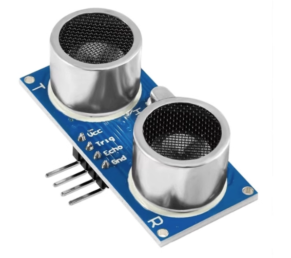
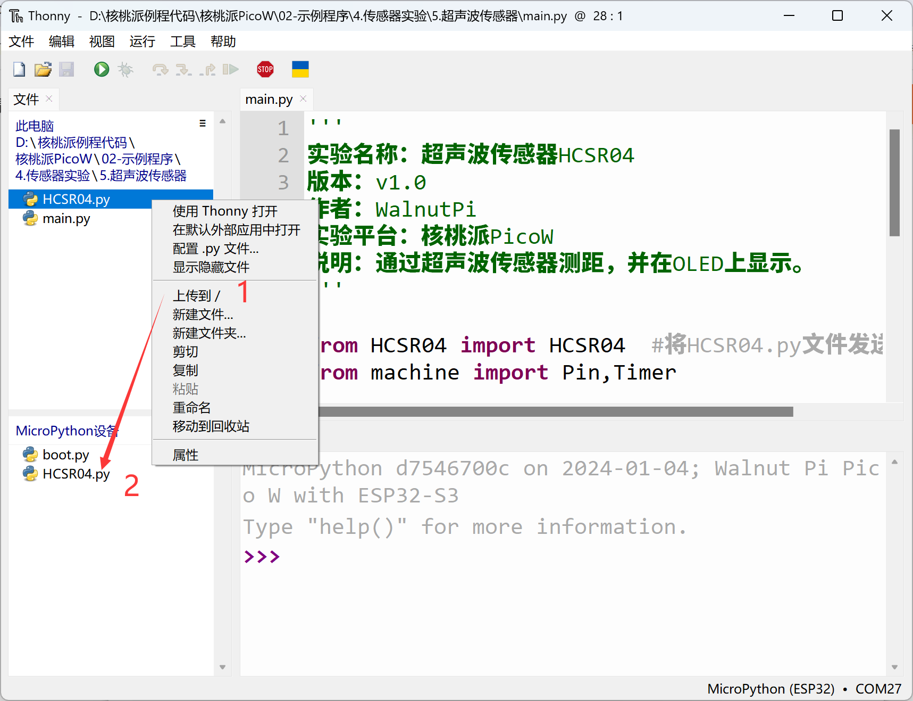
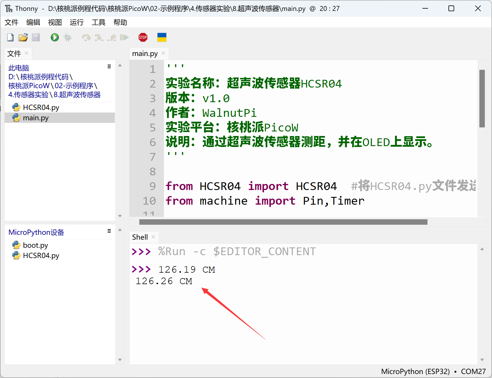

# 超声波测距（HC-SR04）

## 前言
超声波传感器是一款测量距离的传感器。其原理是利用声波在遇到障碍物反射接收结合声波在空气中传播的速度计算的得出。在测量、避障小车，无人驾驶等领域都有相关应用。

## 实验目的
通过MicroPython编程实现超声波传感器测距。

## 实验讲解

下图是一款市面上常用的HCSR04超声波模块：

 

|  模块参数 |
|  :---:  | ---  |
| 供电电压  | 3.3V~5V （核桃派PicoW需要使用支持3.3V的） |
| 测量距离  | 2cm~450cm |
| 测量精度  | 0.5cm | 
| 引脚说明  | `VCC`: 接3.3V <br></br> `GND`: 接地 <br></br>  `Trig`: 发射引脚  <br></br> `Echo`: 接收引脚 |

<br></br>

超声波传感器模块使用两个IO口分别控制超声波发送和接收，工作原理如下：

1. 给超声波模块接入电源和地；
2. 给脉冲触发引脚（trig）输入一个长为20us的高电平方波；
3. 输入方波后，模块会自动发射8个40KHz的声波，与此同时回波引脚（echo）端的电平会由0变为1；（此时应该启动定时器计时）
4. 当超声波返回被模块接收到时，回波引 脚端的电平会由1变为0；（此时应该停止定时器计数），定时器记下的这个时间即为超声波由发射到返回的总时长；
5. 根据声音在空气中的速度为340米/秒，即可计算出所测的距离。

下面是超声波传感器HCSR04的时序触发图：

 

我们可以任意使用2个普通GPIO口来连接超声波传感器，本例程使用GPIO17连接到Trig引脚, GPIO18连接到Echo引脚：

 

MicroPython导入对象库有2种方式，一种是集成在固件的库，直接调用即可。另外一种是通过py库文件方式调用，后者只需要将py库文件发送到开发板文件系统即可。本实验用的超声波对象就是使用py库方式，位于HCSR04.py文件下。对象说明如下：

## HCSR04对象

在CircuitPython中可以直接使用写好的Python库来获取超声波传感器测量的距离值。具体介绍如下：

### 构造函数
```python
sonar = HCSR04(trig,echo)
```
构建超声波模块对象，主要是初始化连接超声波传感器的2个引脚。

- `trig` 超声波发射端引脚；
- `echo` 超声波接收端引脚；

例：
```python
#初始化超声波模块接口
trig = Pin(17,Pin.OUT)
echo = Pin(18,Pin.IN)
sonar = HCSR04(trig,echo)
```

### 使用方法
```python
sonar.getDistance()
```
返回测量距离值，单位cm，数据类型为`float`。

<br></br>

我们构建对象后就可以一直循环获取超声波距离信息了，代码编写流程如下：

```mermaid
graph TD
    导入相关模块-->构建超声波传感器对象-->测量距离并打印-->测量距离并打印;
```

## 参考代码

```python
'''
实验名称：超声波传感器HCSR04
版本：v1.0
作者：WalnutPi
实验平台：核桃派PicoW
说明：通过超声波传感器测距，并在OLED上显示。
'''

from HCSR04 import HCSR04  #将HCSR04.py文件发送到开发板
from machine import Pin,Timer

#初始化超声波模块接口
trig = Pin(17,Pin.OUT)
echo = Pin(18,Pin.IN)
sonar = HCSR04(trig,echo)

#中断回调函数
def fun(tim):

    Distance = sonar.getDistance() #测量距离

    # 终端打印距离,单位cm,保留2位小数。
    print(str('%.2f'%(Distance)) + ' CM')

#开启RTOS定时器
tim = Timer(1)
tim.init(period=1000, mode=Timer.PERIODIC, callback=fun) #周期1s
```

## 实验结果

由于本例程代码依赖其它py库，所以需要将HCSR04.py文件上传到核桃派PicoW：

 

使用Thonny IDE运行主程序代码，可以看到终端打印超声波传感器距离信息。

 
