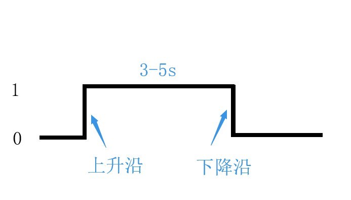
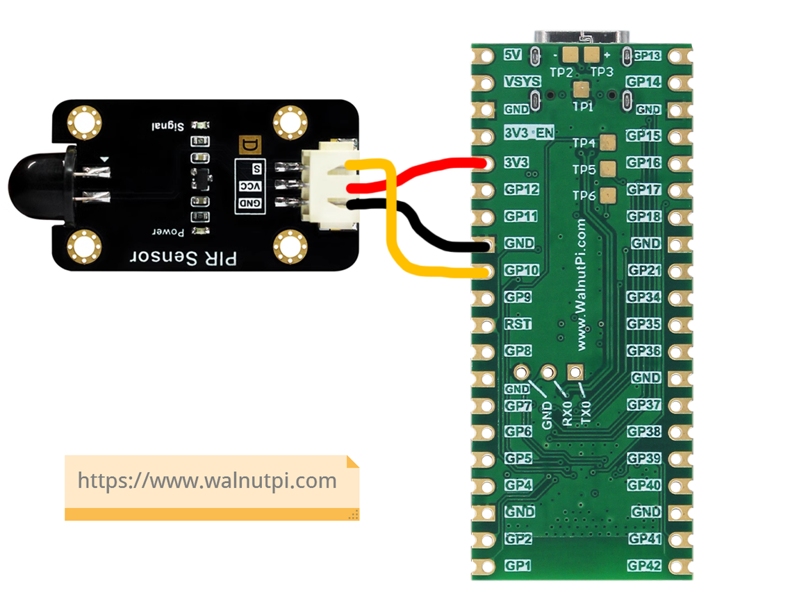
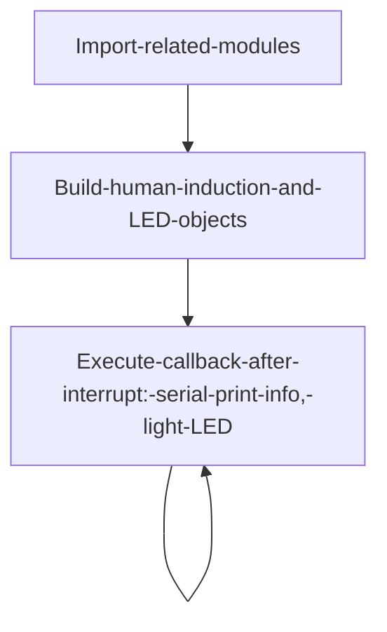
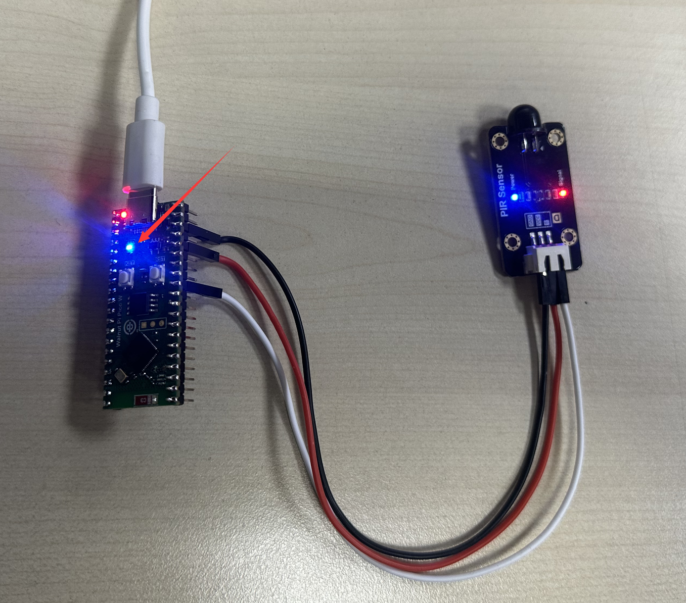
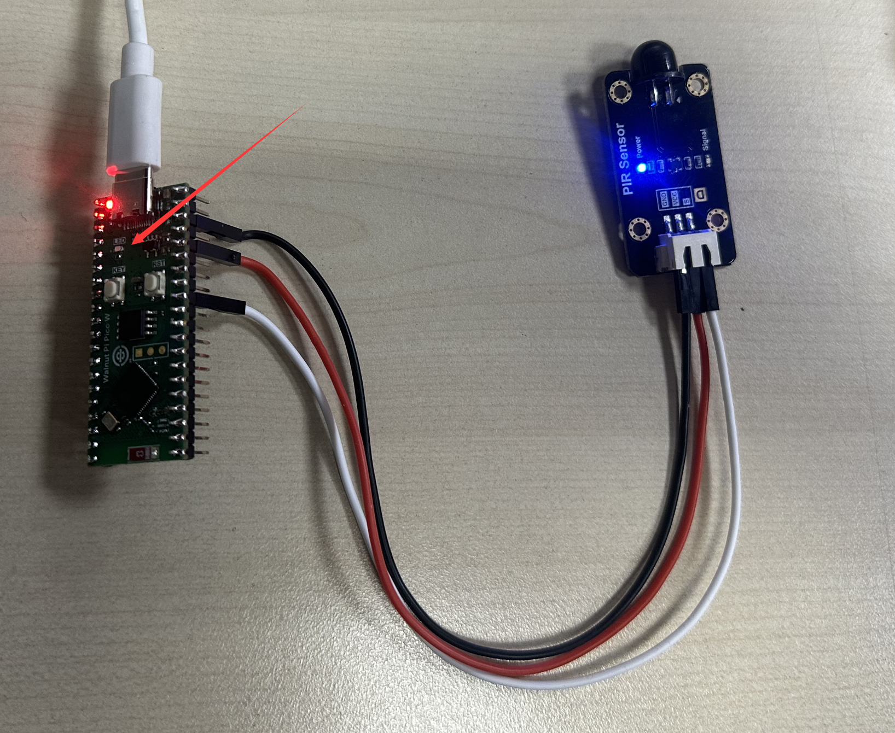

# Human Body Induction Sensor

## Introduction
Human body induction sensors are very common in indoor security applications. Their principle is that the detection element converts detected human body infrared radiation into a weak voltage signal, which is then output after amplification. To improve detection sensitivity and increase detection distance, a plastic Fresnel lens is typically installed in front of the detector. Combined with the amplifier circuit, it can amplify the signal by over 70dB, enabling detection of human movement within a 5-10 meter range.

## Objective
Use Python programming to detect the human body induction module. When a person is detected, the serial terminal prints "Get People!!!" and the blue indicator LED lights up (turns off when no one is present).

## Experiment Explanation

Below is a commonly used human body induction sensor module, primarily with power pins and a signal output pin (supply voltage is typically 3.3V, depending on the manufacturer's specifications).


When this module is powered on and a person is detected, the sensor's signal output pin outputs a high level that lasts for 3-5 seconds.



As can be seen, we can use external interrupts with rising edge trigger to program the related functionality. For external interrupts, refer to the [**External Interrupt**](../basic_examples/exti.md) chapter; it won't be repeated here.

This example uses GPIO10 for connection. The wiring diagram is as follows:




The code flow is as follows:



## Reference Code

```python
'''
Experiment Name: Human Body Induction Sensor
Version: v1.0
Author: WalnutPi
Platform: WalnutPi PicoW
Description: Human body infrared induction sensor application
'''

import time
from machine import Pin   #Import I2C and Pin submodules from machine module

Human=Pin(10,Pin.IN,Pin.PULL_UP) #Build human infrared object
LED=Pin(46,Pin.OUT) #Build LED object, GPIO46, output

def fun(Human): #Get People blinking 5 times effect!
    print("Get People!!!")  # Indicate someone detected
    LED.value(1)  # Light LED

    #Wait for sensor high level to end
    while Human.value():
        pass

    LED.value(0)  # Turn off LED

Human.irq(fun,Pin.IRQ_RISING) #Define interrupt, rising edge trigger
```

## Experimental Results

Run the code in Thonny IDE. When the sensor detects a person, the blue LED lights up.



The terminal prints the prompt message "Get People!!!":


When no one is present, the blue LED turns off.


