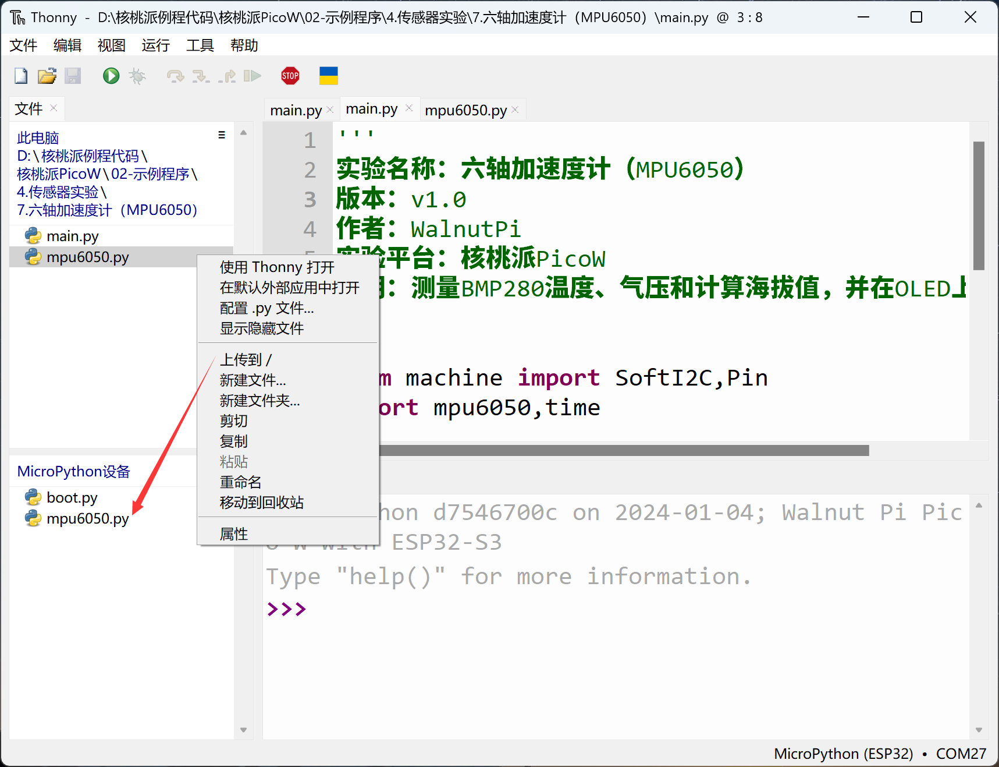
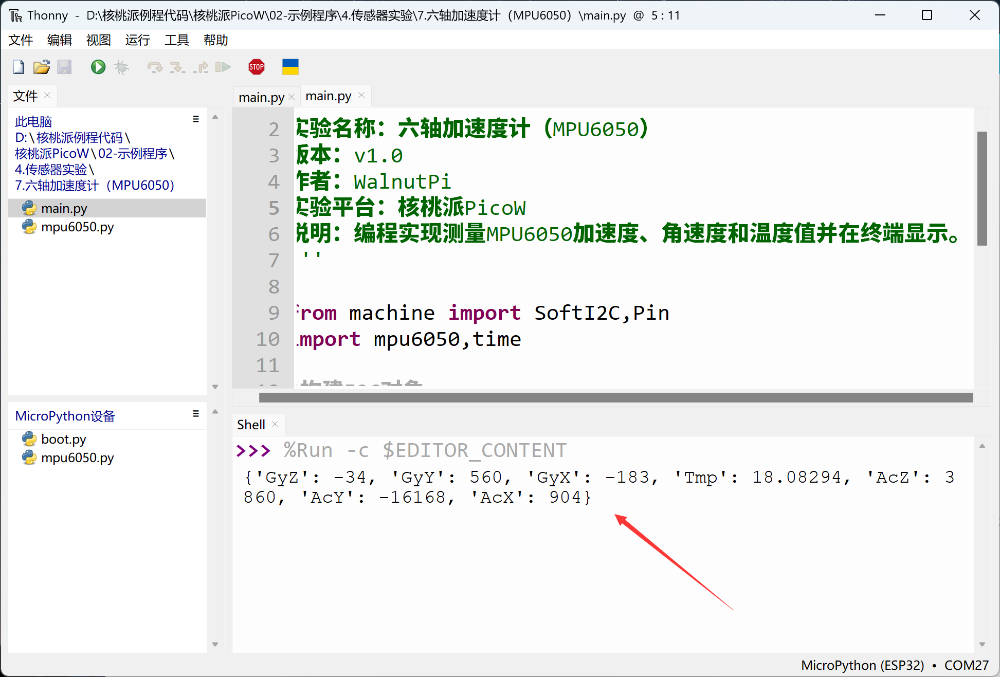

# 六轴加速度计（MPU6050）

## 前言
MPU6050是一款高性能的6轴（三轴加速度+三轴陀螺仪）传感器模块，用于测试物体的运动姿态，I2C接口，常用于四轴飞控，平衡车等场景。

## 实验目的
通过python编程实现测量MPU6050加速度、角速度和温度值。

## 实验讲解

市面上大多MPU6050模块都通用，使用I2C总线通讯，下图是一款MPU6050传感器模块：

 

|  模块参数 |
|  :---:  | ---  |
| 供电电压  | 3.3V |
| 通信方式  | I2C总线（默认地址：0x68） |
| 测量维度  | 加速度：3维 <br></br> 陀螺仪：3维|
| 加速度测量范围  | ±2/±4/±8/±16g |
| 陀螺仪测量范围  | ±250/±500/±1000/±2000°/s |
| 温度传感器  | 测量范围：-40℃~85℃（精度：±1℃） |
| 引脚说明  | `VCC`: 接3.3V <br></br> `GND`: 接地 <br></br>  `SDA`: I2C数据引脚  <br></br> `SCL`: I2C时钟引脚 |

<br></br>

**MPU6050六轴方向说明：**

 

从上面介绍可以看到MPU6050是一款通过I2C接口驱动的传感器。我们通过核桃派PicoW的I2C接口编程，即可以对该模块实现数据通讯。

核桃派PicoW的MicroPython固件集成了软件模拟SoftI2C，支持任意GPIO引脚定义为相关引脚，非常方便。本例程使用核桃派PicoW的GPIO17连接MPU6050传感器SCL引脚，GPIO18连接SDA引脚，如下图：

本例程使用核桃派的I2C1来连接MPU6050传感器：

 

## MPU6050对象

### 构造函数
```python
mpu = mpu6050.accel(i2c, addr=0x68)
```
构建MPU6050对象。

参数说明：
- `i2c` 定义好的I2C对象。
- `addr` 模块I2C地址。默认：0x68；

### 使用方法

```python
mpu.get_values()
```
依次返回7个数据：

x、y、z的加速度值，单位m/s^2，数据类型为`float`

Temp温度值，单位℃, 数据类型为`float`

x、y、z的角速度值，单位rad/s，数据类型为`float`

<br></br>

理解了MPU6050传感器原理和对象使用方法后，我们可以整理出编程思路，流程图如下 ：

```mermaid
graph TD
    导入相关模块-->构建MPU6050对象-->获取加速度/角速度/温度值并打印-->获取加速度/角速度/温度值并打印;
```

## 参考代码

```python
'''
实验名称：六轴加速度计（MPU6050）
版本：v1.0
作者：WalnutPi
实验平台：核桃派PicoW
说明：编程实现测量MPU6050加速度、角速度和温度值并在终端显示。
'''

from machine import SoftI2C,Pin
import mpu6050,time

#构建I2C对象
i2c1 = SoftI2C(scl=Pin(17), sda=Pin(18))

#构建MPU6050对象
mpu = mpu6050.accel(i2c1)

while True:
    
    #打印六轴加速度计原始值
    print(mpu.get_values())
    
    #延时1秒
    time.sleep(1)
```

## 实验结果

由于本例程代码依赖其它py库，所以需要将mpu6050.py文件上传到核桃派PicoW：

 

使用Thonny IDE运行主程序代码，可以看到终端打印出六轴加速度计MPU6050的7个原始数据：

 
