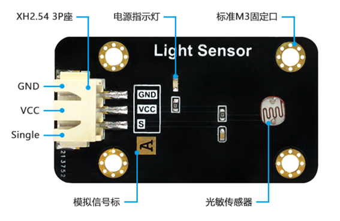
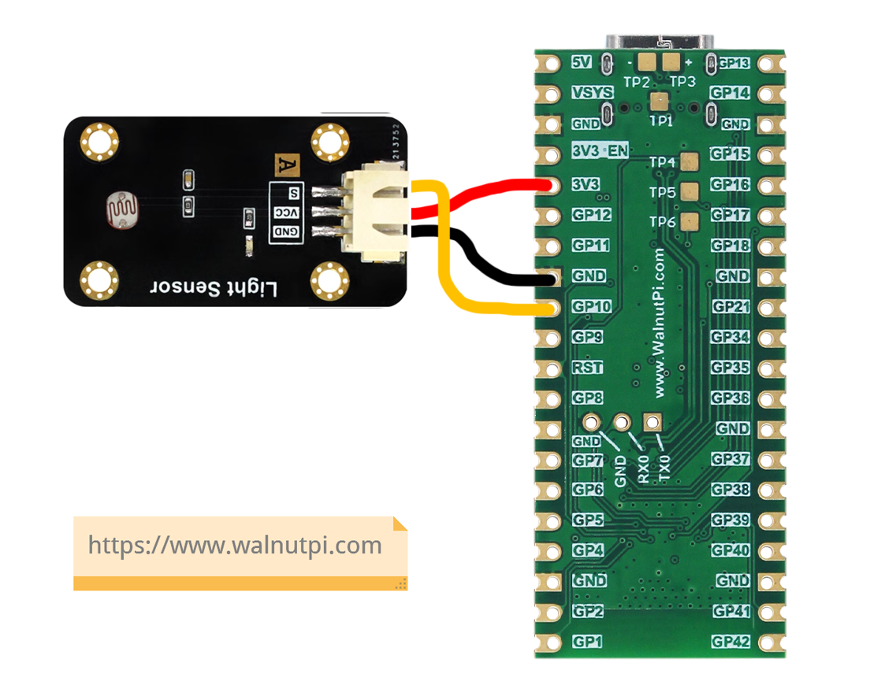
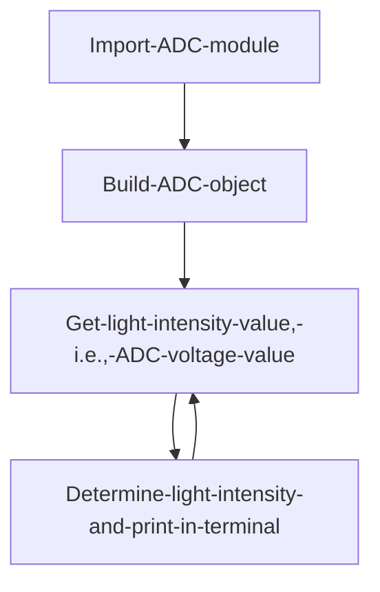
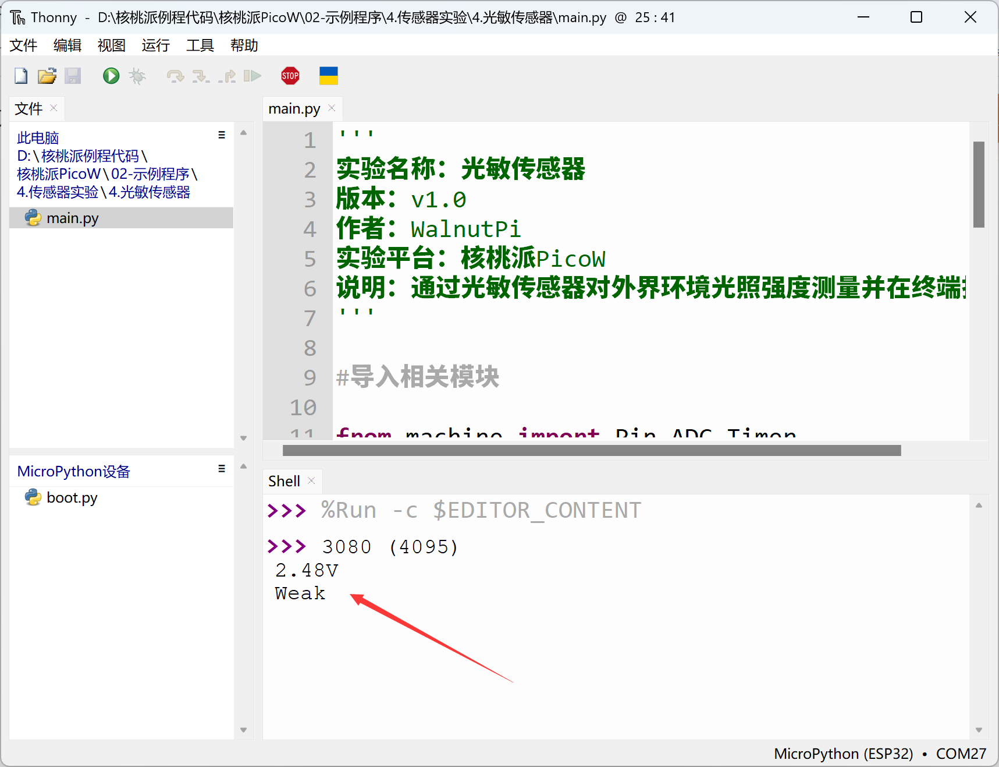
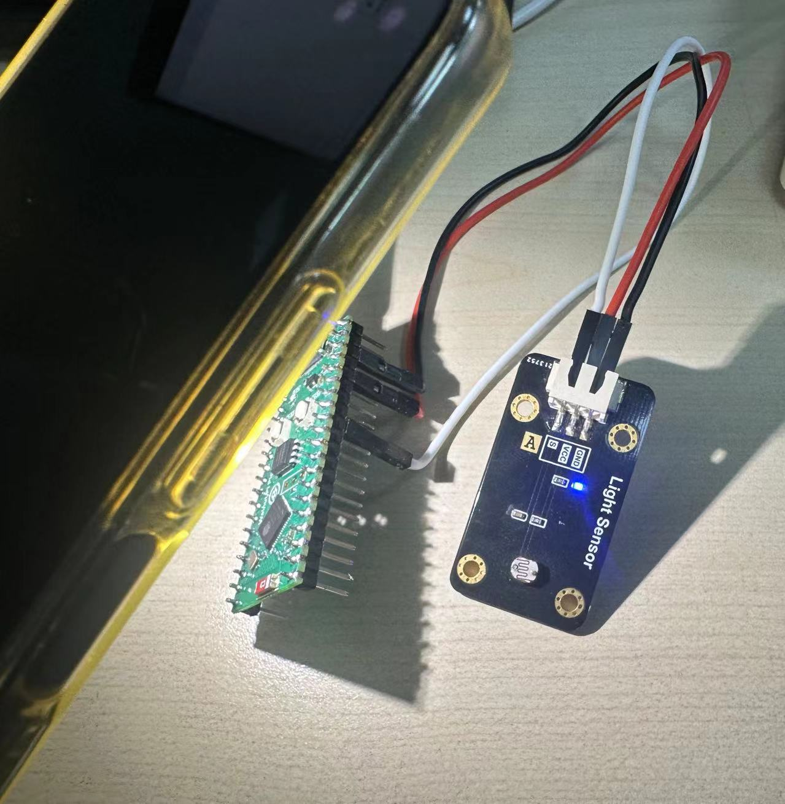
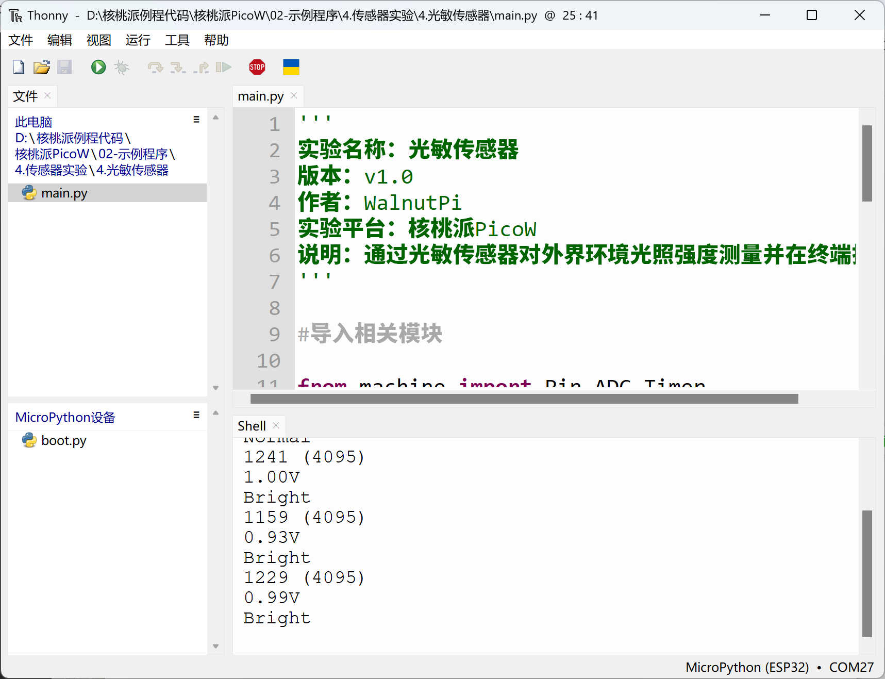

# Photosensitive Sensor

## Introduction
A photosensitive sensor is essentially a sensor that can detect light intensity. It can be applied to detect plant light intensity, indoor light levels, and brightness in various scenarios. The sensor's principle is to convert external analog signal changes into digital signals (voltage values) for the MCU to process — the processing method is the commonly used ADC (Analog-to-Digital Conversion).

## Objective
Collect the current ambient light intensity and print it in the terminal. Display format: Bright, Normal, Weak.

## Experiment Explanation

Below is a photosensitive sensor module, primarily with power pins and a signal output pin.



In this experiment, WalnutPi PicoW pin 10 is connected to the sensor's signal output pin:



When powered by 3.3V, the photosensitive sensor outputs an analog signal: 0-3.3V, which represents the ambient light intensity. When the voltage is near 0V, the light is strongest; when near 3.3V, the light is weakest. Therefore, we can use ADC functionality to program the detection. Refer to the [**ADC (Voltage Measurement)**](../basic_examples/adc.md) chapter; it won't be repeated here.

::::tip Note
The WalnutPi PicoW (ESP32-S3) ADC has a default range of 1V. The chip has a built-in attenuator that can be configured to increase the range for larger measurement voltages. See: **https://docs.micropython.org/en/latest/esp32/quickref.html#ADC**
::::

ADC has 12-bit precision by default, meaning the maximum value is 2^12-1 = 4095. We'll divide the detected values 0-4095 into three ranges representing light levels: Strong: [0-1365], Normal: [1365-2730], Weak: [2730-4095]. Of course, developers can adjust these thresholds based on actual conditions.


The code flow is as follows:



## Reference Code

```python
'''
Experiment Name: Photosensitive Sensor
Version: v1.0
Author: WalnutPi
Platform: WalnutPi PicoW
Description: Measure ambient light intensity using a photosensitive sensor and print to terminal.
'''

#Import related modules

from machine import Pin,ADC,Timer

#Initialize ADC, Pin=10, 11DB attenuation, measurement voltage 0-3.3V
Light = ADC(Pin(10))
Light.atten(ADC.ATTN_11DB)

#Interrupt callback function
def fun(tim):

    value=Light.read() #Get ADC value

    #Display value
    print(str(value)+' (4095)')
    #Calculate voltage, obtained data 0-4095 corresponds to 0-3.3V, ('%.2f'%) means keep 2 decimal places
    print(str('%.2f'%(value/4095*3.3)))

    #Determine light intensity, display in 3 levels.
    if 0 < value <=1365:
        print('Bright')

    if 1365 < value <= 2730:
        print('Normal')

    if 2730 < value <= 4095:
        print('Weak')

#Start RTOS timer
tim = Timer(1)
tim.init(period=1000, mode=Timer.PERIODIC, callback=fun) #Period 1s
```

## Experimental Results

Run the code in Thonny IDE. You can see the terminal outputting the photosensitive module's measurement values and light intensity information.



Use a phone flashlight to change the brightness and observe the measurement values change.




