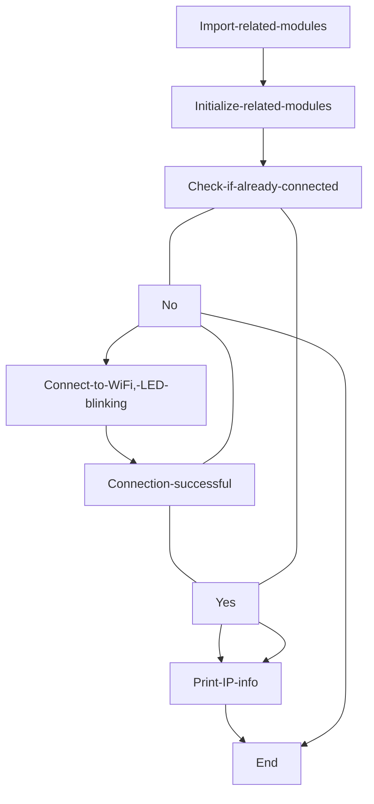
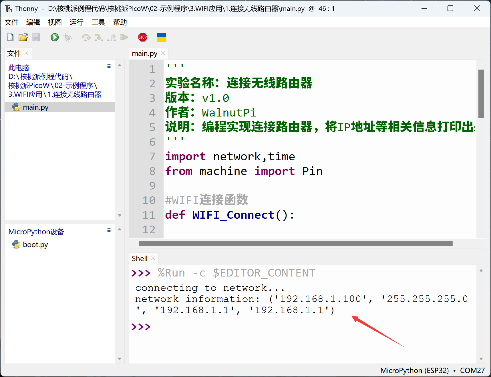

# Connecting to Wireless Router

## Introduction
WiFi plays a very important role in IoT. Nowadays, almost every household has WiFi. Connecting to the internet via WiFi has become a common choice for smart home products. And to get online, you first need to connect to a wireless router. In this section, we'll learn how to program the WalnutPi PicoW to connect to a router using MicroPython.

## Objective
Program the board to connect to a router and print IP address and related information via the serial terminal (2.4G networks only).

## Experiment Explanation

Connecting to a router to go online is something we do every day. In daily life, we just need to know the router's SSID and password to connect a computer or phone to the wireless router and surf the internet.

MicroPython already integrates the network module. Developers can use the built-in network module functions to easily connect to a router. However, connection failures can occur, such as when the password is incorrect. In these cases, we just need to add some simple judgment mechanisms to avoid getting stuck in an infinite connection-failure loop!

Let's first look at the constructor and usage methods of the network module based on WiFi (WLAN module).

## network Object

### Constructor
```python
wlan = network.WLAN(interface_id)
```
Build a WiFi connection object.

- `interface_id`: Wireless mode:
    - `network.STA_IF`: Client (STA) mode;
    - `network.AP_IF`: Access Point (AP) mode.

### Usage
```python
wlan.active([is_active])
```
Activate or deactivate the network interface.
- `[is_active]`: Activate or deactivate the network interface. Returns current interface state when parameter is empty:
    - `True`: Activate network interface;
    - `False`: Deactivate network interface.

<br></br>

```python
wlan.scan()
```

Scan for accessible SSIDs.

<br></br>

```python
wlan.isconnected()
```
Check if the device is already connected. Returns `True`: connected; `False`: not connected.

<br></br>

```python
wlan.connect(ssid,passwork)
```
WiFi connection.
- `ssid`: Account/SSID;
- `passwork`: Password;

<br></br>

```python
wlan.ifconfig([(ip, subnet, gateway, dns)])
```
Configure WiFi information. When the parameter is empty, it shows WiFi connection information.
- `ip`: IP address;
- `subnet`: Subnet mask;
- `gateway`: Gateway address;
- `dns`: DNS information.

**Example: wlan.ifconfig(('192.168.1.110', '255.255.255.0', '192.168.1.1', '8.8.8.8')).**

<br></br>

```python
wlan.disconnected()
```
Disconnect.

<br></br>

For more usage, refer to the official documentation:<br></br>
https://docs.micropython.org/en/latest/library/network.WLAN.html

From the above, we can see that MicroPython makes WiFi connectivity very simple through module encapsulation. The module includes AP (Access Point) and STA (Client) modes. AP mode means the computer connects directly to the hotspot emitted by the WalnutPi PicoW, but then your computer can't access the internet. Therefore, we typically use STA mode — where both the computer and the device connect to a router on the same network segment.

After power-on, the module can first check if it's already connected to the network. If yes, no reconnection is needed. If not, it enters WiFi connection mode with a blinking indicator LED. Once connected, the LED stays on, and IP and related information are displayed and printed to the serial terminal. Additionally, a 15-second timeout should be configured — if connection isn't established within that time, cancel the connection to avoid an infinite loop.

The code flow is as follows:




## Reference Code

```python
'''
Experiment Name: Connect to Wireless Router
Version: v1.0
Author: WalnutPi
Description: Program the board to connect to a router and print IP address and related information.
'''
import network,time
from machine import Pin

#WiFi connection function
def WIFI_Connect():

    WIFI_LED=Pin(46, Pin.OUT) #Initialize WiFi indicator LED

    wlan = network.WLAN(network.STA_IF) #STA mode
    wlan.active(True)                   #Activate interface
    start_time=time.time()              #Record time for timeout judgment

    if not wlan.isconnected():
        print('connecting to network...')
        wlan.connect('01Studio', '88888888') #Enter WiFi SSID and password

        while not wlan.isconnected():

            #LED blinking prompt
            WIFI_LED.value(1)
            time.sleep_ms(300)
            WIFI_LED.value(0)
            time.sleep_ms(300)

            #Timeout judgment, 15 seconds without connection = timeout
            if time.time()-start_time > 15 :
                print('WIFI Connected Timeout!')
                break

    if wlan.isconnected():

        #LED stays on
        WIFI_LED.value(1)

        #Serial print info
        print('network information:', wlan.ifconfig())

#Execute WiFi connection function
WIFI_Connect()
```

## Experimental Results

In the code above, change:

```python
wlan.connect('01Studio', '88888888') #Enter WiFi SSID and password
```

**to your own wireless router's SSID and password. Only 2.4G signals are supported. 5G or 2.4G&5G mixed signals are not supported.**

Run the program. After successfully connecting to the router, you can observe the serial terminal printing IP and other information.



This section is the foundation of WiFi applications. After successfully completing the experiment of connecting to a wireless router, you can move on to socket and MQTT related network communication applications.
