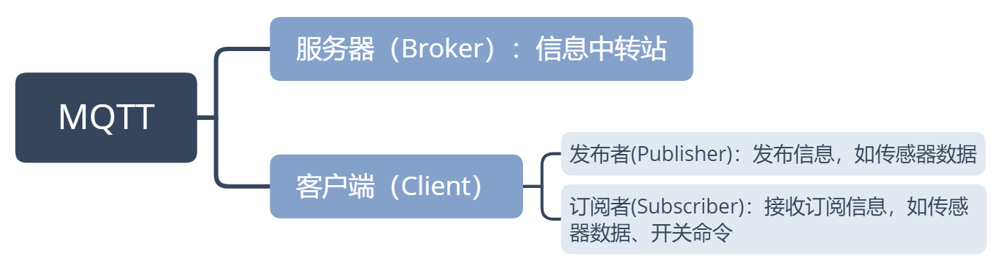
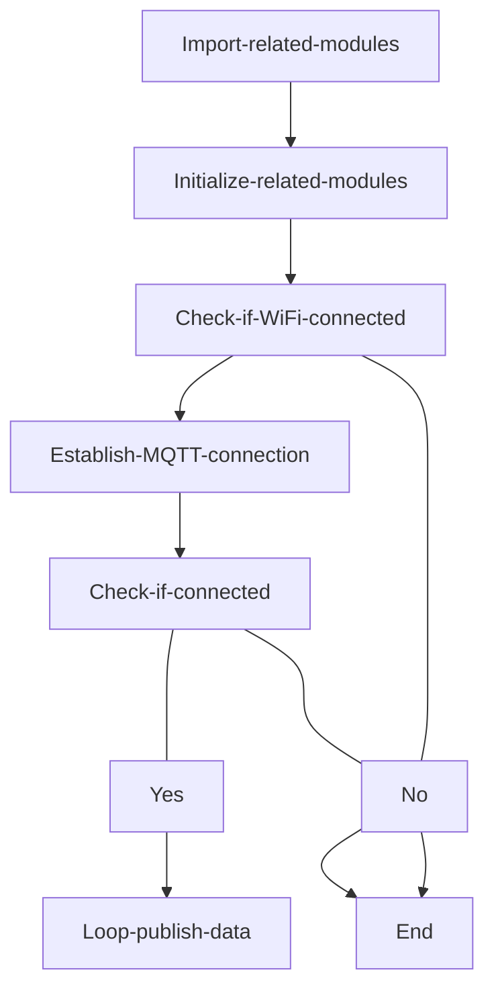
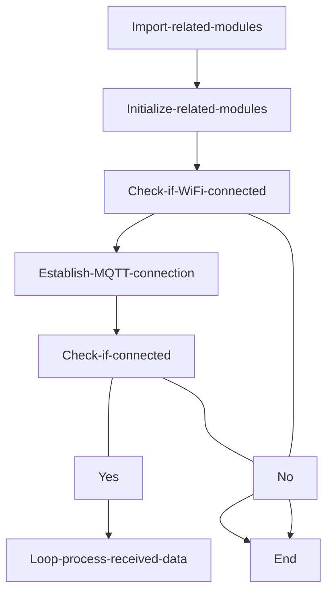
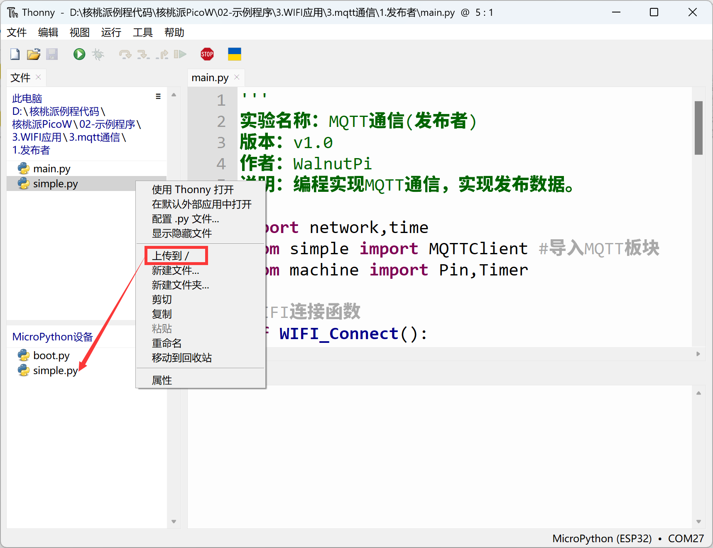
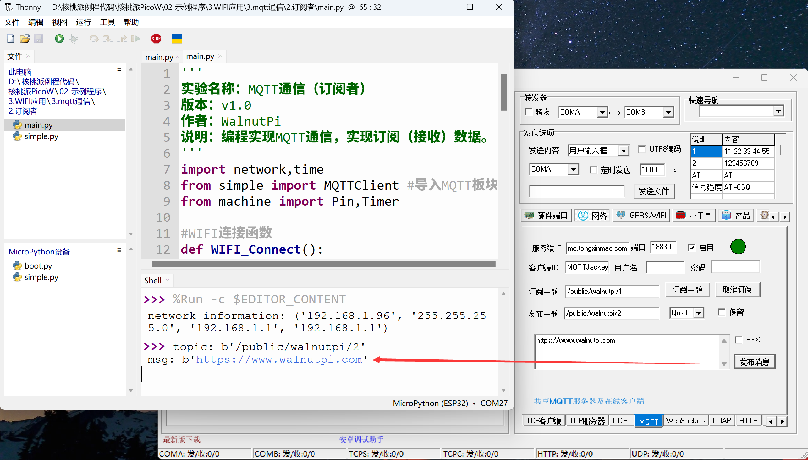

# MQTT Communication

## Introduction
In the previous section, we learned about Socket communication. When a server and client establish a connection, they can communicate with each other. In internet applications, WebSocket interfaces are mostly used for data transmission. However, in IoT applications, a common scenario occurs: massive numbers of sensors need to stay online continuously, transmitting very small amounts of data, with a large number of users. If we still use socket for communication, the server load and communication framework design would become extremely complex as the number increases!

So, is there a framework protocol to solve this problem? The answer is yes — MQTT (Message Queuing Telemetry Transport).


## Objective
Program the WalnutPi PicoW to implement MQTT protocol message publishing and subscribing (receiving).

## Experiment Explanation
MQTT was proposed by IBM in 1999. Like HTTP, it belongs to the application layer and operates on the TCP/IP protocol stack, typically calling the socket interface. It is a client-server based publish/subscribe messaging transport protocol. Its characteristics are that the protocol is lightweight, simple, open, and easy to implement, making it suitable for a very wide range of applications. In many cases, including constrained environments such as Machine-to-Machine (M2M) communication and the Internet of Things (IoT), it has been widely used in sensors communicating via satellite links, occasionally dialing medical devices, smart homes, and various miniaturized devices.

In summary, MQTT has the following features/advantages:
- Asynchronous messaging protocol
- Oriented toward persistent connections
- Bidirectional data transmission
- Lightweight protocol
- Passive data acquisition


From the diagram above, we can see that MQTT communication has two roles: server and client. The server only relays data and does not store it; the client can be an information publisher or subscriber, or both simultaneously. As shown in detail below:



Once roles are determined, how is data transmitted? The table below shows the most basic MQTT data frame format. For example, a temperature sensor publishes the topic "Temperature" with the message "25" (representing temperature). Then all clients (phone apps) that have subscribed to this topic will receive the relevant information, thus achieving communication. As shown in the table below:


Due to the special publish/subscribe mechanism, the server doesn't need to store data (though you can set up a client on the server device to subscribe and save information). This makes it very suitable for massive device transmission.

Life is short, and MicroPython has already encapsulated the MQTT client library files, making our applications simple and elegant. The MQTT module file is the `simple.py` file in the example folder. Usage is as follows:

## MQTTClient Object

### Constructor
```python
client=mqtt.MQTTClient(client_id, server, port)
```
Import the MQTT library and build a client object.

Parameters:
- `client_id`: Client ID, must be unique;
- `server`: MQTT server address, can be IP or URL;
- `port`: MQTT server port (depends on the MQTT server provider).

### Usage
```python
client.connect()
```
Connect to the MQTT server.

<br></br>

```python
client.publish(topic,message)
```
Publish a message.
- `topic`: Topic name;
- `message`: Message content, e.g., 'Hello WalnutPi!'

<br></br>

```python
client.subscribe(topic)
```
Subscribe.
- `topic`: Topic name.

<br></br>

```python
client.set_callback(callback)
```
Set a callback function.
- `callback`: When a message is received after subscribing, execute the callback function with the corresponding name.

<br></br>

```python
client.check_msg()
```
Check for subscription messages. If a message is received, execute the configured callback function.

<br></br>

Since the client can act as both publisher and subscriber, and to help everyone better understand, this experiment is split into two examples: publisher and subscriber. Combined with an MQTT network debugging assistant for testing. The code flow charts are as follows:

**Publisher code flow:**


<br></br>

**Subscriber code flow:**



## Reference Code

### Publisher

```python
'''
Experiment Name: MQTT Communication (Publisher)
Version: v1.0
Author: WalnutPi
Description: Program MQTT communication to publish data.
'''
import network,time
from simple import MQTTClient #Import MQTT module
from machine import Pin,Timer

#WiFi connection function
def WIFI_Connect():

    WIFI_LED=Pin(46, Pin.OUT) #Initialize WiFi indicator LED

    wlan = network.WLAN(network.STA_IF) #STA mode
    wlan.active(True)                   #Activate interface
    start_time=time.time()              #Record time for timeout judgment

    if not wlan.isconnected():
        print('connecting to network...')
        wlan.connect('01Studio', '88888888') #Enter WiFi SSID and password

        while not wlan.isconnected():

            #LED blinking prompt
            WIFI_LED.value(1)
            time.sleep_ms(300)
            WIFI_LED.value(0)
            time.sleep_ms(300)

            #Timeout judgment, 15 seconds without connection = timeout
            if time.time()-start_time > 15 :
                print('WIFI Connected Timeout!')
                break

    if wlan.isconnected():
        #LED stays on
        WIFI_LED.value(1)

        #Serial print info
        print('network information:', wlan.ifconfig())

        return True

    else:
        return False

#Publish data task
def MQTT_Send(tim):
    client.publish(TOPIC, 'Hello WalnutPi!')

#Execute WiFi connection function and check if connected
if WIFI_Connect():

    SERVER = 'mq.tongxinmao.com'
    PORT = 18830
    CLIENT_ID = 'WalnutPi-PicoW' # Client ID
    TOPIC = '/public/walnutpi/1' # TOPIC name
    client = MQTTClient(CLIENT_ID, SERVER, PORT)
    client.connect()

    #Start RTOS timer, number -1, period 1000ms, execute MQTT send task
    tim = Timer(-1)
    tim.init(period=1000, mode=Timer.PERIODIC,callback=MQTT_Send)
```

### Subscriber

```python
'''
Experiment Name: MQTT Communication (Subscriber)
Version: v1.0
Author: WalnutPi
Description: Program MQTT communication to subscribe (receive) data.
'''
import network,time
from simple import MQTTClient #Import MQTT module
from machine import Pin,Timer

#WiFi connection function
def WIFI_Connect():

    WIFI_LED=Pin(46, Pin.OUT) #Initialize WiFi indicator LED

    wlan = network.WLAN(network.STA_IF) #STA mode
    wlan.active(True)                   #Activate interface
    start_time=time.time()              #Record time for timeout judgment

    if not wlan.isconnected():
        print('connecting to network...')
        wlan.connect('01Studio', '88888888') #Enter WiFi SSID and password

        while not wlan.isconnected():

            #LED blinking prompt
            WIFI_LED.value(1)
            time.sleep_ms(300)
            WIFI_LED.value(0)
            time.sleep_ms(300)

            #Timeout judgment, 15 seconds without connection = timeout
            if time.time()-start_time > 15 :
                print('WIFI Connected Timeout!')
                break

    if wlan.isconnected():
        #LED stays on
        WIFI_LED.value(1)

        #Serial print info
        print('network information:', wlan.ifconfig())

        return True

    else:
        return False


#Set MQTT callback function, executes when a message is received
def MQTT_callback(topic, msg):
    print('topic: {}'.format(topic))
    print('msg: {}'.format(msg))

#Receive data task
def MQTT_Rev(tim):
    client.check_msg()

#Execute WiFi connection function and check if connected
if WIFI_Connect():

    SERVER = 'mq.tongxinmao.com'
    PORT = 18830
    CLIENT_ID = 'WalnutPi-PicoW' # Client ID
    TOPIC = '/public/walnutpi/2' # TOPIC name

    client = MQTTClient(CLIENT_ID, SERVER, PORT) #Build client object
    client.set_callback(MQTT_callback)  #Configure callback function
    client.connect()
    client.subscribe(TOPIC) #Subscribe to topic

    #Start RTOS timer, number 1, period 300ms, execute socket communication receive task
    tim = Timer(1)
    tim.init(period=300, mode=Timer.PERIODIC,callback=MQTT_Rev)
```

## Experimental Results

### Publisher Test

On your computer, open the software from **WalnutPi PicoW Resources/01-Development Tools/MQTT Assistant**. Ensure the computer is connected to the internet:


Next, configure the MQTT assistant as shown below.

1. Click Network;

2. Click MQTT;

3. Click Start;

4. Enter the subscription topic — here enter the publisher's topic "/public/walnutpi/1";

5. Click the Subscribe Topic button and wait for messages;

6. After successful subscription, the left side will show "subscription successful".


**The MQTT example depends on the MQTT library file `simple.py` in the example folder. Before running the experiment, you need to upload the `simple.py` file to the development board via Thonny IDE:**



Run the MQTT publisher code in Thonny IDE. After successful execution, you can see the MQTT network assistant receiving messages sent by the development board:


### Subscriber Test


The subscriber code testing method is the opposite of the publisher. In the MQTT assistant, change the published topic to: '/public/walnutpi/2'.


Run the subscriber code. You can see the terminal at the bottom of Thonny IDE printing the received data (which is actually the data received by the WalnutPi PicoW development board).



You can also test both publish and subscribe functionality within the same MQTT online assistant by setting the subscription topic and publish topic to be the same, as shown below:


Through this section, we learned the principles of MQTT communication and successfully implemented communication. This experiment's MQTT connects to the tongxinmao server, which supports remote data transmission. Currently, most IoT cloud platforms on the market support MQTT with similar principles. You can develop based on different platform protocols to achieve remote connection for your own IoT devices.
