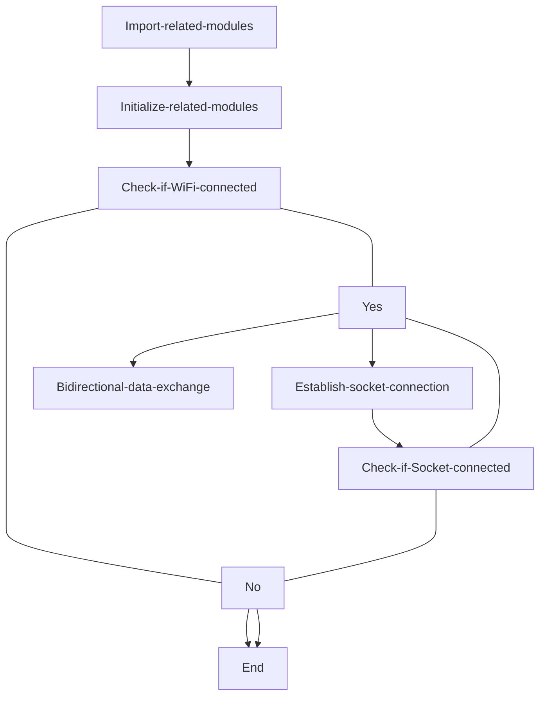
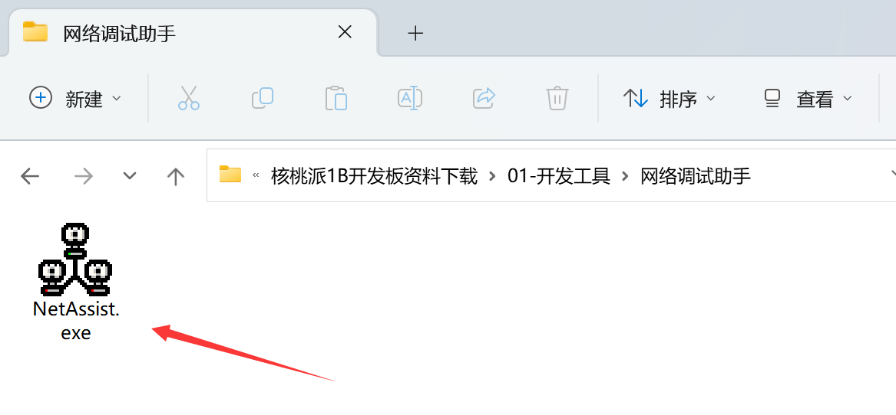
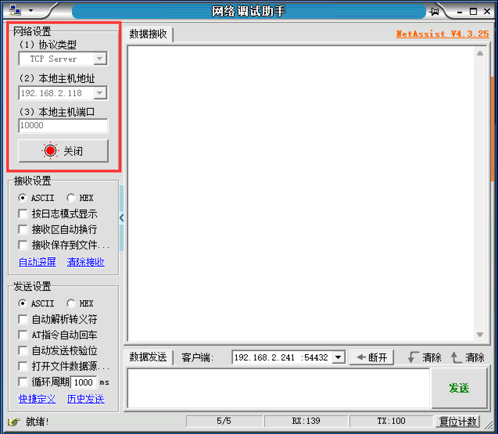
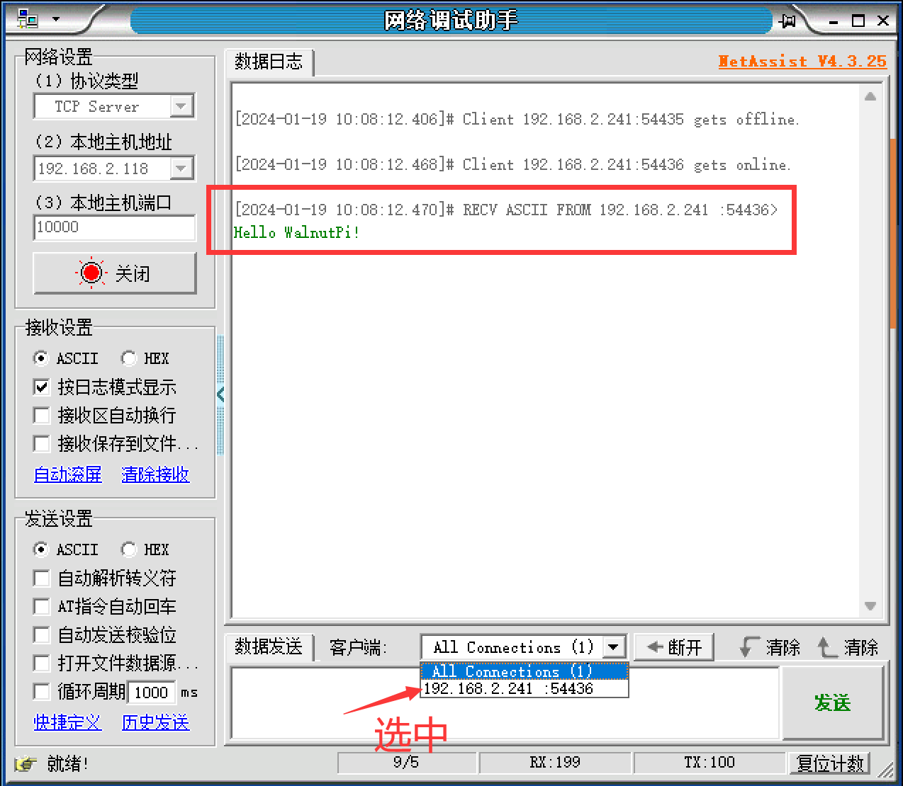
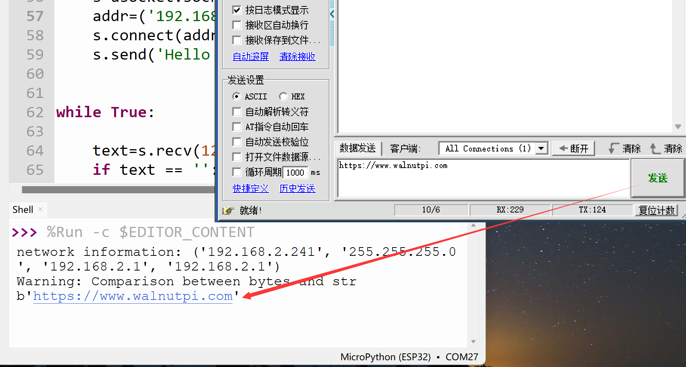

# Socket Communication

## Introduction
In the previous section, we learned how to program the WalnutPi PicoW to connect to a wireless router using MicroPython. In this section, we'll learn about Socket communication. Socket is essentially the foundation of all internet communication.

## Objective
Use Socket programming to establish a connection between the WalnutPi PicoW and a PC server assistant, allowing bidirectional data transmission.

## Experiment Explanation
We've heard a lot about Socket, but since network engineering is a systematic discipline involving a broad scope of knowledge and many concepts — each knowledge point could fill a thick book — we often get confused. Here, we'll try to explain Socket in the most understandable way possible. For a comprehensive understanding, feel free to research further on your own.

Let's first look at the network layer model diagram, which forms the basis of network communication:


Let's look at the transport layer and application layer of the TCP/IP model. More familiar concepts at the transport layer are TCP and UDP. The UDP protocol basically does no additional processing on IP layer data. The TCP protocol adds more complex transmission control, such as sliding data transmission windows (Slice Window), as well as acknowledgment and retransmission mechanisms to achieve reliable data delivery. At the application layer, HTTP is commonly used for web pages. So let's first analyze the relationship between TCP and HTTP.

We know that network communication fundamentally depends on IP and ports. HTTP typically uses port 80 by default. A simple example: when we browse Taobao, the browser sends a request to Taobao's URL (essentially an IP) and port. When Taobao receives the request, it responds by sending related webpage data information back to our phone, completing the web interaction process. This raises the issue of multi-user connections — many people visit Taobao, and in practice, they disconnect after receiving the webpage information. Otherwise, Taobao's servers couldn't support so many people staying connected for extended periods, and even if they could, it would consume enormous resources.

In other words, when application-layer HTTP communicates data through the transport layer, TCP encounters the problem of providing concurrent services to multiple application processes simultaneously. Multiple TCP connections or application processes may need to transmit data through the same TCP protocol port. To distinguish between different application processes and connections, many computer operating systems provide the Socket interface for applications to interact with the TCP/IP protocol. The application layer can communicate with the transport layer through the Socket interface, distinguishing communications from different application processes or network connections, thus enabling concurrent data transmission services.

Simply put, the Socket abstraction layer sits between the transport layer and application layer and has no necessary connection with TCP/IP. When the Socket programming interface was designed, it was intended to adapt to other network protocols as well.


A socket is the cornerstone of communication and the basic operational unit supporting TCP/IP protocol network communication. It is an abstract representation of endpoints in the network communication process, containing the five essential pieces of information for network communication: **the protocol used (typically TCP or UDP), local host IP address, local process protocol port, remote host IP address, and remote process protocol port.**

So, the emergence of socket simply makes it more convenient to use the TCP/IP protocol stack. Simply understood, it abstracts TCP/IP into a few basic function interfaces such as **create, listen, accept, connect, read, write**, etc. The communication flow is as follows:


From the diagram above, Socket communication requires a server and a client. In this experiment, the WalnutPi PicoW acts as the client, and the computer uses a network debugging assistant as the server, with both using TCP for transmission. For the client, it only needs to know the computer's IP and port to establish a connection. (Ports can be customized in the range 0~65535 — just avoid commonly used ports like 80.)

In summary, if the user is application-oriented, the WalnutPi only needs to know these 3 pieces of information: **communication protocol (TCP or UDP), server IP address, and port number** — to initiate a connection and send messages. It's that simple.

MicroPython has already encapsulated the relevant socket module. The object is described as follows:

## socket Object

### Constructor
```python
s=usocket.socket(af=AF_INET, type=SOCK_STREAM,proto=IPPROTO_TCP)
```
Build a socket object.
- `af`: IP version type
    - `AF_INET`: IPv4;
    - `AF_INET6`: IPv6;

- `type`:
    - `SOCK_STREAM`: TCP;
    - `SOCK_DGRAM`: UDP;

- `proto`:
    - `IPPROTO_TCP`: TCP protocol;
    - `IPPROTO_UDP`: UDP protocol;

(To build a TCP connection, you can use the default parameter configuration, i.e., no arguments needed.)

### Usage
```python
addr=usocket.getaddrinfo('https://www.walnutpi.com', 80)[0][-1]
```
Get Socket communication format address. Returns: ('106.52.127.213', 80)
<br></br>

```python
s.connect(address)
```
Create a connection.
- `address`: Address format is IP + port. Example: ('192.168.1.115',10000)

<br></br>

```python
s.send(bytes)
```
Send data.
- `bytes`: Content to send in bytes format.

<br></br>

```python
s.recv(bufsize)
```
Receive data.
- `bufsize`: Maximum number of bytes to receive at once.

<br></br>

```python
s.bind(address)
```
Bind, used for server role.

<br></br>

```python
s.listen([backlog])
```
Listen, used for server role.
- `backlog`: Number of allowed connections, must be greater than 0.

<br></br>

```python
s.accept()
```
Accept connection, used for server role.

<br></br>

For more usage, refer to the official documentation:<br></br>
https://docs.micropython.org/en/latest/library/socket.html#module-socket

In this experiment, the WalnutPi PicoW is the client, so we only need the client-side functions. The code flow is as follows:




## Reference Code

```python
'''
Experiment Name: Socket Communication
Version: v1.0
Author: WalnutPi
Platform: WalnutPi PicoW
Description: Use Socket programming to establish a TCP connection between WalnutPi PicoW and a PC server assistant, exchanging data bidirectionally.
'''

#Import related modules
import network,usocket,time
from machine import Pin,Timer

#WiFi connection function
def WIFI_Connect():

    WIFI_LED=Pin(46, Pin.OUT) #Initialize WiFi indicator LED

    wlan = network.WLAN(network.STA_IF) #STA mode
    wlan.active(True)                   #Activate interface
    start_time=time.time()              #Record time for timeout judgment

    if not wlan.isconnected():
        print('Connecting to network...')
        wlan.connect('01Studio', '88888888') #Enter WiFi SSID and password

        while not wlan.isconnected():

            #LED blinking prompt
            WIFI_LED.value(1)
            time.sleep_ms(300)
            WIFI_LED.value(0)
            time.sleep_ms(300)

            #Timeout judgment, 15 seconds without connection = timeout
            if time.time()-start_time > 15 :
                print('WIFI Connected Timeout!')
                break

    if wlan.isconnected():
        #LED stays on
        WIFI_LED.value(1)

        #Serial print info
        print('network information:', wlan.ifconfig())

        return True

    else:
        return False


#Check if WiFi is connected
if WIFI_Connect():

    #Create socket TCP connection, send "Hello WalnutPi!" to server after connecting.
    s=usocket.socket()
    addr=('192.168.2.118',10000) #Server IP and port
    s.connect(addr)
    s.send('Hello WalnutPi!')


while True:

    text=s.recv(128) #Maximum 128 bytes per receive
    if text == '':
        pass

    else: #Print received info as bytes, can convert to string via decode('utf-8')
        print(text)
        s.send('I got:'+text.decode('utf-8'))

    time.sleep_ms(300)
```

The WiFi connection code was explained in the previous section and won't be repeated here. After connecting, the program establishes a Socket connection and sends the message 'Hello WalnutPi!' to the server upon successful connection. Additionally, the code is set to process data received from the server every 300ms, printing received data via the serial port and sending it back to the server.

## Experimental Results

Ensure the computer and WalnutPi PicoW are on the same network segment (typically connected to the same router), and it's best to disable the computer's firewall.

On the computer, open the network debugging assistant and set up a server. The software is at <u>WalnutPi PicoW Resources\01-Development Tools\Network Debugging Assistant</u> — NetAssist.exe. Just double-click to open!

Open the network debugging assistant on the computer:



Here's how to set up a new server: After opening the network debugging assistant, select protocol type as TCP Server in the top left corner; the local IP address in the middle is auto-detected — don't modify it, as this is the server IP address. Then set the port to 10000 (any value from 0-65535 works). Click connect, and the red light turns on after success. As shown below:



The server is now in listening mode! Users need to enter their own WiFi information and server IP address + port based on their actual situation. That is, modify the following parts of the code above. (The server IP and port can be found in the network debugging assistant.)

**Change the WiFi network to your own wireless router's SSID and password. Only 2.4G signals are supported. 5G or 2.4G&5G mixed signals are not supported.**

```python
wlan.connect('01Studio', '88888888') #Enter WiFi SSID and password
```

**Modify server IP and port according to the network assistant:**
```python
addr=('192.168.2.128',10000) #Server IP and port
```

Run the program. After the development board successfully connects to WiFi, it initiates a socket connection. Once connected, you can see the network debugging assistant has received the message from the development board. An extra connection object appears in the list below — click to select it:



After selecting, enter the message **https://www.walnutpi.com** in the send box, click send, and you can see the development board's serial terminal prints that information as byte data.



Through this section, we learned the principles of socket communication and conducted experiments using MicroPython for socket programming and communication. Thanks to excellent encapsulation, we can directly program against socket objects to quickly implement socket communication and develop more network applications, such as sending previously collected sensor data to a server.
